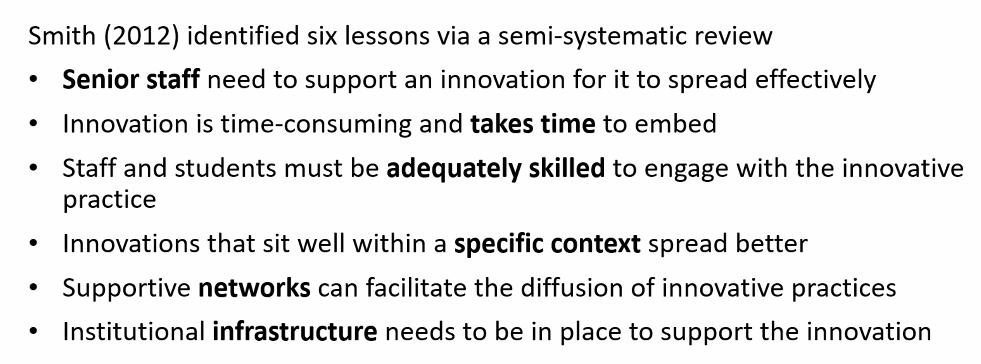
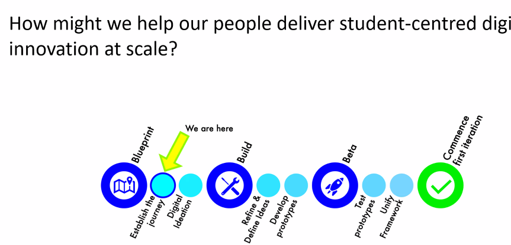
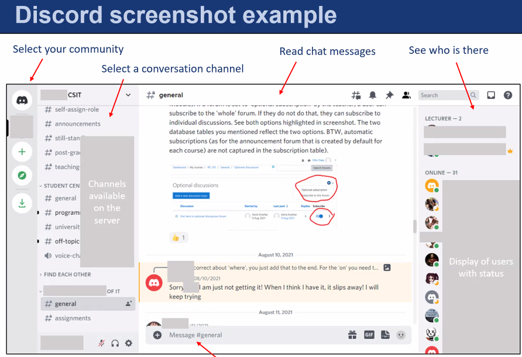

# ASCILITE 2022 - Day 1

See [[ascilite 2022]] Monday 5 December 2022

### Keynote - Using educational technologies to create relationships that enable student learning and thriving

Good fit with conference theme and important topic.

- In questions, need for structural change required to get feedback loops working proper (e.g. contract grading)

Peter Felten - [book details](https://www.elon.edu/u/news/2021/01/04/lambert-and-felten-explore-the-power-of-relationship-rich-education-in-new-book/)

> Decades of research demonstrate that the quality of student-student and student-staff interactions are foundational to learning, belonging, and well-being for all undergraduates, and are particularly significant for students from groups that have been (and too often continue to be) marginalized in higher education. Drawing on more 450 interviews with students and staff across U.S. higher education, including scores of student interviews during the pandemic, this interactive session will explore how academic staff can use educational technologies to nurture relationships that support student thriving at university. Because these relationships tend to have lasting legacies, we also will consider how relationship-rich experiences can enable students to develop the skills and capacities – as well as the constellations of colleagues and mentors – that will empower them to contribute positively to their communities and professions after they graduate.

> not where the students where, but what they were asked to do

i.e. no significant difference phenomena

Building human connections online four suggestions

- Humanise the instructor
- Provide personalised Feedback
- Reach out to students
- Support student peer collaboration (Glazier, 2021)

Positioned as working online, but it really not technology dependent

#### References

Glazier, R.A. (2021). Connecting in the Online Classroom: Building Rapport between Teachers and Students. (Johns Hopkins 	University Press).

### Using educational technologies to create relationships that enable student learning and thriving

### Re/Connecting university teachers with digital teaching tools for “jobs to be done”

[Paper](https://publications.ascilite.org/index.php/APUB/article/view/118)

decision making/conversation starting Framework and apparent website to scaffold making decisions...linking to tools

The actual [tool guide](https://tl-tools-guide.deakin.edu.au/)

> Although constructive alignment is well understood within university teaching practices, technology does not always feature explicitly within this conceptual model. When educators seek digital technologies to assist them in their teaching, how do they find out both what is available to them within their higher education institution and, more importantly, which tools might make a good pedagogical “fit” within their unit of study? One university in Australia recently designed and developed a Teaching and Learning Tools Guide to assist their teachers to determine which educational technologies are available for their various educational purposes. This new resource offers guided navigation to assist teacher choice of tool to align to their intended pedagogical strategy. As an open-source resource, the guide is also offered widely to the higher education community. This paper recommends that this or a similar resource is used to support digital tool choice within the constructive alignment process.

### Co-creating a digital learning innovation framework through design thinking approaches 

[Paper](https://publications.ascilite.org/index.php/APUB/article/view/140)

Abstract
> Although innovation is widely used as a marker of excellence by universities it remains a poorly conceptualised idea, particularly in the realm of teaching and learning. In this paper, we describe an institution-wide project to co-create a Digital Learning Innovation Framework at a large Australian university. Through design thinking approaches a central learning and teaching unit led a co-design process to investigate and define digital learning innovation within their institutional context. This initiative involved a total of 114 stakeholders who design and deliver digital learning innovations at the University. This paper reports on a tentative, working definition of digital learning innovation and six guiding principles that arose out of this Digital Learning Innovation Framework co-design process. In this way, this paper makes significant contributions in conceptualising and contextualising practice-based innovation for digital education. Future implications and limitations of this study are also noted.

- Most claims of innovation in higher ed is incremental and focused on efficiency
- Own experience didn't impact practice

Smith 2012 six lessons
  

Looking for framework and infrastructure to support innovation

Talk with people - 3 3 hour workshops.  Design thinking, sprint.  External moderator for workshops

  

Gathered lots of feedback ideas and developed 6 principles

Six principles

1. Create a safe place for new ideas
2. Keep focused on your purposes.
3. Keep focused on your users.
4. Be ethical.
5. Start small and build up.
6. Think holistically

    Argues against traditional organisational approaches that rely on teleological approaches that suffer from not being able to see the whole.

### In the business of nudging

[Paper](https://publications.ascilite.org/index.php/APUB/article/view/222)

Abstract
> We have long been leveraging the use of technologies to help build and sustain connections in the online environment. The pandemic opened our eyes to the value of these connections and the ability to better use technologies to facilitate them. Now we must question what more we can do. Creating communities through safe environments, building trust, showing students our ‘human’ sides through rapport building and teacher presence which may have previously been hidden in plain sight when operating in a face-to-face mode are a good start. By breaking down traditional barriers brought about through power relationships, the foundations of a quality learning experience are both created and maintained. Using case scenarios and personal narrative from two metropolitan university business schools, we explore techniques that have been used to build connections during lockdowns and begin to reconnect as we emerge from the pandemic. We found that nudging our students through initial uncomfortableness really helped them feel part of a community of learners, one which we also belonged.

Nudge theory is mentioned.  Also CoI and the importance of teacher presence and in particular "setting climate"

### Fostering connections for professional identity formation: two case studies of Discord discipline-focused communities 

[paper](https://publications.ascilite.org/index.php/APUB/article/view/136)

How do support or students with online communication & networking. - Professional identity formation

More an exploratory feature.

Two case studies - both using Discord

- Computer science/Information technology 

    - 4+ years of discord use   
	- bottom up use - one tutor - community developed organically
	- interview with 19 students
	- distance students included lots of them, incl. part-time
- Veterinary sciences

    - new use of discord in one core course
	- aiming to be more online help-seeking
	- interviews with 4 staff

Computer science discord set up 

  

[//begin]: # "Autogenerated link references for markdown compatibility"
[ascilite 2022]: <ascilite 2022> "ASCILITE 2022"
[//end]: # "Autogenerated link references"