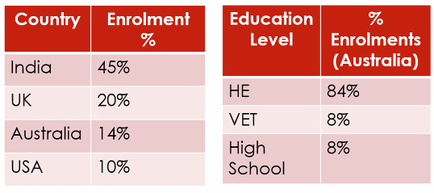
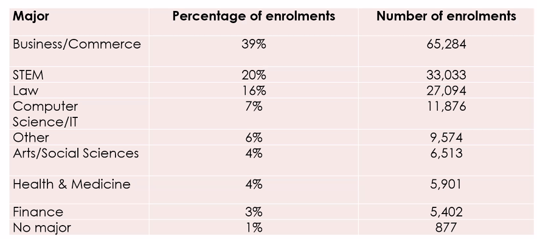
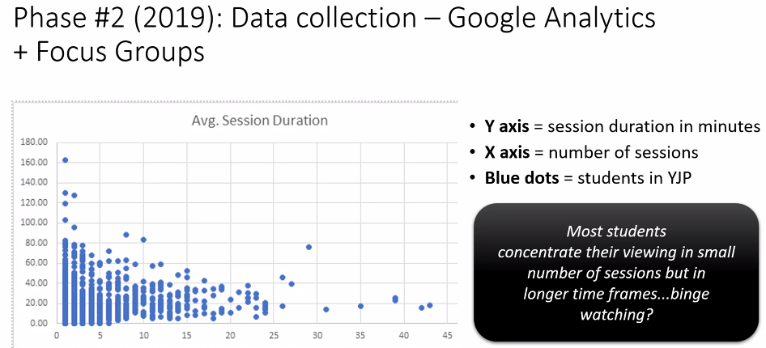
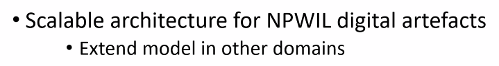
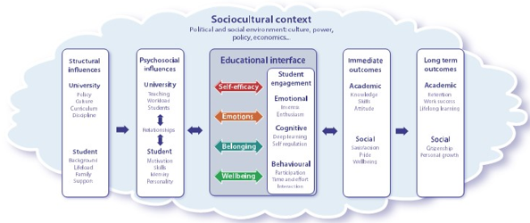
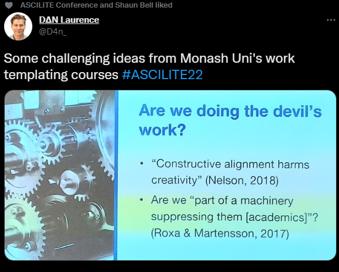

# ASCILITE 2022 - Day 3

See [[ascilite-2022]]

## Connecting students with ‘industry’: A pilot implementation of authentic assessment tasks in business education

[paper](https://publications.ascilite.org/index.php/APUB/article/view/172)

Good example of an attempt to re-design assessment to add authenticity...more data required

Abstract
> Universities are continuing to encourage academics to implement more authentic assessment strategies into their teaching and learning activities to ensure that students are work-ready on graduation. Connecting students with the expectations of industry through these assessments encourages students to identify key competencies which need to be strengthened in order to ensure they are employable upon graduation. Since COVID-19 struck in early 2020, we have all had to consider how technology can assist in connecting people to continue to be able to work. This is no truer than with students and teaching staff as well as connecting students with industry. This paper reports on the implementation of a new authentic assessment project for business students where students worked both face-to-face and online to complete a major work-based project.

## Bridging education to employment through virtual experience placement

[paper](https://publications.ascilite.org/index.php/APUB/article/view/215)

Abstract
> The transition from education to employment is a pivotal point for students. Workplace experience can play a key role in a student’s transition to full-time work. Despite the important role in bridging the gap between education and employment, students’ participation in workintegrated learning (WIL) experiences varies significantly across disciplines. Through participant surveys, we examined students’ reasons for, and benefits of, undertaking WIL opportunities online through Forage: a platform facilitating access to virtual and simulated placements in partnership with employer organisations. Virtual and simulated WIL experiences have gained interest, particularly during the COVID-19 pandemic. Our findings show that virtual or simulated WIL experiences are inclusive opportunities that can assist students, including those studying in areas with a historically low prevalence of WIL, in both career and organisation exploration

[Forage](http://www.theforage.com/) - free for students 

Library of job simulations that can be used.   A simulation gives detail about working in a particular company and engage in tasks.  Tasks are given via multimedia resources which apparently include real staff.  Students complete the task and can get access to a sample model answer which is annotated....apparently completed by a real staff.  The students are asked to reflect on their performance.

Will provide certificates from company also connection with LinkedIn

Reporting on data from millions of students from Forage (provided to researchers). Forage also ran survey.

  

  

## The Youth Justice Portal and Transformative Digital Education in Criminology

[paper](https://publications.ascilite.org/index.php/APUB/article/view/106)

Abstract
> The ideas in this paper explore how learning design intentions developed by academics, practitioners and learning designers, intersect with students’ development of pre-professional identities (PPI) in the field of youth justice. We propose a theoretical framework built on Activity Theory that situates the learning environment as a set of two activity systems – teachers and students – that come together through a boundary object called the ‘Youth Justice Portal’. The portal is the main avenue through which teaching, and learning takes place, and we examine how the technical and theoretical framework that we have adopted can be applied in open-ended domains that require the development of students’ PPI. The practical implications related to the adoption of the model in disciplines which require placement-based learning opportunities are discussed.

Seeking a digital form of WIL. - [Youth Justice Portal](https://lf.westernsydney.edu.au/p/videowall/2/index.html?d=data/youth-justice.json)

Data is in JSON - portal is portable and scaleable.  Nodes are semantic categories. 

At first glance it is a portal to a series of videos.   But it is used as a form of dialogic learning - displacing the lecture.

  

- Some binge viewing going on
- Also during assessment
- Not matching the learning design of the portal

Activity theory used to disconnect

  

Scalability - data divorced from 'presentation' layer is seen as a contribution

##  Using technology to build relationships and foster student engagement

Invited plenary 

Abstract
> It is often claimed that technology makes learning more engaging. But such claims are rarely backed by an explicit definition of student engagement and often see engagement as simply paying attention. Student engagement – the student’s emotional, behavioural, and cognitive connection to their learning – is a complex concept and a more nuanced understanding of engagement can inform more purposeful use of technology in education. In my presentation I will introduce my holistic framework of student engagement which illustrates the interwoven institutional, student, and contextual factors which influence how a student engages with their studies. As well, the framework highlights four key dimensions of the students’ psychosocial responses to their learning environment which act as pathways to engagement – their belonging, self-efficacy, wellbeing, and emotions. In exploring the framework, I will draw on examples from my own research and teaching experiences as well as other student engagement research to illustrate how technology can help engage students – either directly or through the pathways. Given the theme of the conference, I will pay particular attention to the development of teacher-student relationships which are a critical influence on student engagement.

And discussion of engagement rarely backed by explicit definition of technology.

  

## Educational Designer social influence: changing teaching and learning practice

[paper](https://publications.ascilite.org/index.php/APUB/article/view/56)

Abstract
> In the current neoliberal agenda, universities require Educational Designers (EDs) to establish influence and ensure the improvements in education for the benefit of graduates. The preservation of high-quality teaching is fundamental in connecting educators with students, which was crucial during the COVID-19 pandemic. Yet, the influence of EDs on affecting a change in teaching practice has not been adequately explored. This case study collected qualitative survey responses from seventeen EDs in one Australian university, and used inductive thematic analysis to explore how they attempted to influence academics to change teaching practices. Results indicated a definitive need to collaborate with academics to implement the desired changes. Moreover, strong professional relationships with academics, effective communication, and creating a favourable environment were important to the EDs’ influence attempts. Cultural challenges within the university was an interesting discovery regarding influence capability. These findings provide key insights into how EDs support a change in educational practice within the university environment.

“Yet, their role and positioning are often invisible or even camouflaged (Akerman, 2020).” ([D'Souza et al., 2022, p. 1](zotero://select/library/items/BJH4BPXT)) ([pdf](zotero://open-pdf/library/items/6RU6P4KZ?page=1&annotation=X8JXB7KZ))

“This research investigates “How do Australian EDs who practise in a university setting influence academics to implement changes to their teaching practices?”” ([D'Souza et al., 2022, p. 1](zotero://select/library/items/BJH4BPXT)) ([pdf](zotero://open-pdf/library/items/6RU6P4KZ?page=1&annotation=C88DINXD))

“Pratkanis proposed four broad categories of non-coercive social influence tactics, (1) landscaping, (2) credible and social relationships, (3) effective message tactics, and (4) emotional tactics.” ([D'Souza et al., 2022, p. 2](zotero://select/library/items/BJH4BPXT)) ([pdf](zotero://open-pdf/library/items/6RU6P4KZ?page=2&annotation=FBV8VV5M))

“The following sections highlight the thematic findings from the survey data: (1) relationships - trust and credibility; (2) effective communication; (3) creating a favourable environment and; (4) navigating cultural challenges.” ([D'Souza et al., 2022, p. 3](zotero://select/library/items/BJH4BPXT)) ([pdf](zotero://open-pdf/library/items/6RU6P4KZ?page=3&annotation=KC4PBCHR))

“Additionally, several participants noted that while academic staff are content/discipline experts, they may not necessarily have a formalised teaching qualification” ([D'Souza et al., 2022, p. 3](zotero://select/library/items/BJH4BPXT)) ([pdf](zotero://open-pdf/library/items/6RU6P4KZ?page=3&annotation=AQQMJJZW)) Reality versus deficit model?

“ratkanis (2007) advocates for ‘landscaping or pre-persuasion’, creating favourable situations in which “the target is likely to be receptive to a given course of action and respond in a desired manner” (p. 20)” ([D'Souza et al., 2022, p. 4](zotero://select/library/items/BJH4BPXT)) ([pdf](zotero://open-pdf/library/items/6RU6P4KZ?page=4&annotation=UQ5BPAU6))

“EDs discussed building human and non-human resources, establishing communities of practice and evidence-based practices through collaboration, as well as contributing to the university’s strategic needs. The resources which they created, shared and/or showcased bridged the gap between colleagues who may “never otherwise talk to each other and share ideas” (P” ([D'Souza et al., 2022, p. 4](zotero://select/library/items/BJH4BPXT)) ([pdf](zotero://open-pdf/library/items/6RU6P4KZ?page=4&annotation=UT46DHTE))

## ‘As long as you use the template’: fostering creativity in a pedagogic model

[paper](https://publications.ascilite.org/index.php/APUB/article/view/34)

Abstract
> As the higher education landscape enters a new era of digital-first education, education designers are tasked with supporting the pedagogic work of educators to design learning experiences which connect students with disciplinary content, with each other and with their educator in the digital learning environment. This paper uses a collaborative autoethnographic approach to reflect upon the challenges experienced by two education designers implementing a pedagogic model to support blended and hybrid learning at scale. A key tension of this work is the perception that design templates diminish educators’ academic freedom and creativity by exerting institutional control over disciplinary experts. We argue that bringing teaching teams together in dialogic and disciplinary learning communities around our pedagogic model fosters creativity by providing space for educators to scaffold their own development, and ultimately, 

60+ ed designers at Monash - recent growth in central eds

Templates to organise LMS - LMS sites were a mess.

Did a lot of work -- guide on the side? - but results initially good but didn't go very far and issues arose.  Push back on templates.

The template was very specific in structure - pre-class, in-class, post-class.

Have there criteria for good practice to track - somewhat related to QA.

Question from the room - balance academic freedom and consistency.

THe idea that the template provides the structure. The freedom is outside the structure.

  

[//begin]: # "Autogenerated link references for markdown compatibility"
[ascilite 2022]: <ascilite 2022> "ASCILITE 2022"
[//end]: # "Autogenerated link references"