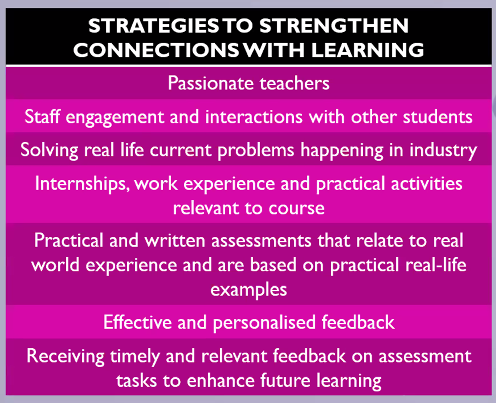
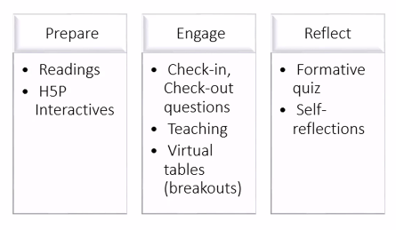

# ASCILITE 2022 - Day 2

See [[ascilite 2022]]

## Rebuilding Connections: The value and purpose of connections and the role technology and emotional intelligence can play

Keynote - Dominque Parrish

Analysis of ASCILITE institutional members strategic plans  
 
- no mention of connections to staff
- only a couple to students
- digital technology to assist using developing

Findability on the website often mentioned by students

  

## There’s a pandemic coming, get yourselves some tablets’: Lessons from the pandemic on a community of practice approach to learning technology diffusion

[paper](https://publications.ascilite.org/index.php/APUB/article/view/100)

Abstract
> A well-planned program for disseminating good practice in teaching with tablet computers within a large science, health and engineering faculty of an Australian university fortuitously came to fruition just in time for the switch to emergency remote teaching triggered by the COVID-19 pandemic. For teachers in disciplines which rely on symbolic representation systems and hand-sketched diagrams, the tablets proved indispensable in overcoming the challenges of teaching under pandemic conditions. Our dissemination strategy was based on an initial phase of voluntary adoption supported by a well-resourced, academic-led community of practice, alongside the establishment of a library of some 80 devices. Using analyses of loan records, a survey of tablet borrowers, and in-depth interviews, we investigate the diffusion pathways of the decision to adopt, as well as tablet teaching know-how. We draw the preliminary conclusion that our community of practice approach to dissemination has wider applicability beyond our pandemic experience.

Check references - issues with academic up take

## Reconnecting teachers and students: Exploring educator experiences in large online cohorts 

[paper](https://publications.ascilite.org/index.php/APUB/article/view/46)

- Just migrated from Blackboard to Canvas
- Long term massification + pandemic
- Large classess 300 to 2300
- Ratios of ~ 1:500 staff:students

## Developing a learning analytics resource with meaningful data for first year teachers

[paper](https://publications.ascilite.org/index.php/APUB/article/view/204)

An improved PAM with a slightly different focus?

## ‘Made good connections’: Amplifying teacher presence and belonging at scale through learning design and personalised feedback

[paper](https://publications.ascilite.org/index.php/APUB/article/view/55)

Abstract
> While online learning offers much flexibility for students in terms of time and place, students’ experiences of online learning have been less than positive. A sense of belonging is key to students’ success and retention in any learning environment. Teaching or teacher presence is significant for setting a climate for belonging. However, few studies have documented how teachers can foster students’ sense of belonging in online settings and students’ experience of these initiatives. This paper presents an exploratory case study of a teacher’s initiatives to foster students’ belonging in an online subject by amplifying teacher presence through technology-mediated, personalised feedback embedded within interactive, engaging subject design. Students’ experiences of the subject and perceptions of their personalised feedback were captured through surveys and focus groups. Together, the findings indicate that the primary role of personalised feedback in fostering belonging was building connectedness between the teacher and students, thereby enhancing students’ motivation to learn in the subject. The findings also resonate with other research highlighting the importance of teacher presence throughout the subject, not just during synchronous classes.

Canvas course with interactive design. Canvas modules structured with the prepare, engage, reflect stages.  Engage is a 3 hour synchronous teams session every week.  But very interactive. Not a lot of listening

  

Important - quite explicit support is given to working with the academics to design the feedback process for use of OnTask

> **Mid-semester survey results** 52 students (51% of the cohort) responded to this survey asking them to rate the extent to which they found their personalised feedback helpful. Students responded with a mean rating of 4.6 (SD = 0.8). An overwhelming proportion of survey respondents (71%) rated their personalised feedback as being very helpful at this stage.
> **End semester survey results** 41 (41% of the cohort) students responded to this survey. Similar to the mid-semester results, students held positive views of their feedback at this stage. Students’ ratings were highest, on average, for the item This feedback made me feel more supported by my teacher (M = 5.24, SD = 1.2). Students also held a high level of agreement that The feedback and support improved the quality and standard of my work (M = 4.83, SD = 1.4).

# Annotations  
(12/6/2022, 2:32:49 PM)

“Current literature on belonging highlights the importance of engaging and interactive course design, together with regular and timely feedback and communication (Delahunty et al., 2014; Stone & Springer, 2019; Peacock et al., 2020).” ([Lim et al., 2022, p. 1](zotero://select/library/items/3W54RB8Z)) ([pdf](zotero://open-pdf/library/items/6WGIRR7L?page=1&annotation=KBJC5HMW))

“Essentially, the research indicates that students’ sense of belonging in online courses can be fostered by two critical elements perceivable by students in the learning environment: teacher presence and interactive course design (Fiock, 2020; Peacock, et al., 2020; Stone & Springer, 2019)” ([Lim et al., 2022, p. 2](zotero://select/library/items/3W54RB8Z)) ([pdf](zotero://open-pdf/library/items/6WGIRR7L?page=2&annotation=8T25VEGA))

“At the classroom level, emerging research indicates that the critical factor in fostering belonging is the teacher (Kirby & Thomas, 2022; Stone & Springer, 2019), who demonstrates care and support for student learning, and who orchestrates features of the learning environment to provide a strong community of learning with clear expectations. However, the challenge of fostering belonging through teacher presence is exacerbated with large cohorts (Stone & Springer, 2019). How can teachers sustain students’ engagement in their learning from week to week, given large enrolments in online courses and the limited time for interaction?” ([Lim et al., 2022, p. 2](zotero://select/library/items/3W54RB8Z)) ([pdf](zotero://open-pdf/library/items/6WGIRR7L?page=2&annotation=7YAWKF9S))

“Learning analytics offers a technological solution to scaling feedback that is personalised to students’ progress and ongoing performance in a course (Pardo et al., 2017).” ([Lim et al., 2022, p. 2](zotero://select/library/items/3W54RB8Z)) ([pdf](zotero://open-pdf/library/items/6WGIRR7L?page=2&annotation=6NPDF496))

“On the other hand, learning analytics feedback interventions that involve humans in the loop are mediated by the teacher and delivered in the teacher’s voice. These systems may therefore be more able to augment teacher presence and foster a sense of belonging in students. One example of a human-in-the-loop learning analytics feedback system is OnTask (Pardo et al., 2018).” ([Lim et al., 2022, p. 2](zotero://select/library/items/3W54RB8Z)) ([pdf](zotero://open-pdf/library/items/6WGIRR7L?page=2&annotation=QLBAATW3))

“The intervention involved using OnTask, together with interactive and engaging learning design, to create and communicate regular, personalised messages of feedback and support to all students in a fully online postgraduate subject.” ([Lim et al., 2022, p. 2](zotero://select/library/items/3W54RB8Z)) ([pdf](zotero://open-pdf/library/items/6WGIRR7L?page=2&annotation=6DUP67EW))

“Regular, personalised feedback was integrated into the learning design through OnTask, a web-based platform that helps teachers create rule-based messages informed by students’ learning data to trigger personalised feedback at scale.” ([Lim et al., 2022, p. 3](zotero://select/library/items/3W54RB8Z)) ([pdf](zotero://open-pdf/library/items/6WGIRR7L?page=3&annotation=UW79VF37))

“41 (41% of the cohort) students responded to this survey. Similar to the mid-semester results, students held positive views of their feedback at this stage. Students’ ratings were highest, on average, for the item This feedback made me feel more supported by my teacher (M = 5.24, SD = 1.2). Students also held a high level of agreement that The feedback and support improved the quality and standard of my work (M = 4.83, SD = 1.4).” ([Lim et al., 2022, p. 5](zotero://select/library/items/3W54RB8Z)) ([pdf](zotero://open-pdf/library/items/6WGIRR7L?page=5&annotation=ASIQKR59))

“The researchers identified 9 categories and 33 main themes from this iterative process. The nine categories are: 1) learning experience [from the <subject code>]; 2) predicaments [with the <subject code>]; 3) perceptions of the personalised feedback emails; 4) action/s taken in response to the feedback; 5) impact on performance; 6) feedback emails, affect and learning; 7) feedback emails and motivation to study in <subject code; 8) factors influencing the way students performed; and 9) edification (i.e., how the personalised feedback could be improved)” ([Lim et al., 2022, p. 5](zotero://select/library/items/3W54RB8Z)) ([pdf](zotero://open-pdf/library/items/6WGIRR7L?page=5&annotation=MHAEXST4))

“The main recurring themes related to the perception of care and support conveyed through the feedback, as well as the resultant enhanced motivation felt by the student. The motivational and relational impact of personalised feedback has been demonstrated in other research (e.g., Lim et al., 2021, Tsai et al., 2021).” ([Lim et al., 2022, p. 8](zotero://select/library/items/3W54RB8Z)) ([pdf](zotero://open-pdf/library/items/6WGIRR7L?page=8&annotation=BMXCJ7GU))

“Overall, this case study illustrates that fostering a sense of belonging entails a curriculum-wide approach, an approach that involves a community of students supported by strong teaching presence (Garrison, 2011)” ([Lim et al., 2022, p. 8](zotero://select/library/items/3W54RB8Z)) ([pdf](zotero://open-pdf/library/items/6WGIRR7L?page=8&annotation=HUAPRTDL))

“This study identifies three possible strategies for fostering belonging in online learning. The first strategy involves leveraging learning analytics to personalise feedback and support and therefore amplify teacher presence in the online learning setting. In this study, tailoring feedback to students’ learning data facilitated ‘regular and prompt communication between teacher and students’ (Stone & Springer, 2019, p.164), and helped students to feel the teachers’ care and to know that they were valued (Atif et al., 2020). The second strategy is the use of weekly check-in, check-out questions at the start of each synchronous class. For the students taking this subject, these questions played an important role in connecting them to the teacher because they helped the teacher know more about and understand her students not just at the start of the subject but in a dynamic way over the semester. This interactive element created a sense of belonging by building connections between the teacher and students, which fostered student motivation to learn. A third strategy that was enjoyed by students and fostered their belonging in terms of a desire to attend every synchronous class, was the use of collaborative learning activity around ‘virtual tables’. This strategy involves small group work where students collaborate on in-class activities” ([Lim et al., 2022, p. 8](zotero://select/library/items/3W54RB8Z)) ([pdf](zotero://open-pdf/library/items/6WGIRR7L?page=8&annotation=X5TCEFC3))

“to learn the content. It allowed for thinking time and encouraged students to present and share their work. By giving students advance notice about who would be sharing and presenting in the large group, students were encouraged to participate as part of the learning community” ([Lim et al., 2022, p. 9](zotero://select/library/items/3W54RB8Z)) ([pdf](zotero://open-pdf/library/items/6WGIRR7L?page=9&annotation=QRI5TZ9V))

### Scale-up of the artisans: Creating practices, systems & tools for a team of learning designers

Pecha Kucha presentation

Abstract
> As institutions seek to increase their capacity in various modes and models of instruction, they are relying more heavily on learning designers to implement these projects. This has created a need to scale-up beyond the artisanal approaches and practices of traditional learning design. This presentation will explore the development of collaborative practices, the use of learning patterns and the development of a new tool, the Smart Storyboard, to help meet the needs of a scaled-up learning design team.

[//begin]: # "Autogenerated link references for markdown compatibility"
[ascilite 2022]: <ascilite 2022> "ASCILITE 2022"
[//end]: # "Autogenerated link references"