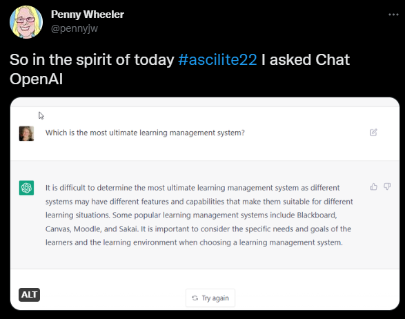

# ASCILITE 2022 - interesting stuff on the socials

## Dashboards and the tension with learning is hard

@lindaCorrin [shared](https://twitter.com/LindaCorrin/status/1599568004232392705) a question that applies to much of what we do

  

## OpanAI's advice on the best LMS

@pennyjw [shared](https://twitter.com/pennyjw/status/1599726226842996736)

But if diversity and rapid change is key parts of the needs and goals of the learners and the learning environment - how can you choose in a one off? 

  