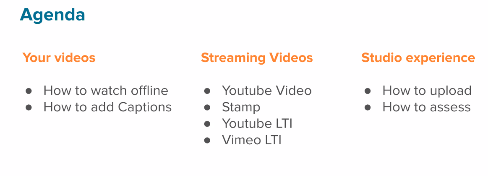
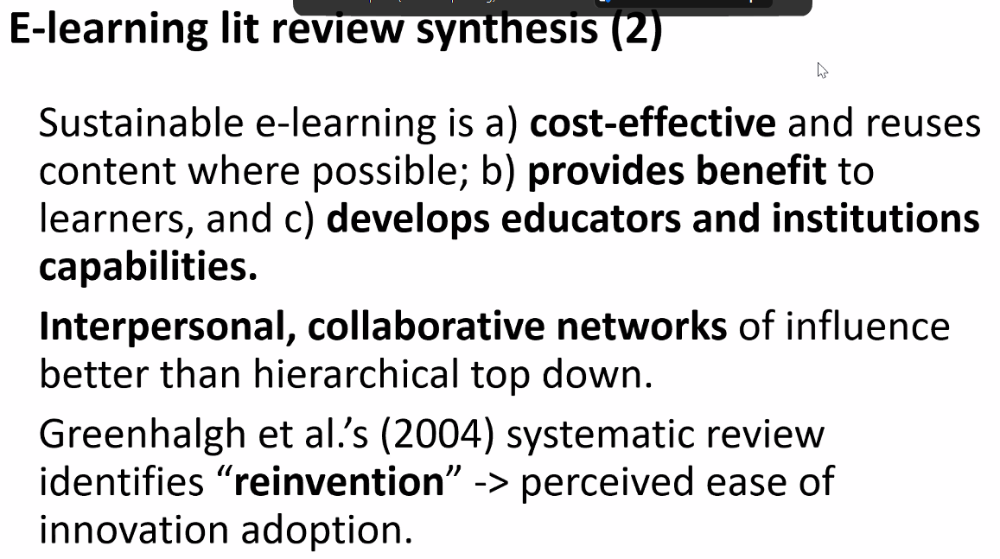

# Teaching with video in Canvas

## Uploading/embedding with RCE

- Uploaded to "content collection". Simple RCE mechanism for embedding, including way to associated SRT/VTT files.
- embed codes also work

**NOTE:** Again a focus on individual user constructing stuff interactively

## Studio

- Individual users have their own studio library - no-one else can see them

### Apparent features

- Lots of stats type stuff and other functionality around video
- Also a h5p like ability to add interactive elements to the video
  - Look more like the abilty to add comments, including students adding comments

#######################################

# Bearman Cradle seminar

Sustainability in teaching and learning innovations

Personal Questions

- What are the barriers to sustainability of L&T innovations
- What makes such sustainable
- Bigum would have a field day

## Sustainable innovation
## Conceptualisations of sustainability

QWERTY keyboard mentioned as a sustainable innovation. Even though perhaps not optimum. An example of sustainability gone on from too long. Though apparently original testers were telegraph operators.

Pointing to attachements/assemblages/black boxing make things sustainable. Telegraph operators practice is being embedded in the QWERTY keyboard.

Sustainable innovation focuses on what comes after change management

Zehetmeier 2014 
- phase models
- process based models (not zehetmeir)
- recursive and reflexibe models

## Lit review

Lit review 2810 -> 14 inclusions

Greenhalg et al 2014 - reinvention important - assembling into personal technology