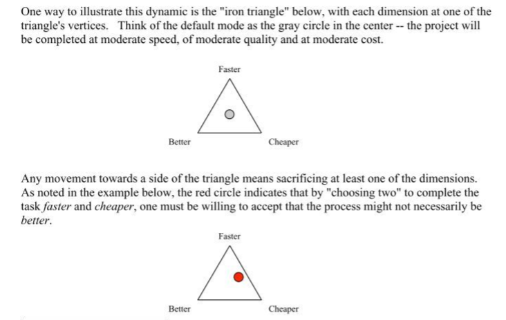

# Iron Triangle

[[iron-triangle-reusability-paradox]]

## Visualisation

Adapted from [Chun nd](https://www.yumpu.com/en/document/read/11738175/faster-better-cheaper-the-iron-triangle-of-higher-education-cae)

## Old engineer's saying

Quote from Norman (1998) - [chapter 10](https://www.nngroup.com/articles-want-human-centered-development-reorganize/)
> What do you want for your product? Good quality? Inexpensive? Quick to get to the market?  Good, cheap, quick: pick any two. 
## Definition

Where three constraints are used to identify project success. The three constraints form the vertices that form a triangle. The triangle represents that attempting to move one of the constraints (e.g. improving quality) will require the other two points to change (e.g. cost will increase)

> For example, since quality can be most easily achieved with small to moderate student-to-staff ratios, it is difficult to increase scale without either reducing quality or increasing costs. This concept has been referred to as the Iron Triangle (also known as the triple constraint) (Daniel, Kanwar, and Uvalić-Trumbić 2009; Immerwahr, Johnson, and Gasbarra 2008). The logic of the Iron Triangle implies that the three triangle vertices of access, cost and quality are locked in an unbreakable relationship, such that making changes to one or two of the vertices will inevitably have an impact on the third. (Ryan et al, 2021, p. 1384)

The Iron Triangle used by Ryan et al is Daniel's version. Comfing from DE: access, quality, and cost. And it relies on the constraints being vectors, not points
> In light of these trends, we view Daniel’s iron-triangle framework as dated and fundamentally unworkable, an industrial solution in a post-industrial period (Power and Morven-Gould, 2011)

> The concept of the Iron Triangle, also sometimes referred to as the Triple Constraint, or the Project Management Triangle, is a fundamental aspect of how we understand success in projects. The Iron Triangle is a representation of the most basic criteria by which project success is measured, namely, whether the project is delivered by the due date, within budget, and to some agreed level of quality, performance or scope. The Iron Triangle has become the standard for routinely assessing project performance (Pinto, 2010, p. 35). -- Pollack 2018

> sometimes expressed as "good, fast, or cheap - pick two" (van Wyngaard et al, 2021) -- Pollack 2018

## Beyond the Iron Triangle: improving the quality of teching and learning at scale

Ryan, T., French, S., & Kennedy, G. (2021). Beyond the Iron Triangle: Improving the quality of teaching and learning at scale. Studies in Higher Education, 46(7), 1383–1394. https://doi.org/10.1080/03075079.2019.1679763

**Important** they fall to the promise of AI and smart tools as a promise of offloading administrative and technical support, rather than having "infrastructure" in place to do this

- Examine tensions between mutually conflicting concepts of **access, cost and quality**
- Highlights key strategies that can enhance quality without dramatically inflating costs

_Question_: Why access? Why not scope? Esp. WRT COVID requiring much greater variety in what is required, especially given student calls to have everything?

> A key issue for contemporary higher education, therefore, revolves around the need to maintain the quality of teaching, learning and assessment while teaching at scale.

Four main challenges to quality teaching, learning and assessment 
- The prevalence of poorly designed and delivered lectures
- Impersonal learning experiences
- Impoverished feedback practices
- Reduced student engagement

Six key practical and pedagogical strategies to address those challenges
- High-quality large group teaching and learning
- Alternative curriculum structures
- Automation of assessment and feedback
- Personalising feedback at scale
- Peer-based learning
- Offloading administrative and technical support
- 

## The Iron Triangle Revisited

(Weerts & Sorenson, 2021)
- the iron triangle represents a zero-sum approach to the pursuit of quality, access, affordability
- "differing views of quality constitutes a core tension within the iron triangle....Uneven expectations or views about quality put (..stakeholders...) in tension with another" (p. 95)

    The idea that the "purpose" you see for an assemblage will influence what you see as quality. They give examples of teaching/research and how many academics are "waived" from teaching. And they go onto to illustrate how this leads to a culture of blame shifting that fuels debates between different stakeholders.

- "Multiple strategies are being pursued simultaneously to manage these tensions within the iron triangle" (p. 98)

    At policy, campus etc. levels...e.g. open text-books

## References

Power, T. M., & Morven-Gould, A. (2011). Head of gold, feet of clay: The online learning paradox. The International Review of Research in Open and Distributed Learning, 12(2), 19–39. https://doi.org/10.19173/irrodl.v12i2.916

Pollack, J., Helm, J., & Adler, D. (2018). What is the Iron Triangle, and how has it changed? International Journal of Managing Projects in Business, 11(2), 527–547. https://doi.org/10.1108/IJMPB-09-2017-0107

Weerts, D. J., & Sorenson, N. (2021). The Iron Triangle Revisited: Re-Envisioning Public Research University Financing. In A. Furco, R. H. Bruininks, R. J. Jones, & K. Kent, *Re-Envisioning the Public Research University* (1st ed., pp. 93--111). Routledge. <https://doi.org/10.4324/9781315110523-7>

[//begin]: # "Autogenerated link references for markdown compatibility"
[iron-triangle-reusability-paradox]: iron-triangle-reusability-paradox "Links between Iron Triangle and the Reusability Paradox"
[//end]: # "Autogenerated link references"