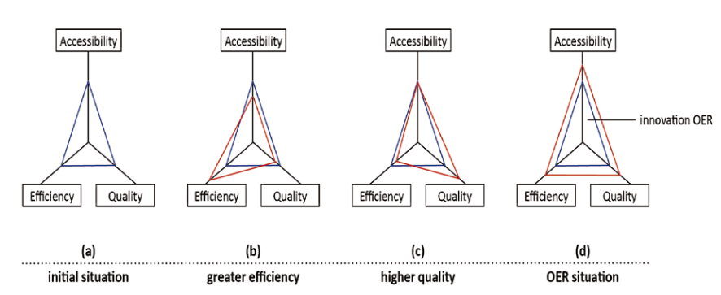

# Iron Triangle

There are two orgins for the iron triangle concept. The broader orgin is project management - scope, cost, and speed. The narrower, more specific is that proposed by Daniels et al - access, quality, cost.  Or latterly accessibility, quality, efficiency which gets at "widening access to higher education for the same or lower cost without compromising outcomes" (Lane, 2014, p. 2)

[[iron-triangle-reusability-paradox]]

## Visualisation

Adapted from [Chun nd](https://www.yumpu.com/en/document/read/11738175/faster-better-cheaper-the-iron-triangle-of-higher-education-cae)

## Old engineer's saying

Quote from Norman (1998) - [chapter 10](https://www.nngroup.com/articles-want-human-centered-development-reorganize/)
> What do you want for your product? Good quality? Inexpensive? Quick to get to the market?  Good, cheap, quick: pick any two. 

## Definition

Where three constraints are used to identify project success. The three constraints form the vertices that form a triangle. The triangle represents that attempting to move one of the constraints (e.g. improving quality) will require the other two points to change (e.g. cost will increase)

> For example, since quality can be most easily achieved with small to moderate student-to-staff ratios, it is difficult to increase scale without either reducing quality or increasing costs. This concept has been referred to as the Iron Triangle (also known as the triple constraint) (Daniel, Kanwar, and Uvalić-Trumbić 2009; Immerwahr, Johnson, and Gasbarra 2008). The logic of the Iron Triangle implies that the three triangle vertices of access, cost and quality are locked in an unbreakable relationship, such that making changes to one or two of the vertices will inevitably have an impact on the third. (Ryan et al, 2021, p. 1384)

The Iron Triangle used by Ryan et al is Daniel's version. Comfing from DE: access, quality, and cost. And it relies on the constraints being vectors, not points
> In light of these trends, we view Daniel’s iron-triangle framework as dated and fundamentally unworkable, an industrial solution in a post-industrial period (Power and Morven-Gould, 2011)

> The concept of the Iron Triangle, also sometimes referred to as the Triple Constraint, or the Project Management Triangle, is a fundamental aspect of how we understand success in projects. The Iron Triangle is a representation of the most basic criteria by which project success is measured, namely, whether the project is delivered by the due date, within budget, and to some agreed level of quality, performance or scope. The Iron Triangle has become the standard for routinely assessing project performance (Pinto, 2010, p. 35). -- Pollack 2018

> sometimes expressed as "good, fast, or cheap - pick two" (van Wyngaard et al, 2021) -- Pollack 2018

## Beyond the Iron Triangle: improving the quality of teching and learning at scale

Ryan, T., French, S., & Kennedy, G. (2021). Beyond the Iron Triangle: Improving the quality of teaching and learning at scale. Studies in Higher Education, 46(7), 1383–1394. https://doi.org/10.1080/03075079.2019.1679763

### Notes

Massification is an issue. Briefly analyses factors behind massification in Oz higher education before using the iron triangle to examine the tensions of access, cost and quality. Identifies four main challenges to quality L&T and assessment. Provide 6 practical strategies to help.

Their focus is on the coal face teaching. Not so much (so far) on how this is supported orgnisationally?

**Important** They are quite a bit "hand wavy" when it comes to the claims that "these techniques all address the triple constraint of the Iron Triangle as, in addition to improving quality, they can all be instituted at scale without significant ongoing increases in cost" (p. 1391).  Most of these approaches have been used to varying extents already. However, their use at scale has not been successfully used in any institution.  They've not implemented them at scale into the entanglement of institutional educational technology.

- Examine tensions between mutually conflicting concepts of **access, cost and quality**
- Highlights key strategies that can enhance quality without dramatically inflating costs

_Question_: Why access? Why not scope? Esp. WRT COVID requiring much greater variety in what is required, especially given student calls to have everything? -- this is because of the existence of two iron triangles

> A key issue for contemporary higher education, therefore, revolves around the need to maintain the quality of teaching, learning and assessment while teaching at scale.

Four main challenges to quality teaching, learning and assessment 
- The prevalence of poorly designed and delivered lectures

    Assumes that lectures will continue to exist and thus need to be improved

- Impersonal learning experiences

    Links issues with with the "one-size-fits-all" strategy which Arvanitakis (2014) suggests leads to disengaged high-achieving students and left behind struggling students

    The solution here is that there are scaleable ways for teachers to "gauge individual student understanding, and support students who are most in need" (p. 1386)

- Impoverished feedback practices

    Highlights the "reusabilty paradox" problem.  Difficult to do individual/contextual knowledge to give good feedback at scale, marking at scale sacrifices contextual knowledge

- Reduced student engagement

Six key practical and pedagogical strategies to address those challenges
- High-quality large group teaching and learning
    - pedagogical techniques: narrative and story telling, rhetorical questions, real-life case studies, involving students in dialogue and problem solving....
    - varied learnign activities: multiple-choice quizes, facilitated note-taking, short-writing tasks, small gruop discsusession
    - varying styles of presntation: video clips, interactive technologies etc.
- Alternative curriculum structures

    Accellerated, compressed, block modes.  **fails to recognise that this diversity within an entangled institution is not going to save money - actually introduces issues with scaling - e.g. GFS experience**

- Automation of assessment and feedback

    Student response systems, automated tutors, virtual surgey techniques, automated mapping of assessment. Some of these are expensive.

    Automated writing evaluation tools.

- Personalising feedback at scale

    Digital recordings, learning analytics, **but forgets that Pardo's OnTask prep required a lot of work and pre-planning which then required maintenance. OnTask helps with this, but it does move some of the cost. It's also an example of using specialised software to automate orchestration**

- Peer-based learning
- Offloading administrative and technical support

## The Iron Triangle Revisited

(Weerts & Sorenson, 2021)
- the iron triangle represents a zero-sum approach to the pursuit of quality, access, affordability
- "differing views of quality constitutes a core tension within the iron triangle....Uneven expectations or views about quality put (..stakeholders...) in tension with another" (p. 95)

    The idea that the "purpose" you see for an assemblage will influence what you see as quality. They give examples of teaching/research and how many academics are "waived" from teaching. And they go onto to illustrate how this leads to a culture of blame shifting that fuels debates between different stakeholders.

- "Multiple strategies are being pursued simultaneously to manage these tensions within the iron triangle" (p. 98)

    At policy, campus etc. levels...e.g. open text-books

## Breaking Higher Education's Iron Triangle

Introduces the iron triangle as being linked to particular models of university education. Starting with student community and lecture bazaar models. The nature of these models establish fixed values for the vectors that make up the iron triangle (access, quality, cost).

The ultimate aim is a model that is
> readily scalable (wide access), academically credible (high quality) and affordable (low cost). (p. 34)

Their solution is 
> building higher education networks around credible examination systems run by national or independent bodies or established institutions and then encouraging a market of support providers to aid in development

Essentially unbundling the assessment function.

### Introduction 

Daniel et al (2009)

- starts with detailed look in participation growth in higher education globally
- links to problems governments face in paying for this using traditional modes of delivery

> The question, then, is not whether developing countries should try to expand their higher education systems, taking advantage of Western partnerships, but how they can do so rapidly and with reasonable quality (p. 32)

- private providers are seen as one solution "open and distance learning and eLearning" seen as the other

### Defining the iron triangle

> The ambition of ministers of education in developing countries is to provide wide access to high-quality higher education at a low cost. Making a triangle from the three vectors of access, quality, and cost gives us a simple way of representing different models of higher education. (p. 32)

> The iron triangle—the assumption that quality, exclusivity, and expense necessarily go together—has been the bugbear of education. (p. 33)

How to define the vectors
- access - student numbers
- cost - per capita costs
- quality - (seen as harder) apparently defined by the model

Starts on the origins of universities and different models
- Oxford/Cambridge more about peer education with limited explicit teaching (student communit)
- London University introduced lectures - a change slammed by Coleridge as "lecture bazaars under the absurd name of universities" (lecture bazaar)
- University of London introduced external studies in 1858
k
Student community model values the quality of the student. Argues the lecture bazaar model is expenditure per student.

The iron triangle is then defined as an inability to move the vectors when using particular models of the university

- Community model - no economies of scale, locking in the vectors
- lecture bazaar model 
    - "impossible to change the vector on one side without ill effects on either or both of the others"
    - more students increases access but will lower quality (defined as faculty-student interaction), unless increase cost by hiring more staff
    - improve quality will usually restrict access and raise costs

Identifies that a problem with the above is associating quality with cost of the quality of inputs.  "capability and reliability" rather than "exclusivity and cost". 

### Quality and standards and alternatives

> Quality assurance, usually done at the institutional level, is generally meant to verify that institutions are fulfilling their declared missions (p. 33)

But concerns about quality assurance has led to a move toward standards

Alternatives mentioned
- examination systems
- support for learning
    - mentions unbundling 

Cites research from Bernard - meta analysis that deterimined increasing student-content interaction had the greatest effect on student performance over student-student and student-teacher interaction.

Bemoans limited work on improving student-content interaction.

## Placing students at the heart of the iron triangle

Summary of Lane (2014)

Cites Mulder (2013) focusing on "accessibility, quality and efficiency" and seeking to maximise each function, rather than minimise.  Mulder also suggests OER as a solution.

## Mulder's (2013) revised model

Three changes
1. modify performance indicators to: accessibility, quality and cost-efficiency - the aim of maximisation
2. Focus on utilisation of OER, rather than just technology
3. a 3-dimensional representation to better fit modellign with 3 performance indicators

  

## References

Daniel, J., Kanwar, A., & Uvalić-Trumbić, S. (2009). Breaking Higher Education's Iron Triangle: Access, Cost, and Quality. *Change: The Magazine of Higher Learning*, *41*(2), 30--35\. <https://doi.org/10.3200/CHNG.41.2.30-35>

Lane, A. (2014). Placing students at the heart of the iron triangle and the interaction equivalence theorem models. *Journal of Interactive Media in Education*, *2014*(2), Article 2\. <http://oro.open.ac.uk/41809/>

Mulder, F. (2013). The LOGIC of National Policies and Strategies for Open Educational Resources. *International Review of Research in Open and Distributed Learning*, *14*(2), 96--105\. <https://doi.org/10.19173/irrodl.v14i2.1536>

Power, T. M., & Morven-Gould, A. (2011). Head of gold, feet of clay: The online learning paradox. The International Review of Research in Open and Distributed Learning, 12(2), 19–39. https://doi.org/10.19173/irrodl.v12i2.916

Pollack, J., Helm, J., & Adler, D. (2018). What is the Iron Triangle, and how has it changed? International Journal of Managing Projects in Business, 11(2), 527–547. https://doi.org/10.1108/IJMPB-09-2017-0107

Weerts, D. J., & Sorenson, N. (2021). The Iron Triangle Revisited: Re-Envisioning Public Research University Financing. In A. Furco, R. H. Bruininks, R. J. Jones, & K. Kent, *Re-Envisioning the Public Research University* (1st ed., pp. 93--111). Routledge. <https://doi.org/10.4324/9781315110523-7>

[//begin]: # "Autogenerated link references for markdown compatibility"
[iron-triangle-reusability-paradox]: iron-triangle-reusability-paradox "Links between Iron Triangle and the Reusability Paradox"
[//end]: # "Autogenerated link references"