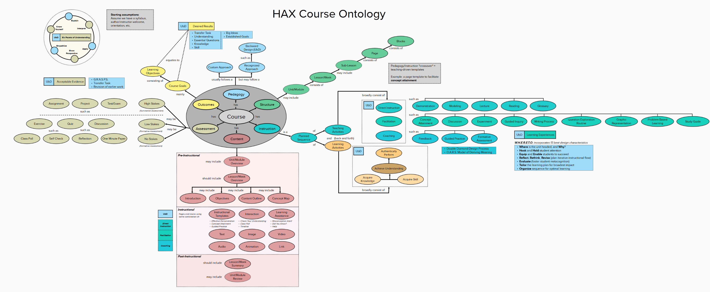

<!--
 Copyright (C) 2023 David Jones
 
 This file is part of memex.
 
 memex is free software: you can redistribute it and/or modify
 it under the terms of the GNU General Public License as published by
 the Free Software Foundation, either version 3 of the License, or
 (at your option) any later version.
 
 memex is distributed in the hope that it will be useful,
 but WITHOUT ANY WARRANTY; without even the implied warranty of
 MERCHANTABILITY or FITNESS FOR A PARTICULAR PURPOSE.  See the
 GNU General Public License for more details.
 
 You should have received a copy of the GNU General Public License
 along with memex.  If not, see <http://www.gnu.org/licenses/>.
-->

# Learning Design Ontologies 

See also: [[learning]], [[design]], [[teaching-as-design-science]]

## Overview 

Deep ppproaches to learning design typically end up creating an "ontology" of learning design. 

## HAX Course Ontology 

[//begin]: # "Autogenerated link references for markdown compatibility"
[learning]: ../Learning/learning "Learning"
[design]: design "Design"
[teaching-as-design-science]: ../Teaching/teaching-as-design-science "Teaching as design science"
[//end]: # "Autogenerated link references"