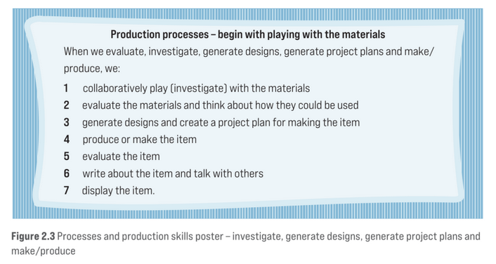

<!--
 Copyright (C) 2023 David Jones
 
 This file is part of memex.
 
 memex is free software: you can redistribute it and/or modify
 it under the terms of the GNU General Public License as published by
 the Free Software Foundation, either version 3 of the License, or
 (at your option) any later version.
 
 memex is distributed in the hope that it will be useful,
 but WITHOUT ANY WARRANTY; without even the implied warranty of
 MERCHANTABILITY or FITNESS FOR A PARTICULAR PURPOSE.  See the
 GNU General Public License for more details.
 
 You should have received a copy of the GNU General Public License
 along with memex.  If not, see <http://www.gnu.org/licenses/>.
-->

# Pedagogy before technology 

See also: [[design]], [[entangled-pedagogy]]

Numerous authors (Ascough, 2002; Leijen et al, 2008; Glover et al, 2016; Cowling & Birt, 2018; Sankey et al, 2020) suggest that thinking of the "pedagogy before the technology" is a good approach to designing learning and teaching experiences.

aka 

- Put the pedagogy horse before the technology cart 
- pedagogy is the driver and technology is the accelerator (Tsui and Tavares, 2021)

# Challenges

Other work challenges this idea (Dron, 2012; Tsui & Tavares, 2021; Fawns, 2022).

## Play with your materials

The following is from a book (Fleer, 2023) intended to help school teachers teaching the Technologies learning area from the Oz curriculum. It is a poster a teacher had on her wall explaining a production processes used in her class.

The first step in this process is to "collaboratively play (investigate) with the materials". I take this as playing with a technology to understand its affordances and constraints. If you design without having such an understanding your ultimate design will be constrained.

## References

Ascough, R. S. (2002). Designing for Online Distance Education: Putting Pedagogy Before Technology. *Teaching Theology & Religion*, *5*(1), 17--29. <https://doi.org/10.1111/1467-9647.00114>

Cowling, M., & Birt, J. (2018). Pedagogy before Technology: A Design-Based Research Approach to Enhancing Skills Development in Paramedic Science Using Mixed Reality. *Information*, *9*(2), 29. <https://doi.org/10.3390/info9020029>

Dron, J. (2012). *The pedagogical-technological divide and the elephant in the room*. *11*(1), 23--38. <https://www.learntechlib.org/primary/p/33288/>

Fleer, M. (2023). *Technologies for Children*. Cambridge University Press.

Glover, I., Hepplestone, S., Parkin, H. J., Rodger, H., & Irwin, B. (2016). Pedagogy first: Realising technology enhanced learning by focusing on teaching practice. *British Journal of Educational Technology*, *47*(5), 993--1002. <https://doi.org/10.1111/bjet.12425>

Leijen, Ä., Admiraal, W. F., Wildschut, L., & Robert-Jan Simons, P. (2008). Pedagogy before technology: What should an ICT intervention facilitate in practical dance classes? *Teaching in Higher Education*, *13*(2), 219--231. <https://doi.org/10.1080/13562510801923351>

Sankey, M., Zhang, Y., & Xiao, J. (2020). Putting the pedagogic horse in front of the technology cart. *Journal of Distance Education in China*, *5*, 46-53+77.

Tsui, A. B. M., & Tavares, N. J. (2021). The Technology Cart and the Pedagogy Horse in Online Teaching. *English Teaching & Learning*, *45*(1), 109--118. <https://doi.org/10.1007/s42321-020-00073-z>

Watson, D. M. (2001). Pedagogy before Technology: Re-thinking the Relationship between ICT and Teaching. *Education and Information Technologies*, *6*(4), 251--266. <https://doi.org/10.1023/A:1012976702296>

[//begin]: # "Autogenerated link references for markdown compatibility"
[design]: design "Design"
[entangled-pedagogy]: ../Distribution/entangled-pedagogy "Entangled Pedagogy"
[//end]: # "Autogenerated link references"