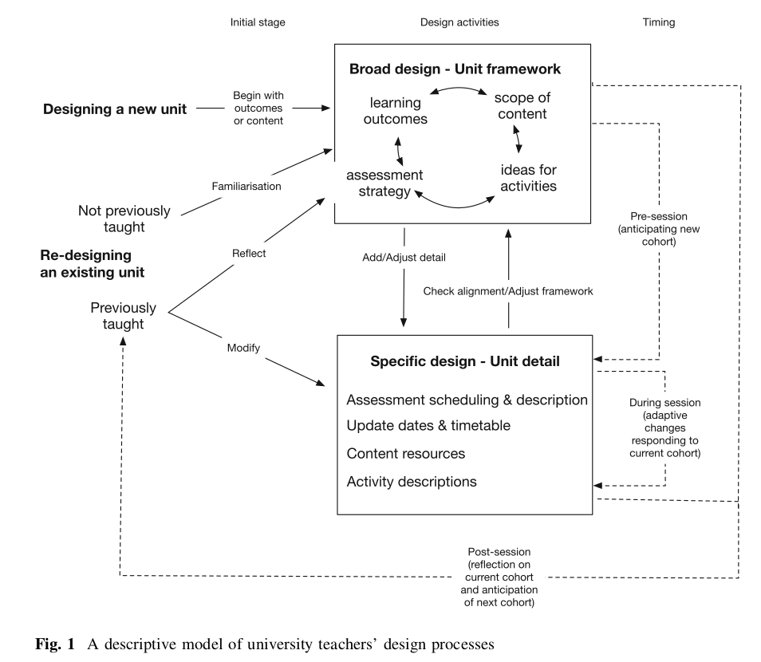

# Understanding University Teachers Design Work

Bennett, S., Agostinho, S., & Lockyer, L. (2017). [The process of designing for learning: Understanding university teachers' design work.](https://drive.google.com/file/d/1LS_2Yrr2dDIl4qCGXM75KXyUrebiYLKg/view?usp=sharing) *Educational Technology Research & Development*, *65*(1), 125--145\. <https://doi.org/10.1007/s11423-016-9469-y>

## Summary

Collection of experienced teachers are interviewed to extract a descriptive model (see below) of how teachers go about designing student learning experiences (courses). Major points highlighted in section headings in the *results* section, include:

- The starting point depended on the nature of the design problem
- Design moved from broad considerations to specific detail
- Design occurred before, during, and after a unit's implementation

*A descriptive model of university teacher's design processes (adapted from Bennett et. al., 2017)*

### Thoughts

#### Fit with current practice: "curriculum" design and "learning" design...but!

Resonates with existing institutional practice with the course profile somewhat filling the *broad design* activity and with delivery prep more focused on *specific design*.  

Though it's not a 100% neat fit. The question of where to draw the line.

Importantly, "specific design" involves an iterative process of "continuously reflecting on both their broad and specific design decisions to ensure that all unit components aligned".

**Questions** How well do existing institutional systems support an iterative process?

#### Starting point dependent on nature of the design problem

One of they key observations is that there are two broad, but very different, starting points

1. Design of a new unit; and,
2. Redesign of an existing unit. (e.g. significant changes in content topics or changes in delivery mechanism, but typically not involving changes in learning outcomes) 

The first is typically what instructional designers assume they are doing. But a fair bit of what we're doing is more the second point.

**Questions** How well do existing institutional systems support this distinction?

#### Forward oriented design

Participants describe a design process extending over multiple offerings (whilst they remain involved with a course) "rather than being a more tightly defined 'project'" 

**Questions** How do you support design beyond projects? How do you encourage/support on-going reflection and re-design? i.e. how do you support a forward oriented design approach.

#### Shortage of relevant practical and conceptual supports for teacher design

Early on suggests that building design capacity of teachers "is critical" (citing Goodyear). Findings said to support similar findings from other others (Mor and Craft, 2012; Goodear, 2015) that there is an absence of support.

Argue that such supports "are more likely to be adopted if they first seek to connect with teachers' existing practices". i.e. meet immediate needs, address familiar problems to encourage adoption and from there "seek to enhance and extend teachers' design practice".

## Extracted Annotations (1/26/2021, 8:22:37 AM)

> The results show design as a top-down iterative process, beginning with a broad framework to which detail is added through cycles of elaboration" ([Bennett et al 2017:125](zotero://open-pdf/library/items/5SU24DWK?page=1))

*What do these findings have to say about how an institutional eco system should support teacher engagement with design

What does this say about the limitations of a traditional "design team" approach to creating a course when they don't build in any support for what teachers do.

Pointing to a need for Joyce/Tim's work to take a more forward-oriented approach. Also highlighting a possible research opportunity to evaluate/explore what is happening to courses that Joyce's team produces after implementation.

Also questions the implication of our sourcing the tutorail work and how those part time tutors feedback into the evolution of a course.

Also points to the limitations of this type of research, exploring what is currently done and thus what is reveal is dependent on how things are currently done, not necessarily how they should be done. ([note on p.125](zotero://open-pdf/library/items/5SU24DWK?page=1))*

> Design extends over the period before, while, and after a unit is taught, demonstrating the dynamic nature of design and highlighting the importance of reflection in teachers' design practice." ([Bennett et al 2017:125](zotero://open-pdf/library/items/5SU24DWK?page=1))

> We argue that tools to support teachers' design work are more likely to be adopted if they first seek to connect with teachers' existing practices" ([Bennett et al 2017:126](zotero://open-pdf/library/items/5SU24DWK?page=2))

> Such a strategy would complement the existing types of initiatives universities already adopt to enhance the quality of teaching, such as employing instructional designers, providing professional development and developing institutional policies and procedures." ([Bennett et al 2017:126](zotero://open-pdf/library/items/5SU24DWK?page=2))

> This reasoning follows similar arguments that technologies that align well with immediate need and address familiar problems are more likely to be adopted (e.g., Ertmer 2005). Once adopted, technologies can seek to enhance and extend teachers' design practice." ([Bennett et al 2017:126](zotero://open-pdf/library/items/5SU24DWK?page=2))

> This research highlights the key role teachers have in influencing student outcomes through their design of learning experiences." ([Bennett et al 2017:127](zotero://open-pdf/library/items/5SU24DWK?page=3))

*The provision of a tools and an institutional ecosystem that values, enables and supports teacher engagement and reflection with teaching as design for learning would arguably provide better contextual factors encouraging better practice.

Especially if it were done in a convivial way in which all those involved were able to contribute (more on convival coudl fit here) ([note on p.127](zotero://open-pdf/library/items/5SU24DWK?page=3))*

> unit design is often an individual responsibility, even in environments where there is collegial planning at a program level (Bennett et al. 2011)" ([Bennett et al 2017:127](zotero://open-pdf/library/items/5SU24DWK?page=3))

> All three studies provided insights into how colleagues are a source of ideas through informal discussions" ([Bennett et al 2017:127](zotero://open-pdf/library/items/5SU24DWK?page=3))

*Raising questions about how this can be supported and encouraged in any type of system. How does the ecosystem supporting design for learning become convivial? ([note on p.127](zotero://open-pdf/library/items/5SU24DWK?page=3))*

> The differences between the work of an instructional designer and a teacher raise questions about how directly relevant this research is (McKenney et al. 2015a, b)." ([Bennett et al 2017:128](zotero://open-pdf/library/items/5SU24DWK?page=4))

> resage factors encompass the context set by the teaching and institution, including characteristics of the teacher and the course. These factors influence the teaching experience facilitated by the teacher and experienced by the student, and lead to the outcomes for both learner and teacher." ([Bennett et al 2017:128](zotero://open-pdf/library/items/5SU24DWK?page=4))

> The conceptual framing highlights teaching (and therefore teacher design) as a complex, situated practice." ([Bennett et al 2017:129](zotero://open-pdf/library/items/5SU24DWK?page=5))

> These changes have brought significant pressure on educators to adopt new and innovative educational approaches within a relatively short time. Designsupport services exist centrally or within the faculties of all Australian universities, but these are limited resources for which there is strong demand, leaving many university teachers to rely on their own skills" ([Bennett et al 2017:133](zotero://open-pdf/library/items/5SU24DWK?page=9))

> Two distinct starting points emerged from descriptions of designing a new unit, while the starting points for redesigning were more varied." ([Bennett et al 2017:133](zotero://open-pdf/library/items/5SU24DWK?page=9))

> The situation was quite different when redesigning an existing unit." ([Bennett et al 2017:134](zotero://open-pdf/library/items/5SU24DWK?page=10))

*This is more what we do. There has been some identified need to do a redesign. Which is different from going back to first principles. The difference typically comes with a different purpose. ([note on p.134](zotero://open-pdf/library/items/5SU24DWK?page=10))*

> Overall, five key reasons surfaced for redesigning: addressing feedback from students and colleagues (12 participants); updating the content covered in a unit (10 participants); making changes to perceived problems identified during teaching the unit (8 participants); changing the way a unit is delivered to include online components (6 participants); and staff changes such as taking over from someone who had left (4 participants)." ([Bennett et al 2017:134](zotero://open-pdf/library/items/5SU24DWK?page=10))

> The accounts provided by our participants suggest that design and redesign processes begin differently. When designing a new unit, participants began by focusing on either learning outcomes or content area, whereas when redesigning an existing unit, the starting point depended on the specific modifications required." ([Bennett et al 2017:135](zotero://open-pdf/library/items/5SU24DWK?page=11))

> Participants explained that in the early stages of the design process they needed to create or understand the unit's overarching framework." ([Bennett et al 2017:135](zotero://open-pdf/library/items/5SU24DWK?page=11))

*Pointing to the value provided by the ABC Learning Design type overview. But perhaps also raising questions about how well existing practice provides this over-arching framework at the start?

Is part of the problem with L&T that all we have typically is a list of topics, lecture slides, tute sheets and assessment tasks? ([note on p.135](zotero://open-pdf/library/items/5SU24DWK?page=11))*

> Only when this framework was established did they turn their attention to the specifics of the unit" ([Bennett et al 2017:135](zotero://open-pdf/library/items/5SU24DWK?page=11))

> After the overarching unit framework had been established, attention turned to designing the specifics of the unit, such as selecting readings, creating content resources, developing specific learning activities to include in classes, and determining the timing and requirements of assessment tasks." ([Bennett et al 2017:136](zotero://open-pdf/library/items/5SU24DWK?page=12))

> Working iteratively was important for achieving this alignment, but the processes described did not involve a systematic or linear sequence." ([Bennett et al 2017:136](zotero://open-pdf/library/items/5SU24DWK?page=12))

> Instead, participants typically described working on whatever aspects of the design they deemed to be a priority at the time, while also checking new details against what they had already specified" ([Bennett et al 2017:136](zotero://open-pdf/library/items/5SU24DWK?page=12))

> When participants had not taught the unit before, they undertook a process of familiarization to better understand the existing unit's structure and determine whether its existing design aligned with their teaching style and content expertise." ([Bennett et al 2017:136](zotero://open-pdf/library/items/5SU24DWK?page=12))

*Raising interesting points about how this works in the increasingly non-traditional/casualised approach to teaching.

e.g. the distinction between a permanent member of staff who serves as the nominal course convenor, but doesn't teach at all. Instead, that's a task taken on by one or more casuals. ([note on p.137](zotero://open-pdf/library/items/5SU24DWK?page=13))*

> When participants redesigned an existing unit that they had taught before, their redesign considerations mainly focused on the specific aspects of the unit they wanted to modify or improve, such as updating the scope of content, making modifications to address student feedback, making changes to issues identified during implementation, and making changes to how the unit would be delivered, such as incorporating online components" ([Bennett et al 2017:137](zotero://open-pdf/library/items/5SU24DWK?page=13))

> articipants explained this as a process of trying to achieve alignment among the outcomes, content, activities, and assessment, supported by their overall framework and driven by a desire to improve the unit's design." ([Bennett et al 2017:137](zotero://open-pdf/library/items/5SU24DWK?page=13))

> For our participants, design was an iterative process that occurs before, during, and after a unit's implementation." ([Bennett et al 2017:137](zotero://open-pdf/library/items/5SU24DWK?page=13))

> The design process continued after the start of the teaching session, with participants engaged in designing the specific modules, weekly materials, or class and online activities. Many of these smaller components were planned for, but not fully prepared before the teaching session." ([Bennett et al 2017:137](zotero://open-pdf/library/items/5SU24DWK?page=13))

> Even after the end of the teaching session, more than half of the participants described reflecting on how the unit could be improved for its next iteration." ([Bennett et al 2017:137](zotero://open-pdf/library/items/5SU24DWK?page=13))

> The participants' accounts suggest that unit design can extend over multiple offerings, rather than being a more tightly defined "project"" ([Bennett et al 2017:138](zotero://open-pdf/library/items/5SU24DWK?page=14))

> Like Stark (2000), we identified a non-systematic cyclic design process in the accounts of our participants and variation in the steps taken depending on whether they were designing a new unit or revising an existing unit." ([Bennett et al 2017:139](zotero://open-pdf/library/items/5SU24DWK?page=15))

> A noteworthy absence in the data is any reference to the use of models or frameworks to guide the design process." ([Bennett et al 2017:140](zotero://open-pdf/library/items/5SU24DWK?page=16))

> Put simply, regardless of whether participants described beginning with a learning-outcome or content-area focus, their subsequent processes followed a similar top-down process" ([Bennett et al 2017:140](zotero://open-pdf/library/items/5SU24DWK?page=16))

> It is important to emphasize that the model we have outlined above is descriptive rather than prescriptive." ([Bennett et al 2017:140](zotero://open-pdf/library/items/5SU24DWK?page=16))

> Although this study helps to understand what teachers currently do, with the intention of informing future support strategies," ([Bennett et al 2017:141](zotero://open-pdf/library/items/5SU24DWK?page=17))

> Although some of our participants mentioned making notes during their design process, none referred to using systematic representations to document their designs." ([Bennett et al 2017:141](zotero://open-pdf/library/items/5SU24DWK?page=17))

> Findings from design studies suggest that design is an iterative endeavor, characterized by an evolving understanding of the problem and its context, drawing on precedent and experience to develop an appropriate solution, subject to constraints on resources (Cross 2006; Goldschmidt 1998)." ([Bennett et al 2017:141](zotero://open-pdf/library/items/5SU24DWK?page=17))

*Highlighting a possible hole which something like the ABC learning approach might help with, especially when integrated with something like a components based content interface.

And then also figure out how to encourage the adoption of useful conceptual models into this practice (e.g. Kolb's, Laurliard's conversation theory etc). ([note on p.141](zotero://open-pdf/library/items/5SU24DWK?page=17))*

*Point to the difference between instructional designers and teachers. Can the ABC learnign design be adapted to support the approach used by teachers?

In the following they point to related need for this type of work

- "support the contention that there is a shortage of relevant practical and conceptaul tools to support teacher design"
- "supports must be voluntarily adopted by teachers, rather than mandated"
- "and adaptable to different routines"
- "colleagues...(are)importnt sources of design ideas...,their input might also be harnessed to support the process of design as well"

The idea of a CASA for teacher design and implementation would seem to fit here.

CASA principles

1\. Contextual need within a specific activity
2\. Built using generative technologies
3\. Strategically aligned and supproted
4\. Package appropriate design knowledge to enable reuse by teachers
5\. Forward oriented approach to design for learning
6\. Conceptualised as contextual assemblages

#6 argues against the unviersal solution for everyone. Use higher level existing tools and assemble them together into something that can be used by folk ([note on p.142](zotero://open-pdf/library/items/5SU24DWK?page=18))*

> Previous findings suggest that, while design training may be useful, teachers' design work differs from that of instructional designers such that approaches sensitive to teachers' particular design work may be needed" ([Bennett et al 2017:142](zotero://open-pdf/library/items/5SU24DWK?page=18))

> Our findings support the contention that there is a shortage of relevant practical and conceptual tools to support teacher design (Mor and Craft 2012; Goodyear 2015)" ([Bennett et al 2017:142](zotero://open-pdf/library/items/5SU24DWK?page=18))

> s, teachers do not consciously think of their work as "design", nor do they articulate or conceptualise what they do in design terms." ([Bennett et al 2017:142](zotero://open-pdf/library/items/5SU24DWK?page=18))

> design work that reflect key characteristics of design more generally, but unlike instructional designers, teachers do not consciously think of their work as "design", nor do they articulate or conceptualise what they do in design terms." ([Bennett et al 2017:142](zotero://open-pdf/library/items/5SU24DWK?page=18))

> While exploring actual practice is an important starting point, a further step would be to investigate the effectiveness of particular design processes by collecting data about a design's implementation and the resulting student outcomes" ([Bennett et al 2017:143](zotero://open-pdf/library/items/5SU24DWK?page=19))

*The type of design work I see with a CASA for teacher design would explore suggested options in an iterative approach to explore if this approach works. ([note on p.143](zotero://open-pdf/library/items/5SU24DWK?page=19))*

> It is too soon to suggest how teachers should design, but this must be addressed in the future to ensure that improvements to practice can be realized." ([Bennett et al 2017:143](zotero://open-pdf/library/items/5SU24DWK?page=19))

> These findings suggest that university teachers do undertake design in ways similar to other designers, but important differences were also found. Specifically, the university teachers in this study did not appear to draw on design models to guide their process, nor did they create representations of their designs. If teacher design is to drive innovation in higher education, as has been suggested, appropriate training and supports will be needed and will need to be adopted much more widely." ([Bennett et al 2017:143](zotero://open-pdf/library/items/5SU24DWK?page=19))