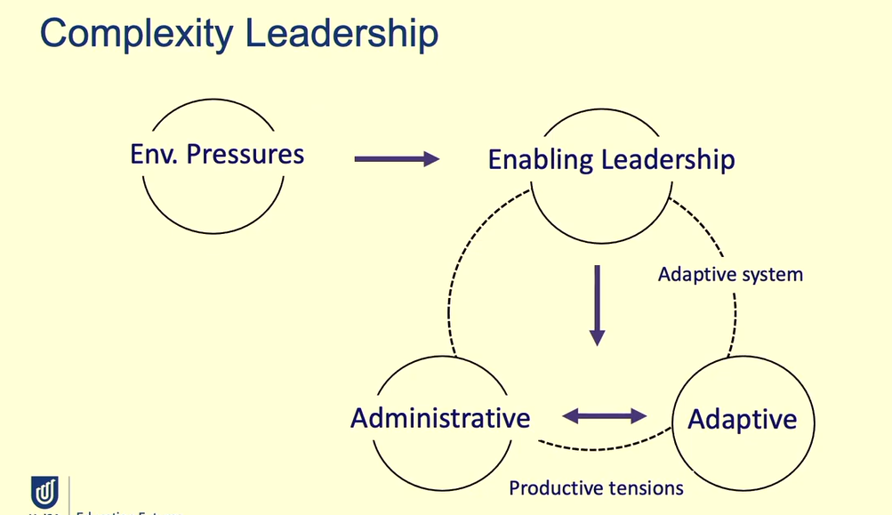

<!--
 Copyright (C) 2023 David Jones
 
 This file is part of memex.
 
 memex is free software: you can redistribute it and/or modify
 it under the terms of the GNU General Public License as published by
 the Free Software Foundation, either version 3 of the License, or
 (at your option) any later version.
 
 memex is distributed in the hope that it will be useful,
 but WITHOUT ANY WARRANTY; without even the implied warranty of
 MERCHANTABILITY or FITNESS FOR A PARTICULAR PURPOSE.  See the
 GNU General Public License for more details.
 
 You should have received a copy of the GNU General Public License
 along with memex.  If not, see <http://www.gnu.org/licenses/>.
-->

# Complexity Leadership 

See also: [[distribution]]

## Shane Dawson 

[Keynote talk](https://www.youtube.com/watch?v=IXetXFk7f9g&t=16s). See also Dawson et al (2018)

> As depicted in Figure 1, when pressure from the surrounding environment is placed upon a system, leadership acts to enable a response by drawing on and balancing interactions that operate in two primary organizational functions – administrative and adaptive (Dawson et al, 2018, p. 239)

Education as a complex system with integrated systems.  There is both administrative and adaptive systems. Administrative doesn't change quickly. Adaptive can. 

Initially, Shane talks about the lever for change being around teaching delivery.  That's where the adaptive space currently is. There are stable bits you can't change assessment, curriculum structures, AQF frameworks, LMS but it doesn't mean you can't work around those systems.

At the same stage, formal leadership under appropriate environmental pressures have to consider/drive changes to the administrative side. He gives the example of COVID changing assessment and teaching delivery.

Suggesting that there are two ways of moving forward for leadership

    Leadership in response to perceived env pressures change those stable systems
    Leadership encourage and enable the adaptive space

#2 is the space where MLPs can operate. Even in a distributed leadership model, MLPs can't change the administrative systems (but more later). But they can encourage, grow, and leverage the adaptive space.

Suggesting a few moves for an MLP or others.  Perhaps these are the spaces where your design theory can work?

    Encourage and leverage the adaptive space as much as possible.
    As Shane would argue (I think) this is space you can work around systems easily. Teaching delivery etc. In this space, it's about being able to orchestrate the loose networks in this space to respond to local needs effectively/efficiently.  But it's also about helping cultivate those loose networks.
    Use assemblages to soften the administrative systems
    One of Dron's observations is that hard technologies can be softened by wrapping them around with different technologies.  There are limits to what you can do effeciently/effectively but it can be done.

The distinction between these two spaces is made much more complex due to the fractal nature of complex systems (I think). This confuses things because depending on what level you are viewing the system you will see different types of administrative/adaptive systems.  Perhaps something your design theory should help orient people to?

In different specific institutions the possibilities in these two spaces will vary widely. Due to leadership, rampant IT division, and numerous other factors.  The question is can you come up with a design theory that helps MLPs do this in context appropriate ways?

## References 

Dawson, S., Poquet, O., Colvin, C., Rogers, T., Pardo, A., & Gasevic, D. (2018). Rethinking Learning Analytics Adoption Through Complexity Leadership Theory. *Proceedings of the 8th International Conference on Learning Analytics and Knowledge*, 236--244. <https://doi.org/10.1145/3170358.3170375>

[//begin]: # "Autogenerated link references for markdown compatibility"
[distribution]: distribution "Distribution"
[//end]: # "Autogenerated link references"