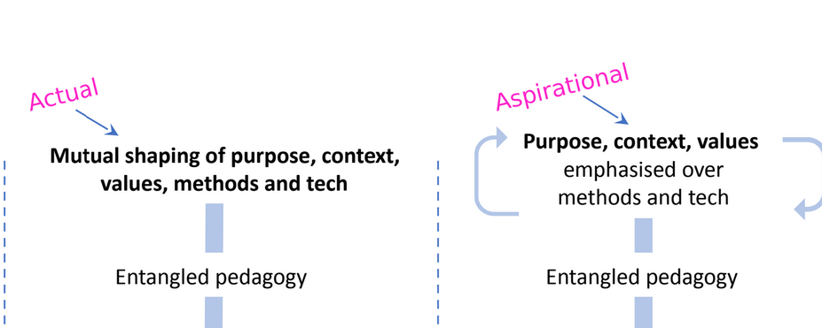

# Notes from ["Learning Design SIG webinar on entangled pedagogy and learning design"](https://ascilite.org/events/learning-design-sig-webinar-on-entangled-pedagogy-and-learning-design/)

## Abstract

Entangled pedagogy challenges the notion that technology-first or pedagogy-first framings accurately describe the complex relationships between the different elements that contribute to any educational activity. It offers a framework for thinking about how these elements inevitably shape each other, and about the kinds of approaches and knowledge that can support educators to effectively navigate the messy, emergent spaces of teaching and learning. In this talk, our presenter will use the entangled pedagogy framework to think about the implications for learning design and how aspects of educational activity are inevitably interrelated and distributed across different kinds of staff and students, both constraining and strengthening possibilities for practice. The presentation will also briefly consider some implications for faculty development, technological adoption, different modalities of teaching (e.g. on campus, online and hybrid) and ethics.

## Presenter Bio

Dr Tim Fawns is a Senior Lecturer in Clinical Education, University of Edinburgh and Deputy Programme Director of the online MSc Clinical Education, Director of the international Edinburgh Summer School in Clinical Education. He also runs a course in “Postdigital Society” for the Edinburgh Futures Institute. His main academic interests are in teaching, learning and assessment (mostly in healthcare and professional education), technology, and memory. Before his current role, he was a learning technologist, and a graphic and web designer. Tim is an Australian who went travelling one day and forgot to go back, married an Edinburgher and now has three kids who think they’re Scottish.

## Resources

- [presentation shared space](https://docs.google.com/presentation/d/15FojzDbs2ICuQ_76dcGwV_7OE4FpW3iXvpzFtd2i2C4/edit#slide=id.g13c350c2076_0_1) - idea for some homework - perhaps for explaining the paper

## Notes

Linked to other [[distribution]] views - actor-network theory, distributed cognition, complex systems

### Question

How to move from the "actual" to the "aspirational"?  How to get beyond simply dealing with the entanglement to actually working toward specific, contextually appropriate purposes.

But that's actually what I'm doing - trying to make the contextual purposes become the driver.

### Where to start

Backwards design breaks down.

  

