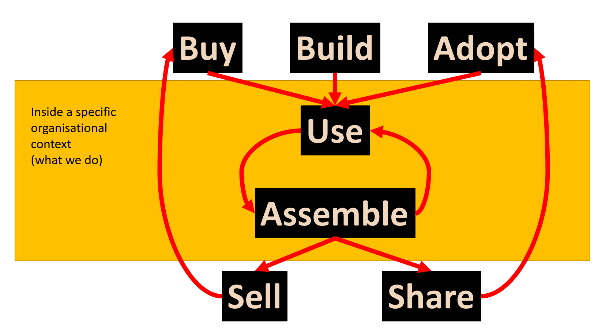

# Gathers, Weavers and Augmenters: Three principles for dynamic and sustainable delivery of quality learning and teaching

Resources related to THETA'2023 conference presentation

## Abstract

The pandemic reinforced higher educations’ difficulty responding to the long-observed challenge of how to sustainably and at scale fulfill diverse requirements for quality learning and teaching (Bennett et al., 2018; Ellis & Goodyear, 2019). Difficulty increased due to many issues, including: competition with the private sector for digital talent; battling concerns over the casualisation and perceived importance of teaching; and, growing expectations around ethics, diversity, and sustainability. That this challenge is unresolved and becoming increasingly difficult suggests a need for innovative practices in both learning and teaching, and how learning and teaching is enabled. Starting in 2019 and accelerated by a Learning Management System (LMS) migration starting in 2021 a small group have been refining and using an alternate set of principles and practices to respond to this challenge by developing reusable orchestrations – organised arrangements of actions, tools, methods, and processes (Dron, 2022) – to sustainably, and at scale, fulfill diverse requirements for quality learning and teaching. Leading to a process where requirements are informed through collegial networks of learning and teaching stakeholders that weigh their objective strategic and contextual concerns to inform priority and approach. Helping to share knowledge and concerns and develop institutional capability laterally and in recognition of available educator expertise.  

The presentation will be structured around three common tasks: quality assurance of course sites; migrating content between two LMS; and, designing effective course sites. For each task a comparison will be made between the group’s innovative orchestrations and standard institutional/vendor orchestrations. These comparisons will: demonstrate the benefits of the innovative orchestrations; outline the development process; and, explain the three principles informing this work - 1) contextual digital augmentation, 2) meso-level automation, and 3) generativity and adaptive reuse. The comparisons will also be used to establish the practical and theoretical inspirations for the approach, including: RPA and citizen development; and, convivial technologies (Illich, 1973), lightweight IT development (Bygstad, 2017), and socio-material understandings of educational technology (Dron, 2022). The breadth of the work will be illustrated through an overview of the growing catalogue of orchestrations using a gatherers, weavers, and augmenters taxonomy. 

### References

Bennett, S., Lockyer, L., & Agostinho, S. (2018). Towards sustainable technology-enhanced innovation in higher education: Advancing learning design by understanding and supporting teacher design practice. British Journal of Educational Technology, 49(6), 1014–1026. https://doi.org/10.1111/bjet.12683

Bygstad, B. (2017). Generative Innovation: A Comparison of Lightweight and Heavyweight IT: Journal of Information Technology. https://doi.org/10.1057/jit.2016.15

Dron, J. (2022). Educational technology: What it is and how it works. AI & SOCIETY, 37, 155–166. https://doi.org/10.1007/s00146-021-01195-z

Ellis, R. A., & Goodyear, P. (2019). The Education Ecology of Universities: Integrating Learning, Strategy and the Academy. Routledge.

Illich, I. (1973). Tools for Conviviality. Harper and Row.

# Presentation structure

## Set the scene

Explain the context, rationale of what we did. Linking in current sector strategic challenges. Establish how this connects with the audience.

Possible content

- Something about the difficulty of providing quality L&T in the current context

    Iron triangle, Goodyear on the same etc

- Importance of digital transformation

- Something about "more usable tools" being important (this toward the end as the segue to the show and tell)

Work in the following Quote from [solutions engineer's job ad](https://jobs.lever.co/instructure/438e3c44-d187-4265-a3d8-91628977186e) from instructure
> We make better, more usable tools for teaching, learning and employee development (you know, stuff people will actually use). A better connected and more open edtech ecosystem

  

## Disclaimers

Establish expectations of what we're showing

1. Still a work in progress.
2. Not the first people to do this type of work but timing has been good 
3. ??

## Which of these tools is more usable?

The practical show and tell comparison of the tools set. Show our tools and the tools others are using. Give a practical taste of the benefit/difference.

Show the three tasks (or a subset) and ask get people to vote on which is more usable

But perhaps at the end of this section (or the end of the talk) get them thinking about which of these is more usable for different roles/positions in a university? HC's Idea
> the different roles as it determines different perspectives of usability W2C/QA less important to some but crucial for others... but if we appended Accessibility to either of them then all of a sudden it would jump in usability as it interacts with more roles (Deans telling others how great they are at solving a wicked problem), In that example without the unimportant assemblages can't have the important ones

## How we did it?

#### Buy vs build OR... Buy, build and assemble?

It's not a question of "buy or build" or even "buy and build", but perhaps more exploring the distinction between "buy and build and assemble/garden/automate"

Or perhaps it's identifying these four

1. Buy - purchase various tools and systems 
2. Build - build your own tools and systems 
3. (re-)Assemble - engage in lightweight IT development to add more contextually appropriate combinations of technologies

    Another thought, for me, designing and teaching a course (esp. in these days of blended/digital learning) includes a fair bit of assembly.  Assembly isn't just a technology thing.  It's an L&T thing, but one we all do at varying levels.
4. Use all the technologies

  

Maybe [[laws-of-software-evolution]]

### Gatherers, weavers, augmenters

Talk about the gatherers, weavers, augmenters metaphor giving some idea of the architecture. Talk about leveraging 

### Principles 

Talk about the three (or two) principles - abstracting from gatherers, weavers, augmenters - and generalise into implications for what we do and what others might do. Link to context

It's all about the context

ASCILITE poster version of principles

1. On-going task focused re-entanglement
2. Contextual digital augmentation
3. Meso-level automation - arguably, isn't this about context as well?

Original principles

1. contextual digital augmentation 
2. meso-level automation, and 
3. generativity and adaptive reuse.

## Implications/So what?

- [In search of Spime script](https://blog.gardeviance.org/2012/02/in-search-of-spime-script.html)

    > Our world is heading in a fairly clear direction in terms of continual evolution of business activities such as commoditisation of discrete IT components, creation of higher order systems, disruption of past industries, development and exploitation of ecosystems, co-evolution of practice and ... well, I've covered this lots.

### Epistemic failure

Random thought for the morning, arguably one of the big problems we face around contemporary L&T are failures in terms of

1.  ⁠[Epistemic fluency](https://epistemicfluency.com/about/ "https://epistemicfluency.com/about/") - an in ability to successfully combine "different kinds of specialised and context-dependent knowledge"
2.  ⁠[Epistemic humility](https://en.wikipedia.org/wiki/Epistemic_humility "https://en.wikipedia.org/wiki/Epistemic_humility") -  too much of our processes (strategic plans, project management) are based on, and too many of our people (e.g. engineer's disease) assume, that they know or can know the right answer.

[//begin]: # "Autogenerated link references for markdown compatibility"
[laws-of-software-evolution]: ../../Bricolage/laws-of-software-evolution "Laws of Software Evolution"
[//end]: # "Autogenerated link references"