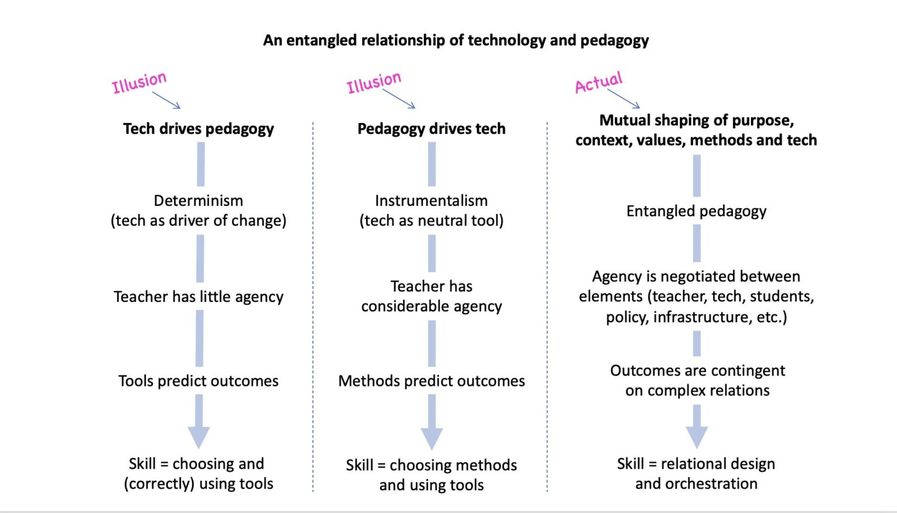

# Dealing with bad relationships by turning BAD: An LMS migration case study

A case study of an LMS migration
- TeLdesigner work is fruitfully dealing with relationships - post-digital, ANT
- Too often the work they are set and how they are expected to work is atomistic, not relational
- Perhaps one explanation why the relationships suffer, they are bad relationships
- If we're to do any better this relationships have to be better, more productive...
- This paper will use a case study of an LMS migration to
    - give examples of these bad relationships
    - give examples of how these can be improved
        - and not just at Griffith but evidence is visible at other institutions
    - use the SET/BAD mindsets to explain 
	- ???

- BAD/SET as theoretical framework
- BAD to encapsulate broader/deeper theoretical viewpoints
- But with a tendency toward action - how to do things as MLPs

## Possible sources/theories etc 

### Implement H5P online interactive activities at scale

[ascilite paper](https://www.researchgate.net/publication/356816265_Implementing_H5P_Online_Interactive_Activities_at_Scale/link/61aec9fefb3b7258a0a25765/download) from VU talking about scaling h5p.  Quick skim suggests it focuses on the curriculum design side of things, doesn't talk about technological, or forward-design requirements.  i.e. a good example? of a very atomistic approach, not the whole picture.

### [Fawn's entangled relationship of technology and pedagogy](https://open.ed.ac.uk/an-entangled-pedagogy-views-of-the-relationship-between-technology-and-pedagogy/)

The "actual" column from Fawn's entangled view of the relationship provides the core (perhaps) of the conceptual framework. Puts relational design and orchestration as the key skill.

## Example bad relationships

- organisations with technology - technology as established
- 
## Related

- [[bad-mindset]]
- [[task-activity-distinction]]

[//begin]: # "Autogenerated link references for markdown compatibility"
[task-activity-distinction]: ../Design/task-activity-distinction "The distinction between task and activity"
[//end]: # "Autogenerated link references"