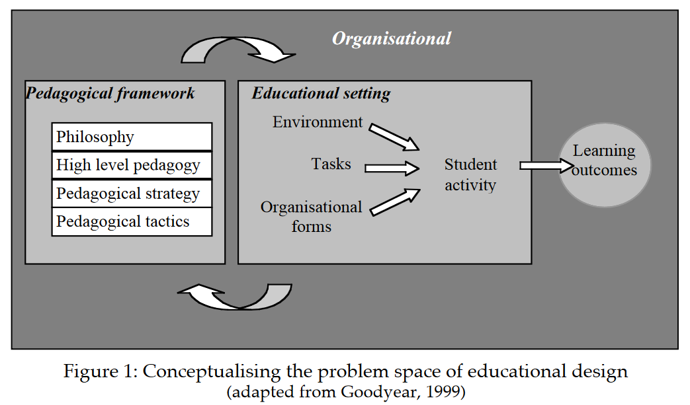

# Patterns, pattern languages and design practice

Goodyear, P. (2005). Educational design and networked learning: Patterns, pattern languages and design practice. *Australasian Journal of Educational Technology*, *21*(1). <https://doi.org/10.14742/ajet.1344>

## Summary

Responds to "growing demand" for effective & efficient uses of digital technologies to support student learning by providing a "high level view of the educational design problem space". Adds to this the patterns practice to help with "encoding, sharing and using knowledge for educational design" and provide "a powerful way of connecting educational values and vision to the details of the tasks, tools and resources we offer our students".

|  |
|:--:|
| *Conceptualising the problem space of educational design (Goodyear, 2005, p. 85)* |

## To do

1. Explore existing work on [[automating-instructional-design]] automation  - **DONE**
2. Consider the comparison of issues/questions done by McAndrew et al (2006) between LAMS, IMS Learning Design, and Design patterns.  In particular the observation that _what is missing_ from design patterns is the "Learning Management System (LMS) and the expertise to get the pattern into the LMS"

## Questions, thoughts, and interesting points

1. The "what's missing" from design patterns provides small suggestion of piece for CASA work the ability to translate the patterns into LMS (the learning environment). Which links explicitly to this paper's point about learning being constrained by the learning environment and the point of educational design is the appropriate redesign of the learning environment.
1. What's the value/impact of separating _educational design_ from _educational development_? Are the two clearly separated? Especially in the context of latter suggestions from Goodyear around short arc design and embedding ideas into tools ([[long-and-short-arc-learning-design]])
2. "networked learning" focuses on using digital technology to promote _connections_, what about taking that same focus to make connections between design, development, teacher practice etc, i.e. taking a much more [[forward-oriented-design]] approach
3. Flexibility, fluency and novel distributions - this quote seems to be foreshadowing that this shifting needs to happen within the treatment of digital technology and development - it is mentioned in the context of digital technologies - which further linkages to "entangled pedagogy" etc 

	> Rather, it draws attention to the need for our educational arrangements to become even more flexible - reflecting increasingly fluent use of media and communications methods and novel distributions of collaborative activity and relationships. (p. 84)

4. In terms of books/resources intended to support teacher's design activity, what do we currently know?

	> Although such resources have generated positive feedback, we know little about how they are actually used in practice and even less about how well they act as conduits for either research based or experiential design knowledge (p. 84)

5. It doesn't need to be top-down - suggesting the importance of enabling greater agency for the participants (students/teachers) and linking to ideas of [[generativity]] and ideas from [[scale]] and the need for customisation

	> A rational planning model would encourage us to derive high level pedagogy from philosophy, strategy from high level pedagogy, and tactics from strategy, through some process of top down inference. Life is rarely so simple. Indeed it is not uncommon to find strategy which is really emerging from tactics - thus strategy becomes a way of describing the common threads woven by intuitive tactical activity. Emergent strategy is still useful. Its articulation can serve the coordination and communication functions outlined above and help turn intuitive action into something more reflective, self aware and discussible. (p. 88)

6. loose coupling, deductive processes and automation - Goodyear positions the layers in the pedagogical framework as being loosely coupled and suggesting that "it is hard to make a case that the consequences of choices in one layer...have clear, precise implications for activity in another layer" and further it is "not a deductive process or one that can be readily automated" - interesting implications for the [[casa]] work, but also opening up questions about how this fits with the rise of LLMs

## Definitions

- _educational design_: "the set of practices involved in constructing representations of how to support learning in particular cases" (p. 82)
- _educational development_: "the practices of turning these representations into real support for learning (materials, task specifications, tools, etc)" (p. 83)
- _networked learning_: "learning in which ICT is used to promote _connections_: between one learner and other learners; between learners and tutors; between a learning community and its learning resources (Goodyear, Banks, Hodgson & McConnel, 2004)" (p. 83)
- _successful networked learning_: "depends, to a considerable extent, on well-targeted effort at design time - designing good learning tasks, ensuring good access to robust and appropriate technology, and helping create a convivial learning culture" (p. 84)

## Why is it needed

- limited evidence of existing methods that "existing practices led smoothly to optimal learning outcomes" (p. 83)
- "substantial unmet demands for usable forms of guidance"

> In general, the demand from academic staff is for help with design – for customisable, re-usable ideas, not fixed, pre-packaged solutions. However, demand is also expressed in ways which emphasise academics’ strong sense of being time-poor. There is no visible demand for complex methodologies, approaches which require substantial revision of existing work practices, or methods which require mastery of complex skills or specialised language. (p. 83)

## Paper contents

### Conceptualising educational design

- lots of structured design methodologies in educational technology
- few examples of successful attempts applying these methodologies to networked learning
- Focus tends to be on 
  - pedagogy and philosophy, or
  - pedagogical tactics

Explaining _Figure 1_ - three parts 

1. _pedagogical framework_: "loosely coupled structure" of

	- pedagogical philosophy 
    	- multiple sets of belief  around how people learn, what knowledge consists of etc.
    	- often implicit, rarely discussed, which can be problematic for teams, learning etc.

	- high level pedagogy 
    	- "the concrete instantiation of philosophical positions" 
    	- a form of abstraction "which is intermedia between philosophy and action"
    	- "does not contain direct prescriptions for action, but it puts some forms of possible action into the foreground and others into the background"

	- pedagogical strategy 

    	- "a broad brush depiction of plans"
    	- accounts for uncertainties
    	- "Its main purpose is _communicative_ - it supports a description of actions and intentions at a level that ideas confusing details"
    	- "it may also be constructed for the mutual benefit of learners and teachers. In both cases, the point is to promote a shared understanding of intentions and permit coordinated action"

	- pedagogical tactics 
    	- "detailed moves through which strategy is effected"
    	- 
2. _educational setting_: a "concrete educational activity in a real world setting"

	- no reason to impose limits on the scale of learning activity (e.g. # of participants, length of time etc) - instead focus on the appropriate scale to design and management
	- "a way of representing the coming together of tasks, activities, environment and people"
	- Based on three kinds of work
    	1. _design of good learning tasks_: a specification for learner activity drawing on what we know about learning, content, and learners
    	2. _design and management of the learning environment_ - "the physical/digital environment within which learners work"..."The **important point** here is that learning is severely constrained by the learning environment. Part of the point of educational design is to ensure that more flexible access to learning opportunities is accompanied by appropriate redesign of the learning environment" (p. 90) 

3. _organisational context_: 
   - influences "the design and management of the educational setting"
   - influences "the processes through which a pedagogical framework feeds into the design and management of an educational setting" 

## See also

- [[paper-summaries]]

## references

McAndrew, P., Goodyear, P., & Dalziel, J. (2006). Patterns, designs and activities: Unifying descriptions of learning structures. *International Journal of Learning Technology*, *2*(2--3), 216--242. <https://doi.org/10.1504/IJLT.2006.010632>

[//begin]: # "Autogenerated link references for markdown compatibility"
[long-and-short-arc-learning-design]: ../Distribution/long-and-short-arc-learning-design "Long and short arc learning design"
[forward-oriented-design]: ../concepts/forward-oriented-design "Forward-oriented design"
[generativity]: ../nodt/generativity "Generativity"
[scale]: ../Design/scale "Scale and learning, teaching & education"
[casa]: ../casa "Contextually Appropriate Scaffolding Assemblages (CASA)"
[paper-summaries]: ../paper-summaries "Paper Summaries"
[//end]: # "Autogenerated link references"