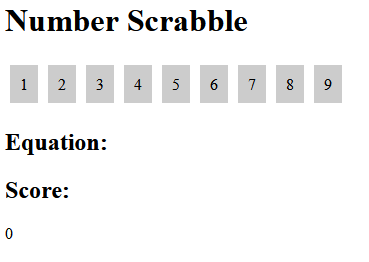
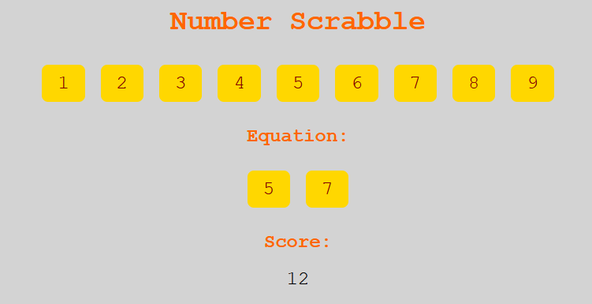
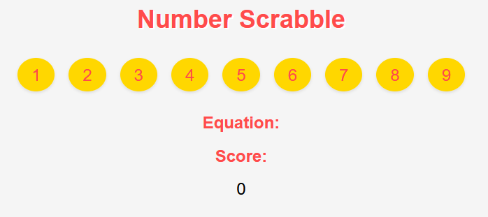
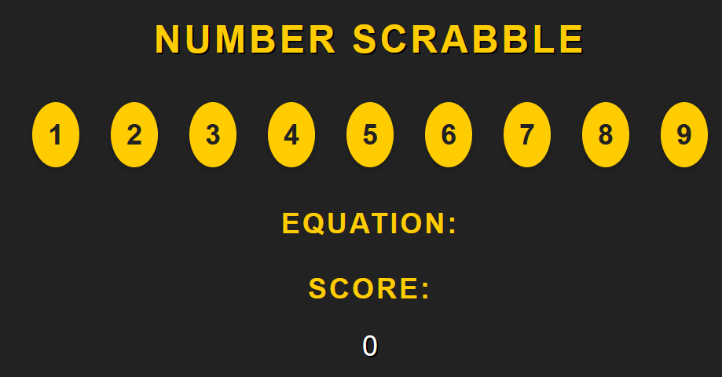
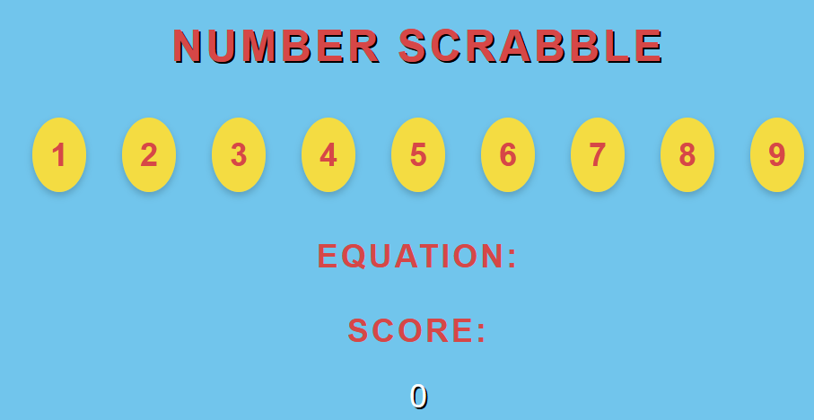
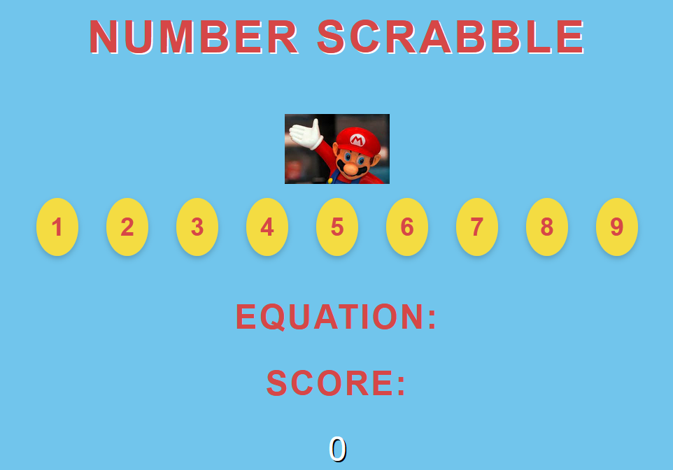
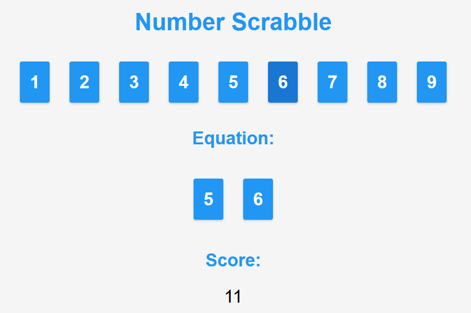
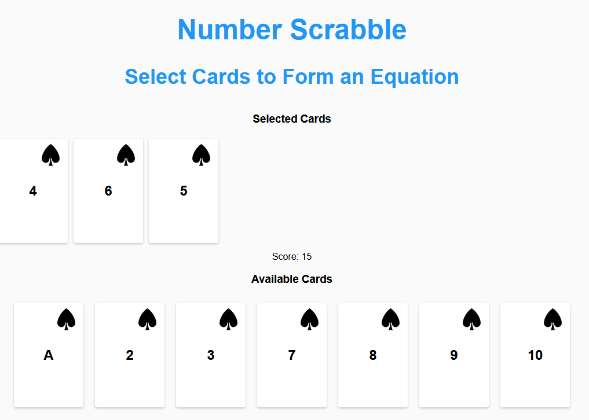

<!--
 Copyright (C) 2023 David Jones
 
 This file is part of memex.
 
 memex is free software: you can redistribute it and/or modify
 it under the terms of the GNU General Public License as published by
 the Free Software Foundation, either version 3 of the License, or
 (at your option) any later version.
 
 memex is distributed in the hope that it will be useful,
 but WITHOUT ANY WARRANTY; without even the implied warranty of
 MERCHANTABILITY or FITNESS FOR A PARTICULAR PURPOSE.  See the
 GNU General Public License for more details.
 
 You should have received a copy of the GNU General Public License
 along with memex.  If not, see <http://www.gnu.org/licenses/>.
-->

# Implementing number scrabble 

See also: [[number-scrabble]], [[AI]]

Vague idea to implement number scrabble in Svelte for demonstrations etc.

## Design 

- very visual, perhaps use playing cards to represent the numbers 
- the numbers should have different representations that can be switched between 

## Inspirations 

- Get ChatGPT to help write it

## 20 May 2023 

### Get a basic working representation 

Start with number scrabble project with first LLM provided code

Prompt 
> I'd like to implement Number Scrabble as a Javascript application. Can you provide source code as a starting point?

Response was some code including the following additional work 
> To use this code, you'll need to create an HTML file that includes the necessary elements for the game's user interface (e.g., an equation display and score display) and link the JavaScript code to the HTML file. You can style the game elements using CSS to enhance the visual presentation.

Prompt 
> Please provide me with a sample of the required HTML file

The provided HTML file appears correct, but the same error occurs `Uncaught TypeError: gameContainer is null`

Prompt 
> What what you've provided I am getting the error "Uncaught TypeError: gameContainer is null". It appears that your initGame function assumes that there are already tiles within game-contain div, but there aren't any.  Can you please fix your Javascript and HTML?

And that has a working representation. Click on the numbers to choose, but there are limitations 

- Only 1 player 
- Tiles are represented visually as numbers, not cards 
- CSS styling is missing

### Add CSS styling 

Process

1. Style to have the tiles horizontal
2. Apply some "fancy styling theme" 
3. Modify them to be playing cards - spades

Prompt - horizontal
> I think it would work better if the tiles being selected were arranged horizontally, not vertically. Please provide some CSS to achieve this.

Easy for it   

Prompt - But the equation tiles are a different styling.
> Please provide some CSS to ensure that the tiles display in the p#equation have the same visual styling.

A simple copy and paste of the resulting code would've led to some duplicate code.  Removed that. But also, the Javascript didn't have the same `div.title` element wrapped around the element. 

Prompt - fix that 
> Sorry, when you add the numbers to p#equation they aren't within a div.title element, can you fix your Javascript?

Yep, had to remove the old code and copy in the new, but that's working. 

Prompt - fancy styling - new chat 
> I understand that web design has gone through a number of different visual design styles. Can you name, describe, and provide links to 3 very different visual design styles for the web?

First three examples are 

- [Material design](https://material.io/design/)
- [Retro design](https://www.awwwards.com/inspiration/search?text=retro)
- Minimalist design - broken link 

Prompt - more please 
> Could you suggest another three different web visual design styles?

- [Flat design](https://www.awwwards.com/inspiration/search?text=flat)  (this one was CoPilot's suggestion as I was editing this document)
- [Metro design](https://www.awwwards.com/inspiration/search?text=metro) (another from CoPilot)
- [Skeuomorphic design](https://www.awwwards.com/inspiration/search?text=skeuomorphic) (another from CoPilot) - copilot is even suggesting the `(another from CoPilot)` brackets
- [Neumorphic design](https://www.awwwards.com/inspiration/search?text=neumorphic) (another from CoPilot)

ChatGPT provided 

- [Grunge Design](https://onepagelove.com/gallery/grunge) - broken link
- [Flat design](https://dribbble.com/tags/flat_design)
- [Illustrative design](https://www.behance.net/search/projects?field=illustration)

Prompt - let's go retro (I'm old)
> I understand that there are a number of visual design styles for the web. One example being retro design. Please update the CSS for number scrabble to use a retro design.

Prompt - illustrative looked fun 
> Nice, could you do a redesign using the illustrative design style. Perhaps by drawing inspiration from famous Japanese anime

Not a great success or difference 

Prompt - a bit more specific 
> I didn't detect any influence from Japanese anime. Perhaps try again drawing heavily on the visual design of Dragon Ball Z

Not so much 

Super Mario Brothers? 

Prompt - stop focusing on colour scheme 
> Update the CSS to make it the Super Mario Brothers inspiration much more obvious, but don't change the colour scheme. Instead, focus on changes to the typography, alignment, and imagery.

There are limits, perhaps my ability to describe what I want visually? 

Prompt - lets drop that and go material 
> Okay, time to drop the illustrative visual design style and the Super Mario Brothers inspiration. Please update the CSS to align with the latest material design style you are aware of

Prompt - let's go with playing cards 
> Rather than use simple numeric tiles, update the HTML and CSS to display playing cards. In particular, using spades as the card suit.

My mistake, it provided HTML and CSS that wouldn't work with the existing Javascript. 

Prompt - do the lot 
> Sorry, what you've provided requires the Javascript to also change. Please update the Javascript, CSS, and HTML to implement number scrabble using playing cards (the suit of spades) to represent the numbers.

Yep, definitely starting to break down.

> Could you provide CSS and perhaps the necessary images to ensure that the cards look exactly like real playing cards?

Better, added a hover effect as well (card moves up a bit), but it asks for the HTML to be modified manually. Let's see if we can get this back unified.

Prompt
> Please regenerate the HTML, CSS and Javascript to correctly implement number scrabble using a material visual design style with the numbers being represented as playing cards using the spades suit

Prompt - almost there, but missing some CSS and javascript 
> Ahh, you've forgotten to retain the playing card representation when move cards to div#equation. Also, cards that are selected are not being removed from the div#card-container. Please update the Javascript to do this correctly.

Prompt - yep, getting there, but equation cards are vertical 
> Ahh but the cards being added into div#equation are displaying vertically. Please modify the CSS (and the HTML if required) to display the cards horizontally.

Prompt - getting there, but the score isn't being updated 
> The score is not being updated when cards are selected. Modify the Javascript so it is updated.

### Add a switch to change the representation 

The point of number scrabble is that it's an isomorph of tic-tac-toe when the cards are represented using a magic square. What would be good is to have a button to change the representation.

Prompt - allow a switch between the two representations
> Number scrabble is isomorphic with tic-tac-toe when the numbers (i.e. the cards in div#card-container) are represented as a magic square. A 3x3 square where all the vertical, horizontal, and diagonal rows of 3 numbers add up to 15. Modify the HTML, CSS, and Javascript to a button labelled "Change Representation". When the button is clicked it should toggle the current representation of div#card-container between the original horizontal row of all the available cards and magic square representation. 

Almost, but the cards aren't displaying at the start and the magic square representation is just another horizontal row.

Prompt - have the cards appear by default
> When first loaded there are no cards visible. Modify the Javascript so when first loaded the cards are displayed as a single horizontal row in ascending order

Prompt - but no magic square being displayed 
> The Javascript you provided is missing the code to modify the visual representation to the magic square. Please write a Javascript function called showMagicSquare that modifies the representation to display the magic square. Make sure this function does not remove cards from the square. Instead, the cards should be greyed out visually and not able to be clicked on.

Prompt - but the CSS styling is missing 
> The CSS you provided is missing the styling for div.magic-square to display the cards as a magic square. Please provide that styling
ChatGPT

Prompt - still no grid 
> That CSS is displaying the cards horizontally. Not as a 3x3 grid (i.e. magic square). Modify the CSS so the magic square is shown as 3x3 grid

Prompt - still not there 
> Sorry that still doesn't work. Please modify the CSS and (if necessary) the HTML to use a grid container to display the magic-square as a 3 by 3 grid

Still not there, close.  But updating all three (HTML/CSS/Javascript) isn't quite working. Again raising the question of whether I modify the code manually or try to prompt ChatGPT to re-do the whole thing? 

Prompt - simple re-do relying on its memory
> Please regenerate the HTML, CSS, and Javascript to capture all those changes

Nope it forgot stuff.  Perhaps memory, perhaps limits on the size of the input. It is missing: 
 
- Visual styling for the selected cards 
- Showing the magic-square as a grid
- As a magic square the cards can't be clicked at all and have lost some visual styling

### Time for manual changes 

Show more headers in the HTML to distinguish selected and available cards

To switch between row and magic square change the class on card-container 

- update the `showMagicSquare` function 
- add the CSS for .magic-square
- remove .magic-square when switching back 

Create a createCard function to create the cards and use for both representations

Update the selected cards when clicked using a CSS style

Prompt - use ChatGPT to get some CSS for the back of a card.  Which will be shown when clicked 
> Provide some CSS that emulates the back of a playing card.

Prompt - a bit boring - a square - try again 
> Can you provide better css for .card-back that better emulates the repeated diamond pattern common to the back of playing cards?

Prompt - better, but black and grey 
> What change would be necessary for that CSS to use red and green, rather than black and grey

Modify equation to be a list and add visual card display 

...and I could go on, though might be better to re-implement in Svelte, or perhaps the real problem is that my [[prompt-engineering]] sucks

### Trying again with "good" prompt engineering 

Have gone away and revised [[prompt-engineering-for-educators]] and arrived at a [[prompt-engineering]] template to be tried here.

[Prompt development](number-scrabble-prompt.md)

Various evolutions 

1.  Didn't display the cards at the start.
2.  Reworked the initial prompt to include the starting display, not there. It did include some code for magicSquare. Even though not requested.
3. Same prompt as #2 but in a new chat. Intent being to avoid the magic square code.

This version was closer but the limitations include 

- Nothing obviously skeuomorphic about the design
- The playing cards are not shown as obviously playing cards. 
- Clicking on cards is always adding to player 1s selected cards 
- A NaN error for score and the number on the card (not converting to int?)
- The selected cards are not the same display as the available cards
- The player 1 and player 2 sections are not displayed not to each other

Definitely a trend here, some issues fixed.  Turn taking is happening. Visual design of the cards is better, but problems include 

- Score is being set to the value of the latest selected card, not the sum of all selected cards
- Displaying the back of the card isn't working anymore 

[//begin]: # "Autogenerated link references for markdown compatibility"
[number-scrabble]: number-scrabble "Number Scrabble"
[AI]: ../AI/AI "AI"
[prompt-engineering]: ../AI/prompt-engineering "Prompt Engineering"
[prompt-engineering-for-educators]: ../AI/prompt-engineering-for-educators "prompt-engineering-for-educators"
[//end]: # "Autogenerated link references"