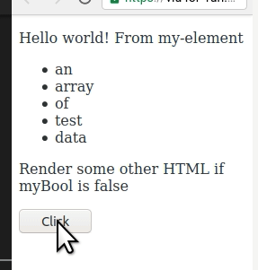

# My First LitElement Web Component

Description and reflections of create a very simple web component using [LitElement's live tutorial](https://lit-element.polymer-project.org/try)

- [My First LitElement Web Component](#my-first-litelement-web-component)
  - [Basic steps](#basic-steps)
    - [Impressive first impression](#impressive-first-impression)
    - [Creating a component](#creating-a-component)
    - [Properties](#properties)
    - [Logic in templates](#logic-in-templates)
    - [Events source](#events-source)
    - [Styling](#styling)
  - [Writing your own - choices](#writing-your-own---choices)
  - [Creating reusable components - LitElement process](#creating-reusable-components---litelement-process)
  - [Create Open Web components](#create-open-web-components)
  - [Creating a simple TrimesterDate component](#creating-a-simple-trimesterdate-component)
    - [Specification](#specification)
    - [Getting started](#getting-started)
    - [Local dev server](#local-dev-server)
    - [Making changes](#making-changes)
    - [Building](#building)
  - [Practical example](#practical-example)
    - [Use the open-wc generator](#use-the-open-wc-generator)
    - [Install other dependencies](#install-other-dependencies)
    - [Write the code](#write-the-code)
    - [Publish the component](#publish-the-component)
    - [Using the web component](#using-the-web-component)
  - [Finishing the trimester-date component](#finishing-the-trimester-date-component)
    - [Load calendar information](#load-calendar-information)

## Basic steps

Lot's not covered in this, including

- how to handle attributes passed to the component
- more flexible approaches to css

### Impressive first impression

First reactions, impressive. Produces a VSCode looking code editor and matching "browser" output all in the browser window. Though it's a bit of pain that it doesn't have the vim bindings.


### Creating a component

In summary,

A component lives in its own JS file, with three main sections

1. Import various "includes"
2. Define a class for the component (the code)
3. Register the element with the browser

### Properties

Looks like basics of contemporary Javascript OO. But also with "React-like" nicety of components updating automatically when their properties change.

- Properties implemented as a hash/object
- Declare a getter for properties

```javascript
    static get properties() {
   return { message: { type: String } };
 }
```

- Initialise the property with a constructor

```javascript
    constructor() {
   super();
   this.message = 'Hello world! From my-element';
 }
 ```

- Use it as an attribute

 ```javascript
 return html`
      <p>${this.message}</p>
    `;
```

### Logic in templates

[source](https://lit-element.polymer-project.org/try/logic)

How to integrate conditionals and loops into components

```javascript
return html`
      <p>${this.message}</p>
      <ul>${this.myArray.map(item => html`<li>${item}</li>`)}</ul>
      ${this.myBool ?
        html`<p>Render some HTML if myBool is true</p>` :
        html`<p>Render some other HTML if myBool is false</p>`}
    `;
```

### Events [source](https://lit-element.polymer-project.org/try/events)

- Add an event listener using ```@event``` - in this ```@click```

```javascript
<button @click=${this.clickHandler}>Click</button>
```

- Add an event handler as method to the class

```javascript
 clickHandler(event) {
   console.log(event.target);
   this.myBool = !this.myBool;
 }
 ```

In operation, this illustrates how components are updated dynamically in response to changes to properties.



### Styling

[source](https://lit-element.polymer-project.org/try/style)

- include a css helper

- define styles by adding a styles getter (must be more complex ways to do this)

```javascript
static get styles() {
  return css`
    p {
      font-family: Roboto;
      font-size: 16px;
      font-weight: 500;
    }
    .red {
      color: red;
    }
    .blue {
      color: blue;
    }
  `;
}
```

- apply styles

```javascript
 <p class="${this.myBool ? 'red' : 'blue' }">styled paragraph</p>
```

## Writing your own - choices

[source](https://lit-element.polymer-project.org/guide/start)

Two options

1. [Create reusable components to share with others](https://lit-element.polymer-project.org/guide/start#component-project)
   e.g. [[casa]]. Typically published to npm. e.g. [[unbundled-web-components]]
2. [Create app-specific components](https://lit-element.polymer-project.org/guide/start#existing-project)
   e.g. Progress Checker. Part of the application code.

## Creating reusable components - LitElement process

[LitElement](https://lit-element.polymer-project.org/guide/start) suggests the following process

- Use a starter project
- Node.js and npm for dependency management
- Local dev server
- ESLint
- Testing with Karma (new to me)
- Static doc site auto built

But also identifies the [open-wc project generator](https://open-wc.org/init/)

## Create Open Web components

[source](https://open-wc.org/init/)

1. ```npm init @open-wc``` - running a generator
2. Choose from two options
   1. ```Web component``` - for a single component
   2. ```Application``` - application project (no shit Sherlock)
3. Add features eventually, including
   1. Linting - ESLint, Prettier, Husky and commitlint
   2. Testing - Karma
   3. Demoing - Storybook
   4. Building

## Creating a simple TrimesterDate component

### Specification

A component that changes the following

```HTML
<trimester-date>Monday, Week 7</trimester-date>
```

into

```html
<span class="trimester-date">Tuesday, Week 7 (15 June, 2020)<span>
```

Where the data that has been added in brackets is calculated by
1. Identifying the current trimester/term for a given institution based either on
   1. The URL of the web page, or
   2. The current default value
1. Identifying the date for the Monday of Week 7 for that trimester
2. Add 1 day to that date to get the date for Tuesday

### Getting started

1. Create a folder and run ```npm init @open-wc```
2. Use cursor keys to make choices, including
  - scaffold a new project or upgrade new
  - web component or application
  - typescript or not
3. Provide the tag name for my component  
4. Shows a default structure for appoval
5. Choose dependencies via npm.

Which provides a full templated project, including source with a lot of the defaults in place. Looks like it's a functioning element by itself. Meaning it should run
   
### Local dev server

[source](https://open-wc.org/developing/es-dev-server.html)

Yep, ```npm run start``` works out of the box.  All working.

### Making changes

The demo HTML is not yet standard - more learning to do - [open-wc codelabs](https://open-wc.org/codelabs/) to the rescue?

1. [[open-wc-webcomponent-basics]]
2. [ ] [lit-html & lit-element basics](https://open-wc.org/codelabs/basics/lit-html.html?index=/codelabs/)
3. [ ] [lit-html & lit-element intermediate](https://open-wc.org/codelabs/intermediate/lit-html.html?index=/codelabs/)

All that was really needed was a bit of thinking and testing.  I've rewritten the default ```index.html``` from open-wc to use something a little bit more related to my thinking. Which works in the local test environment.

```html
<script type="module" src="../trimester-date.js"></script>

<trimester-date title="fred">Hello</trimester-date>
```

The main problem is how to import the ```lit-element``` resource (which npm has handled locally). Google search and Stack Overflow point [to the CDN solution](https://stackoverflow.com/questions/56506084/can-i-use-es-modules-library-from-cdn) and "my" first web component is [publicly available](https://djon.es/gu/test/).

Only now need now to

1. Turn this into a more scalable, sustainable process; and,
2. Complete the code for the component

### Building

[source](https://open-wc.org/building/)

Optimising files to minimise impact on live.  Only do this with final production.

Type of project matters
1. Building single page apps (SPA) - recommend [roll-up](https://open-wc.org/building/building-rollup.html)
2. Building reusable components and libraries - recommend [buildless development](https://open-wc.org/developing/) and [how to publish web components to npm](https://justinfagnani.com/2019/11/01/how-to-publish-web-components-to-npm/)
3. Building websites or multi page apps (MPA) - no final recommendation yet, tips on [building roll-up](https://open-wc.org/building/building-rollup.html)

I'm doing #2 at the moment. 

[Buildless](https://open-wc.org/developing/) recommends avoiding build tools (adding complexity) and instead relying on the browser. 

More advice on [developing without a build](https://dev.to/open-wc/developing-without-a-build-1-introduction-26ao). It touched on evolution of web development (from just a text editor and web server) to complex toolsets that make it hard to learn (preach brother!). Instead, how much (and how) can be done with just the browser.

**TO DO** [How to publish web components to npm](https://justinfagnani.com/2019/11/01/how-to-publish-web-components-to-npm/)

[Rollup](https://open-wc.org/building/building-rollup.html) is recommended to "optimize your code for production and ensure it runs on all supported browsers". Built into the project generator.

## Practical example

The Open-WC site wasn't giving the end-to-end example I wanted. A google search revealed [Building Components with Open Web Components](https://www.nexmo.com/blog/2020/08/13/creating-a-web-component-with-open-wc)

### Use the open-wc generator

As with the above

### Install other dependencies

Their example web component requires a bit more than mine.

### Write the code  - <trimester-date>

It's also a bit more complex.  Good example of a more advanced component.

### Using the web component

Brings the component back in from npm.  Proposes use of a CDN (unpkg.com) if testing where no install available.


- [X] Load the calendar information from JSON/web service
- Figure out the current trimester from 
  - [ ] page URL, 
  - [X] attribute, or 
  - [X] default
- [X] Get the current date string 
- [X] Identify week and day (if possible)
- [X] Calculate the actual date
- [X] Update the HTML to add the date
- [ ] Publish to npm??
- [ ] Get into a CDN??
- [ ] Test in Blackboard

### Load calendar information

Need to load the calendar data from somewhere.  It's currently hard coded into other applications as JSON data. In theory, ES6 supports the importation of JSON data 

e.g. ```import calendar from '../calendar.js'``` would result in a variable named calendar with the information. That appears like it might work. At least initially.

## Publish the component

[Building Components with Open Web Components](https://www.nexmo.com/blog/2020/08/13/creating-a-web-component-with-open-wc) suggests that standard approach with npm - so [time to create an npm account](https://docs.npmjs.com/creating-a-new-npm-user-account)../calendar.js

A bit more of a struggle with npm account login (password issues?) than expected, but is [published](https://www.npmjs.com/package/@djplaner/trimester-date)


## Make it available via a CDN

[Building Components with Open Web Components](https://www.nexmo.com/blog/2020/08/13/creating-a-web-component-with-open-wc) uses [unpkg.com](https://unpkg.com/)


## Use it in Blackboard

[//begin]: # "Autogenerated link references for markdown compatibility"
[casa]: ../casa "Contextually Appropriate Scaffolding Assemblages (CASA)"
[unbundled-web-components]: unbundled-web-components "Unbundled web components"
[open-wc-webcomponent-basics]: open-wc-webcomponent-basics "Open Wc Webcomponent Basics"
[//end]: # "Autogenerated link references"
