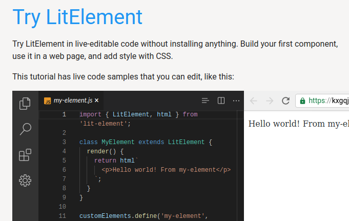

# My First LitElement Web Component

Description and reflections of create a very simple web component using [LitElement's live tutorial](https://lit-element.polymer-project.org/try)

- [My First LitElement Web Component](#my-first-litelement-web-component)
  - [Basic steps](#basic-steps)
    - [Impressive first impression](#impressive-first-impression)
    - [Creating a component](#creating-a-component)
    - [Properties](#properties)
    - [Logic in templates](#logic-in-templates)
    - [Events source](#events-source)
    - [Styling](#styling)
  - [Writing your own - choices](#writing-your-own---choices)
  - [Creating reusable components - LitElement process](#creating-reusable-components---litelement-process)
  - [Create Open Web components](#create-open-web-components)

## Basic steps

Lot's not covered in this, including

- how to handle attributes passed to the component
- more flexible approaches to css

### Impressive first impression

First reactions, impressive. Produces a VSCode looking code editor and matching "browser" output all in the browser window. Though it's a bit of pain that it doesn't have the vim bindings.



### Creating a component

In summary,

A component lives in its own JS file, with three main sections

1. Import various "includes"
2. Define a class for the component (the code)
3. Register the element with the browser

### Properties

Looks like basics of contemporary Javascript OO. But also with "React-like" nicety of components updating automatically when their properties change.

- Properties implemented as a hash/object
- Declare a getter for properties

```javascript
    static get properties() {
   return { message: { type: String } };
 }
```

- Initialise the property with a constructor

```javascript
    constructor() {
   super();
   this.message = 'Hello world! From my-element';
 }
 ```

- Use it as an attribute

 ```javascript
 return html`
      <p>${this.message}</p>
    `;
```

### Logic in templates

[source](https://lit-element.polymer-project.org/try/logic)

How to integrate conditionals and loops into components

```javascript
return html`
      <p>${this.message}</p>
      <ul>${this.myArray.map(item => html`<li>${item}</li>`)}</ul>
      ${this.myBool ?
        html`<p>Render some HTML if myBool is true</p>` :
        html`<p>Render some other HTML if myBool is false</p>`}
    `;
```

### Events [source](https://lit-element.polymer-project.org/try/events)

- Add an event listener using ```@event``` - in this ```@click```

```javascript
<button @click=${this.clickHandler}>Click</button>
```

- Add an event handler as method to the class

```javascript
 clickHandler(event) {
   console.log(event.target);
   this.myBool = !this.myBool;
 }
 ```

In operation, this illustrates how components are updated dynamically in response to changes to properties.


### Styling

[source](https://lit-element.polymer-project.org/try/style)

- include a css helper

- define styles by adding a styles getter (must be more complex ways to do this)

```javascript
static get styles() {
  return css`
    p {
      font-family: Roboto;
      font-size: 16px;
      font-weight: 500;
    }
    .red {
      color: red;
    }
    .blue {
      color: blue;
    }
  `;
}
```

- apply styles

```javascript
 <p class="${this.myBool ? 'red' : 'blue' }">styled paragraph</p>
```

## Writing your own - choices

[source](https://lit-element.polymer-project.org/guide/start)

Two options

1. [Create reusable components to share with others](https://lit-element.polymer-project.org/guide/start#component-project)
   e.g. [[casa]]. Typically published to npm. e.g. [[unbundled-web-components]]
2. [Create app-specific components](https://lit-element.polymer-project.org/guide/start#existing-project)
   e.g. Progress Checker. Part of the application code.

## Creating reusable components - LitElement process

[LitElement](https://lit-element.polymer-project.org/guide/start) suggests the following process

- Use a starter project
- Node.js and npm for dependency management
- Local dev server
- ESLint
- Testing with Karma (new to me)
- Static doc site auto built

But also identifies the [open-wc project generator](https://open-wc.org/init/)

## Create Open Web components

[source](https://open-wc.org/init/)

1. ```npm init @open-wc```

[//begin]: # "Autogenerated link references for markdown compatibility"
[casa]: ../casa "Contextually Appropriate Scaffolding Assemblages (CASA)"
[unbundled-web-components]: unbundled-web-components "Unbundled web components"
[//end]: # "Autogenerated link references"
