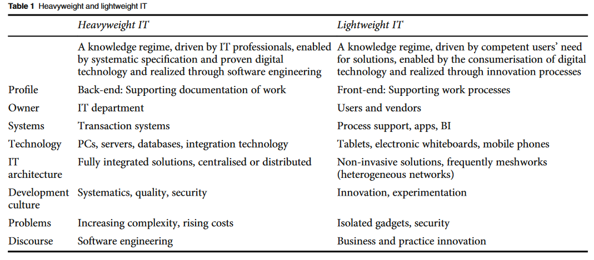
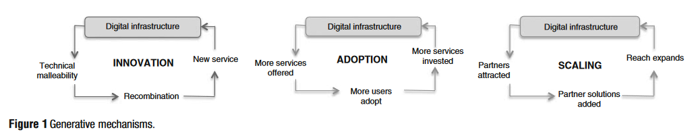

# Heavy Weight and Light Weight Information Technology

Idea generated from Bygstad (2017, p. 180)
> Lightweight IT is suggested as a term for the new knowledge regime of mobile apps, sensors and bring-your-own-device, also called consumerisation and Internet-of-Things. The key aspect of **lightweight IT is not only the cheaper** and more available technology compared with heavyweight IT, but the fact that its deployment is frequently done by users or vendors, bypassing the IT departments

They define lightweight IT as: (p. 181)
> a socio-technical knowledge regime, driven by competent users’ need for solutions, enabled by the consumerisation of digital technology, and realied through innovation processes

Godfroi et al (2021) do a systematic literature review on related topics

Both connect this with [Gartner's _Bimodal IT Model_](https://www.gartner.com/en/information-technology/glossary/bimodal)

## A comparison of lightweight and heavyweight IT

### Abstract

Argues that lightweight IT is necessary/complementary to heavyweight and offers principles that loosely coupled integration in terms of technology, standards, and organisation.

Uses 4 case studies from health sector to find
1. "generativity enfolds differently in heavyweight and lightweight IT"
2. "generativity in digital infrastructures is supported by the interaction of loosely coupled heavyweight and lightweight IT" Bygstad (2017, p.180)
> The practical design implication is that heavyweight and lightweight IT shoould be loosely integrated, both in terms of technology, standardisation and organisation.

### Notes

These are _ideal types_.  

Argues that trends in consumer and enterprise IT can be fruitfully thought of as paradigmatic shift to two different knowledge regimes: _heavyweight_ and _lightweight_ IT

| Characteristics | Heavyweight IT | Lightweight IT |
| -------------- | ------------- | ------------- |
|           | A knowledge regime, driven by IT profesionals, enabled by systematic specification and proven digital technology and realised through software engineering | A knowledge regime, driven by competent users' need for solutions, enabled by the consumerisation of digital technology and relaised through innovation processes |
| Profile | Back-end: supporting documentation of work | Front-end: supporting work processes |
| Owner | IT Department | Users and vendors |
| Systems | Transation systems | Process support, apps, BI |
| Technology | PCs, servers, databases, integration technology | Tablets, electronic whiteboards, mobile phones | 
| IT architecture | Fully integrated solutions, centralised or distributed architecture | Non-invasive solutions, frequently meshworks (heterogeneous networks) |
| Development culture | Systematics, quality, security | Innovation, experimentation |
| Problems | Increasing complexity, rising costs | Isolated gadgets, security |
| Discourse | Software engineering | Business and practice innovation|

  

### Generativity

Cite following as analysing the "huge innovation potential that lies in the creative recombination of technical and social elements in digital infrastructures" (p. 183)
- Yoo (2013)
- Leonardi (2011)
- Sorensen et al (2015)

Argue that generativity is key "because infrastructures evolve through innovation and organic growth, rather than by management interventions (Hanseth and Lyytinen, 2010)" (Bygstad, 2017, p. 183)

Posit evolution of digitial infrastructures arise from the interplay of three self-reinforcing generative mechanisms
> - Innovation: The creative combination of social and technical elements in order to create new services 
> - Adoption: The recruitment of users through easy-to-use solutions, which allows more investments 
> - Scaling: The expansion of the network to include more partners to provide more services

  

> the technical malleability of infrastructure creates a space of possibility, which can be used to recombine components into new services. (p. 184)

### Relationship between heavyweight and lightweight

Generativity in heavyweight and lightweight IT arise from different purposes/mechanisms (see table above)

> Knowledge regimes tend to be more incompatible than often assumed, because of their nested structures of technology and practices (Howard-Grenville and Carlile, 2006) - (p. 190)

### Design principles - Loose coupling

#### 1. Loosely coupled technically

#### 2. Loosely coupled in terms of standards

#### 3. Loosely couples in terms of organisation

## IT outside the IT Department - Lightweight IT in times of shadow IT and IT consumerisation

Systematic literature review ([33 of 164 publications underwent detailed analysis](https://www.dropbox.com/s/xisnntihxqzf7j2/WI2021_Table%25201_IT%2520outside%2520of%2520the%2520IT%2520Department.pdf%3Fdl%3D0)) on the notion of "IT outside the IT department". Draws on Bydstad's light/heavy weight distinction to examine to opposing views of the notion: IT consumerisation and Shadow IT.  Breaks shadow IT into Business IT if it is done with the knowledge of the IT department (shadow is covert).  But argues that Business IT (as in business owned) is closer to lightweight IT

Focuses (apparently) on the question of if the notion should be allowed and how to integrate it into the overall IT efforts.

Categorised papers based on 
- governance model
- drivers
- benefits
- risks

> This leads us to propose that the main benefit of the lightweight IT concept is to enable organizations to fully use the innovation potential outside their IT departments and gives them a toolset to integrate these new solutions with their existing heavyweight IT (p. 568)

### Governance models

RPA considered for special attention. Using either a centralised or decentralised approach

(p. 562-563)
> - Central Control Model: Often used by heavyweight IT vendors that add mobile apps to their solutions. The (heavyweight) IT department decides over and prioritizes lightweight IT initiatives. This ensures a focus on integration and security, but constrains innovation [17]. 
> - Bimodal IT Model: Following Gartner’s notion a separate IT department is installed for lightweight IT. Heavyweight standards are enforced as soon as solutions are set into production, which can lead to the heavyweight IT departments resources being the constraining factor for innovation. This idea was for example discussed by Urbach and Ahlemann [41], who recommend a systematic separation of backend- and frontend development, because the later tends to be lightweight and thus demands for a more agile and user centric development approach. But they consider this as a transitionary solution. As no part of the organizations of the future is going to remain untouched from digitalization, they foresee a much closer integration of business and IT departments [41]. They assume that the organizational boundaries between business and IT might not remain as separate organizations: Application-related IT experts will work directly together with users in the specialist areas, which will lead to interdisciplinary teams [35]. This model is also favored in the context of modern IT Service Management (ITSM) to allow for digitalization [21]. The practical value of this approach was proven in the context of the Digital Renewal mega-program in the Norwegian healthcare sector where a special unit was able to start several lightweight projects and infuse innovation into the large-scale integration and standardization effort. Further research also highlighted the innovation discourse in such mega-programs [28, 29]. 
> - Laissez-fair Model: Lightweight solutions are allowed to be developed as standalone solutions with the support of vendors or the heavyweight IT department. This optimally uses knowledge, abilities and monetary resources in the business for innovation, but can have drawbacks regarding security and scalability [17]
> - Platform Model: The heavyweight solution becomes a platform for the lightweight solutions, which are typically integrated via application program interfaces (APIs). Several publications looked at the lightweight IT concept in this context ranging over different topics: The modular implementation of lightweight IT to be used to compliment a core infrastructure, which is grown as an extension of the existing base and designed and developed over its whole life cycle, [7] the usefulness of the concept in context of a new innovative development approach for applications on digital platforms, [20] its part in a platformization process [39] and its potential regarding platforms that embrace end-user IT development to enable Shadow IT becoming overt business IT [7].

### Drivers

> User needs are mentioned as the main driver of lightweight IT across publications (p. 563)
enabled by IT consumerisation and expert users

### Benefits and corresponding risks

- User focus, satisfaction improvement and lack of scalability 

    The lack of scalability mentioned here is handling additional users.

- Low costs, easy to implement & support complexity

    Mentions low cost development and less training due to the "intuitive design and workflow focus".  Costs may come later with changes in underlying heavyweight infrastructure requires changes.

- Innovation increase, short time to market & lack of security
- Non-invasive, lack of integration, organic growth & synergy loss

    Non-invasive - by acting as presentation layer. 

Three characteristics of lightweight IT deemed very helpful

- Usability and implementation speed 
- available vendor solutions ability to support pilots
- modular structure and layered architecture allowing loose coupling

## References

Bygstad, B. (2017). Generative Innovation: A Comparison of Lightweight and Heavyweight IT: *Journal of Information Technology*. <https://doi.org/10.1057/jit.2016.15>

Godefroid, M.-E., Plattfaut, R., & Niehaves, B. (2021). IT Outside of the IT Department: Reviewing Lightweight IT in Times of Shadow IT and IT Consumerization. In F. Ahlemann, R. Schütte, & S. Stieglitz (Eds.), *Innovation Through Information Systems* (pp. 554--571). Springer International Publishing. <https://doi.org/10.1007/978-3-030-86800-0_39>