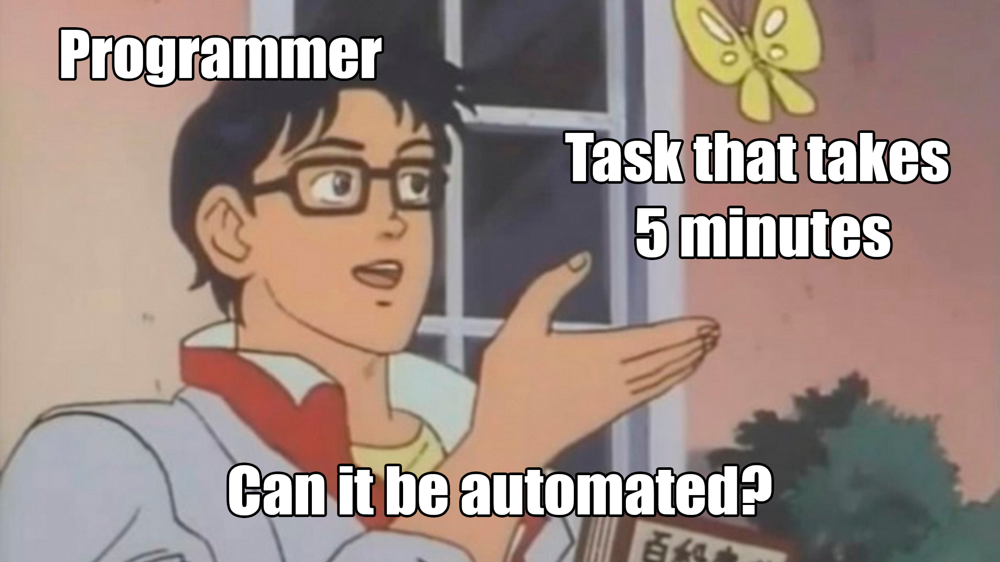
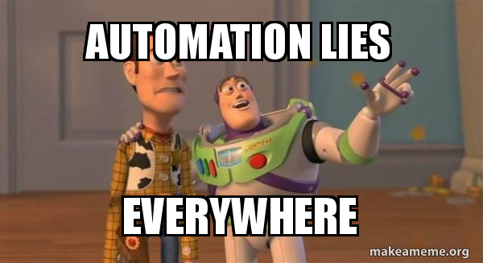
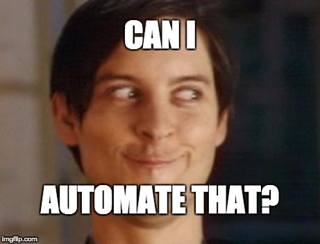

# Developer automation

Ideas about how, why, and perspectives on software developers automating tasks

## Themes

- Robots/automation will replace software developers
- 

## Larry Wall - [Three great virtues of a programmer](https://wiki.c2.com/?LazinessImpatienceHubris)

## Memes

