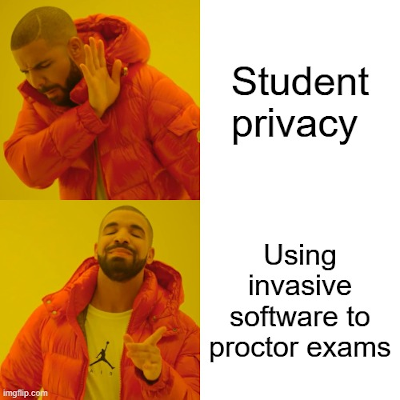
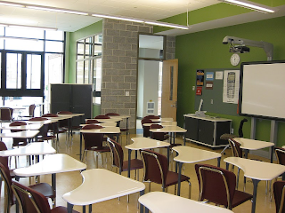
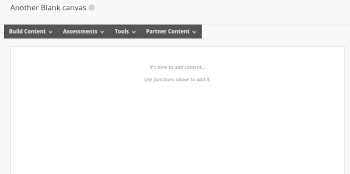

```toml
post_title='Exploring Dron's definition of educational technology'
layout="post"
published=false
id=18044
link="https://djon.es/blog/???"
category="casa"
img_base_url="https://djplaner.github.io/memex/share/blog/"
```

Pre-COVID the role of technology in learning and teaching in higher education was important. It was core to the response to COVID.  But, it seems most of that response was not that great. There was some good work. There was a lot of a "good enough for the situation" work. There was a lot of work that really sucked.



Arugably, not that different from pre-COVID. The main difference being the overall use of digital technology was by necessity much larger. A rapid transformation made whilst responding to a pandemic was never going be our best work. There just wasn't time to engage in significant questioning of current assumptions and practices to develop effective, context specific responses. Especially when most pre-2020 individual and organisational assumptions and practices around learning, teaching and technology were built on fairly limited conceptual foundations. As individuals, institutions, and [vendors](https://edublog.microsoft.com/en-au/2021/02/higher-ed-reimagined-navigating-the-three-rs-to-build-agility-and-resilience/) (thanks Microsoft?) begin to (re-)imagine what's next for learning and teaching in higher education, now is probably a good time to explore and improve those limited conceptual foundations.

The following is an attempt to understand [Dron's (2021)](https://jondron.ca/my-latest-paper-educational-technology-what-it-is-and-how-it-works/) definition of educational technology and how it works. The following starts by applying Dron's definition to a common practical example. It finishes with a list of questions that Dron's definition might raise for the assumptions and practices that I see in everyday practice.

## Analysing a tutorial room

Imagine you're responsible for running a tutorial for a course. You've just rocked up to the tutorial room for the first time and you're looking at one of the following room layouts: computer lab, or classroom. How does Dron's definition of educational technology help understand the learning and teaching activity and experience you and your students are about to embark upon? How might it help students, teachers, and the people from facilities management and your institution's learning and teaching centre?

|Computer lab | Classroom  |
| --- | --- |
| |  |
| [Czeva](https://commons.wikimedia.org/wiki/File:Workshop_for_librarians_2019-06-04_JVK_%C4%8CBu_03.jpg), [CC BY-SA 4.0](https://creativecommons.org/licenses/by-sa/4.0) via Wikimedia Commons | [Thedofc](https://commons.wikimedia.org/wiki/File:SWW-classroom1.jpg), Public domain, via Wikimedia Commons |

Before going any further, it might help to ponder the following questions

1. What is the technology you would see during your tutorial in the rooms above?
2. What is the nature of the work you and your students will need to do during the tutorial?
3. Which of the rooms above would be "best" for your tutorial? Why?
4. How could the rooms above be modified to be better for tutorials? Why?

### What is the (educational) technology in the room?

Considering question 1, what would be on your list?

A typical list might include chairs, tables, computers, whiteboards (interactive/smart and static), clock, notice boards, doors, windows, walls, floors, cupboards, water bottles, phones, books, notepads etc.

Maybe you add more of the technologies that you and your students brought with you. Laptops, phones, backpacks etc. What else?

How do you delineate between what is and isn't technology? How would you define technology?
### Dron's definition of (educational) technology?

Dron (2021) starts by acknowledging that defining technology is hard. That most definitions a vague, incomplete, and often contradictory. Dron builds his definition on [Arthur's (2009)](http://tuvalu.santafe.edu/~wbarthur/thenatureoftechnology.htm) definition of technology as
> the orchestration of phenomena for some purpose (Arthur, 2009, p. 51)
Or, as [this page](http://tuvalu.santafe.edu/~wbarthur/thenatureoftechnology.htm) puts it (emphasis added)
> A technology then is a programming or **orchestration** of **phenomena** to **our use**

The phenomena harnessed by technology includes stuff that is "real or imagined, mental or physical, designed or existing in the natural world" (Dron, 2021, p. 2). This means that the phenomena organised by a technology includes other technologies. Some examples from the classrooms above, might include:

- Manufacturers of furniture orchestrated various physical and material phenomena to produce the chairs, desks and other furniture.
- During a tutorial you and your students will orchestrate various phenomena into the technologies of reading, writing and speaking.
- During a tutorial you and your students will orchestrate or assemble both these physical and mental phenomena/technologies into specific learning activities.

For Arthur and Dron, **pedagogies are a type of technology**. 


### What is educational technology?

Building on this Dron's (2021) position is that
> educational technology, or learning technology, may tentatively be defined as one that, deliberately or not, includes pedagogies among the technologies it orchestrates.

Arguably, following from this both the images above are examples of educational technologies. The inclusion of pedagogies in the empty classroom is more implicit than in the computer lab which shows people apparently engaged in a learning activity. The empty classroom implicitly illustrates some teacher-driven pedagogical assumptions in terms of how it is laid out. With the chairs and desks essentially in rows facing front. 

The teacher-driven pedagogical assumptions in the computer lab is more explicit. Not only because you can see the teacher up the front and the students apparently following along. But also because the teacher-driven pedagogical assumptions are enshrined in the computer lab. The rows in the computer lab are not designed to be moved. The seating positions for students is almost always going to be facing toward the teacher at the front of the room. There are even partitions between each student making collaboration and sharing more difficult.

The classroom, however, is more flexible. It implicitly enables a number of different pedagogical assumptions. A number of different orchetrations of different phenomna. The chairs and tables can be moved. They could be pushed to sides of the room to open up a space for all sorts of large group and collaborative pedagogies. The shapes of the desks suggest that it would be possible to push four of them together to support small group pedagogies. Pedagogies that seek to assemble or orchestrate a very different set of mental and learning phenomena. 

The classroom is designed to be assembled in different ways.

### Use and particpation: hard and soft 

For Dron (2021) students and teachers are "not just _users_ but _participants_ in the orchestration of technologies" (p. 3). The technology that is the tutorial you are running, requires participation from **both** teacher and students. For example, organise the room for particular activities, use the whiteboard/projector to show relevant task information, use language to share a particular message, and use digital or physical notebooks etc. Individuals perform these tasks in different ways, with lesser or greater success, with different definitions of what is required, and with different preferences.

Some technologies heavily pre-deterimine/restrict what activities can be done. For example, the rigidity of the seating arrangements in the computer lab. The constraints this type of technology places on our behaviour leads Dron to label them as **hard** technologies. There is no capacity to creatively orchestrate the seating arrangement in the computer lab to achieve some specific purpose.

Other technologies allow and perhaps require more active and creative orchestration. The classroom has seating that can be creatively arranged to fit a particular activity. It is a **soft** technology. Soft technology allows, perhaps even requires, additional knowledge, processes and techniques (i.e additional technology) to be useful. Dron (2021) identifies "teaching methods, musical instruments and computers" as further examples of soft technologies. Technologies that require more from us in terms of orchestration.

### Hard is easy, soft is hard

Hard technologies don't require additional knowledge, processes and techniques. What participation hard technologies require is constrained and (hopefully) fairly obvious. Hard technologies are typically easy to use. Soft technologies require additional knowledge, processes and techniques. The more you know the more creatively you can orchestrate them. Soft technologies are hard to use.

| Hard is easy |  Soft is hard |
| --- | --- |
| |  |
|[Aleksander Fedyanin](https://commons.wikimedia.org/wiki/File:%D0%9A%D0%B0%D1%80%D1%82%D0%B8%D0%BD%D1%8B_%D0%BF%D0%BE_%D0%BD%D0%BE%D0%BC%D0%B5%D1%80%D0%B0%D0%BC.jpg), [CC0](http://creativecommons.org/publicdomain/zero/1.0/), via Wikimedia Commons | [Small easel with a blank canvas](https://www.publicdomainpictures.net/en/view-image.php?image=62975&picture=small-easel-with-a-blank-canvas), [CC0](http://creativecommons.org/publicdomain/zero/1.0/)   |

Softness is not universally available. It can only be used if you have the awareness, permission, knowledge, and self-efficacy necessary to make use of it. Since I "know" I "can't paint", I'd almost certainly never even think of using of a blank canvas. As a brand new tutor entering the classroom shown above, you may not feel confident enough to re-arrange the chairs. You may also not be aware of certain beneficial learning activites that require moving the chairs. If you've never taught a particular tutorial or topic with a particular collection of students, you may not be aware that different orchestratiosn of technologies may be required.
### Assembly and orchestration

It's easy to look at the layout of the computer lab and the classroom and make judgements about the room. That classroom is X. It encourages Y. If we're to encourage better learning and teaching we need to design more of rooms like room Z. Dron's (2021) argument is that the object (i.e. the physical layout of the room) is not the most important educational technology, instead
> The technology that matters most is that object _plus_ the orchestrated assembly of which it is a part, including soft technologies added by its participants (p. 6)

And that _orchestrated assembly_ is not limited to just what the teacher does. Yes, teaching does require the orchestration of "many phenomena...from hard organization of content to soft facilitation of interaction" (Dron, 2021, p. 6). But that's not the full picture. The quality of the learning that occurs as a result of any educational technology is reliant on "the further (soft) orchestration of phenomena by the learners" (Dron, 2021, p. 6). 

As above, softness is not universally available. Learners enter your tutorial from different backgrounds, different preparation, different personal lives, different resources and different capabilities to orchestrate. Regardless of how much "(soft) orchestration" your tutorial requires (or even intends to allow) from the learner, each learner will make different choices about how to orchestrate what you've designed.

### It's assemblies all the way down

The assembly work done by teachers and students "are just the obvious visible tips of the iceberg" (Dron, 2021, p. 7). Teaching a tutorial in one of the rooms above draws on other the work of others orchestrating phenomena to create the educational technologies that influence and are part of your tutorial assembly. The collection of different people responsible for organising the timetable that has your tutorial in that room at 5pm on Friday have contributed to the phenomena you and your students are orchestrating to create your tutorial. Not to mention the facilities management people who designed the classroom, the designers of the whiteboards, or the authors of the set text.

### Hard technologies are first and structural

When it comes to assemblying your tutorial Dron (2021) argues that because hard technologies take more time to change. That hard technologies are more likely to structure/constrain how you assemble your tutorial than soft technologies. Meaning that the first consideration in any learning design is the hard technologies. You can't think of the pedagogy (a very soft technology) before considering the other harder technologies that will be part of your assembly. 

You assemble the tutorial within a web of other technologies. As the number of hard technologies and interconnections between hard technologies increases, the web in which you're working becomes harder to change. Various policies, requirements and decisions are made before you start assembling the tutorial. You might be a casual paid for 1 hour to take a tutorial in the computer lab shown above on Friday at 5pm. You might be required to use a common, pre-determined set of topics/questions. To ensure a common learning experience for students across all tutorials you might be required to use a specific pedagogical approach.

More on this below.

### Technologies mediate all formal education and intentional learning

Based on Arthur's definition of technology Dron (2021) argues that 
> All teachers use technologies, and technologies mediate all formal education (p. 2)
Everyone involved in education has to be involved in the orchestration of new assemblies of technology. e.g. as you enter one of the rooms above as the teacher, you will orchestrate the available technologies **including** your chose explicit/implicit pedagogical approaches into a learning experience. If you enter one of the rooms as the learner, you will orchestrate the assembly presented to you by the teacher and institution with you technologies, for your purpose.  Dron (2021) does argue that "learning, in contrast, is not a technology" (p. 3) but instead something that naturally (and not so naturally) is done by babies and non-human entities. However, humans commence engaging intentially in learning we start orchestrating assemblies of technologies that include technologies such as language, writing, theories, models etc. 
 
- Dron actively positions learners/teachers as _coparticipants_ in technologies
- Those technologies require different types of participation
- Some have to be followed as is, others require us to fill gaps with novel orchestrations 
- Most are a mix of the two and that mix depends on context, participant, and use
- Thus education is deeply, fundamentally, irreucibly human, complex, situated an social - it is ungeneralizabel in their effects 
  

> Like all technological interventions - and hence all education - it is generative and inductive, a process of imaginitive synthesis, on the part of all co-participants, especially including the learner (p. 10)

> It is the ways the machine is orchestrated by humans, with humans, and for humans that makes it educational. (p. 10)


## Possible questions, applications, and implications

A "coparticipation model"

[Dron (2021)](https://jondron.ca/my-latest-paper-educational-technology-what-it-is-and-how-it-works/) applies his definition of educational technology to some of the big educational research questions including: the no significant different phenomena; learning styles; and the impossibility of replication studies for educational interventions. The following is an ad hoc list of questions, applications, and implications arising from his definition to my practitioner experience with educational technology within Australian Higher Education. A list for further consideration.

### Is the main problem the purpose of contemporary universities?

[Mark Johnson's answer](https://postpandemicuniversity.net/2021/04/05/technology-and-conversation/) to the question "Why don't your Zoom lectures Dance?" he doesn't critique Zoom and its limitations. i.e. he doesn't critique the technological object. Instead he looks at the orchestrated assembly within which this technological object is used. But the orchestrated assembly he examines is not your Zoom lecture, instead he focuses on the orchestrated assembly within which your Zoom lecture occurs. He focuses on the technology (aka orchestrated assembly) that is the Unviersity.

His argument is that the _purpose_ to which various _phenomena_ are being _orchestrated_ to create the technology of a Unviersity is the problem. He describes the current problematic purpose of contemporary unviersities as the "transactional 'delivery of learning' and its measurement" and to "make profits and pay vice-chancellors obscene salaries". He suggests that is the purpose of this particular technology was "creating the contexts for new conversations" is needed to really make your Zoom lectures dance.

Arthur's (2009) conceptualisation of technology and Dron's (2021) definition of educational technology aren't used in Johnson's argument. But it is does seem that there is some resonance. A resonance that does seem to suggest that we should...

### Focus on assembly and fit for (whose) purpose, rather than pedagogy before technology?

Dron argues for viewing education as "a coparticipative technological processes" and that such a conceptualisation is profound.

**Old stuff below here in this section**

I don't ever seem myself being in a position to change the purpose of higher education, but I do think Arthur, Dron and Johnson are onto a useful way of understanding how to influence the quality of learning and teaching at a practitioner level. That is to eschew less than helpful arguments about precedence between pedagogy and technology (see [Google Scholar](https://scholar.google.com/scholar?q=%22pedagogy+before+technology%22)). Instead focus on something along the lines of how easy it is for students and teachers to assemble technologies for their purposes.

Educationalists have been quite rightly arguing against technological "silver bullets" to education for quite some time. As argued above, a single technological object (e.g. Microsoft Teams, O365, Blackboard Ultra etc.) is not what matters. The problem for the "pedagogy before technology" folk is that (depending on your definition) pedagogy is just another technological object. The quality of a learning and teaching experience will most influenced about how well the participants in that experience are able to assemble the necessary technologies to achieve their collective and individual purpose(s).

### Common hard assemblies as a barrier?

All universities appear to already have a common set of core learning and teaching assemblies: lectures, tutorials, workshops, assignments, exams, course sites etc. These common assemblies are well understood within universities. Most participants in higher education quickly form an understanding of the types of orchestrations they are expected to perform within these assemblies. These assemblies are difficult to change because they are enmeshed in interconnected webs of different technologies. Position titles (lecturer, tutor), time-tabling, workload allocation, enterprise bargaining agreements, room design, accreditation requirements of governments and professional bodies, and many more all work to enshrine these technologies as "the way we do things around here".

Isn't any surprise that during the rapid COVID response the most common questions were: How do I move my (lecture|tutorial|final exam) online?

These common hard assemblies appear to be barriers to change. Can far-reaching changes in pedagogical practice occur without changing these hard assemblies? Will mandating that all academic staff must have formal pedagogical credentials change these hard assemblies?

### Universities are trying to use the same assemblies

All those existing hard assemblies surrounding learning and teaching were orchestrated into being to support face-to-face learning and teaching. Part of the challenge now is that those assemblies arguably don't work as effectively for significant uses of digital technology. Digital technology is a new phenomena (technology) that the University technology is trying to use. It works differently to face-to-face technology. Different technologies as different phenomena create and foreclose different different opportunities (Zuboff, 1985). Different technologies have different affordances. Different technologies enable and perhaps enable different types of orchestration and produce different types of assembly.

Evidence for this difference is visible in the history for Australian higher education where there have been universities that were on-campus only, primarily print-based distance education, dual mode, and primarily online.
### The LMS is both too soft (difficult) and too hard

The LMS is not a single technology. It contains multiple tools - discussion board, gradebook, content authoring etc - that can be assembled in many different ways. In most institutions that I'm aware of a course site within the Learning Management Systems is a mixture technologies that are both too hard and too soft. Some of this distinction is baked into the LMS, some of it is enshrined by institutional practice and policy.  

For example, most LMS ensure that only authorised people are able to access a course site. Institutional policy determines specifically who is authorised. Hard limitations that can make it difficult to assemble open educational practices. 

An LMS can also come with its equivalent to a blank canvas, a very soft technology. Below is an image of a blank Blackboard Content Area. The blank canvas where a teacher is expected to create a wonderful learning and teaching experience. Exactly what they do is entirely up to them and their knowledge of learning, teaching, Blackboard, web design and other technical knowledge. It's hard. Not many academics have the necessary knowledge. That's why there are so many [ugly](https://djon.es/blog/2019/01/30/improving-reuse-of-design-knowledge-in-a-lms/#the-initial-problem-ugly-text), badly designed LMS course sites, and a tendency for academics to use the LMS as a content repository for PowerPoints, Word docs, and PDF files (Bartuskova et al., 2015).

| Blank Canvas | Blank Blackboard Content Area |
| --- | --- |
|  |  |
| [Small easel with a blank canvas](https://www.publicdomainpictures.net/en/view-image.php?image=62975&picture=small-easel-with-a-blank-canvas), [CC0](http://creativecommons.org/publicdomain/zero/1.0/) | Another blank canvas [CC0](http://creativecommons.org/publicdomain/zero/1.0/) |

### Using assemblies to make the soft (difficult) hard (easy) and the hard soft

Dron (2021) points out that hard technologies can be made soft, and soft technologies can be made hard by orchestrating them into other assemblies. For example, a previous institution had the practice of creating different course sites for different offerings of a course. Meaning that students in each offering were starting from a clean slate. Any [residue of experience](https://djon.es/blog/2014/08/15/joining-the-swarm-what-a-course-might-be/#evaporating-residue-of-their-experiences) (Riel and Polin, 2004) from earlier offerings is lost. In [this example](https://djon.es/blog/2014/08/15/joining-the-swarm-what-a-course-might-be/#some-examples-of-the-residue-of-experience) the LMS-based course site was orchestrated into a broader assembly of technologies that includes an external social bookmarking and annotation tool (Diigo). Softening the LMS and enabling some development of a shared residue of experience.

Most universities seek to harden the soft (make the difficult, easier) technology of a LMS site through the development of a institutional standard course shell/look and feel. A specific assembly of features that provide a consistent set of features across all courses with the ultimate aim of increase the quality of the learner experience while reducing the workload required to provide it. In what many see as the best scenario course development is not done by the teacher, but instead course development is orchestrated into a broader assembly that includes on a team of people with expertise in content, learning design, and technology that use a systematic design process to develop the course.

But these resulting assemblies (technologies) then have limitations that then lead to different types of assemblies. Generic default course sites suffer from the [[reusability-paradox]]

Walsh et al (2020) as an example of a very specific type of assembly that is being used to produce high quality learning experieences.  Public/private with very specific/different teams - unbundling - but as perhaps the worst example of what Johnson is talking about. Raisign questions of how normal unviersities can achieve this and enable the sspace for the conversations that Johnson talks about. Perhaps the shared assmebly/CASA approach can work here. With a focus on conversations and on generativity

### Swinging from hard to soft

Talk about GO assemblies

Lead into CASA

Some institutions define a common "default course structure" which defines some com

### The difficulty of scale

Resort of project maanagement and hard technologies

## References

Arthur, W. B. (2009). *The Nature of Technology: What it is and how it evolves*. Free Press.

Bartuskova, A., Krejcar, O., & Soukal, I. (2015). Framework of Design Requirements for E-learning Applied on Blackboard Learning System. In M. Núñez, N. T. Nguyen, D. Camacho, & B. Trawiński (Eds.), *Computational Collective Intelligence* (pp. 471--480). Springer International Publishing.

Dron, J. (2021). Educational technology: What it is and how it works. *AI & SOCIETY*. <https://doi.org/10.1007/s00146-021-01195-z>

Riel, M., & Polin, L. (2004). Online learning communities: Common ground and critical differences in designing technical environments. In S. A. Barab, R. Kling, & J. Gray (Eds.), *Designing for Virtual Communities in the Service of Learning* (pp. 16--50). Cambridge University Press.

Walsh, C., Mital, A., Ratcliff, M., Yap, A., & Jamaleddine, Z. (2020). A public-private partnership to transform online education through high levels of academic student support. *Australasian Journal of Educational Technology*, *36*(5), 30--45\. <https://doi.org/10.14742/ajet.6107>

Zuboff, S. (1985). Automate-informate: The two faces of intelligent technology. Organizational Dynamics, 14(2), 5–18. https://doi.org/10.1016/0090-2616(85)90033-6

[//begin]: # "Autogenerated link references for markdown compatibility"
[reusability-paradox]: ../../../sense/Bricolage/reusability-paradox "Reusability Paradox"
[//end]: # "Autogenerated link references"