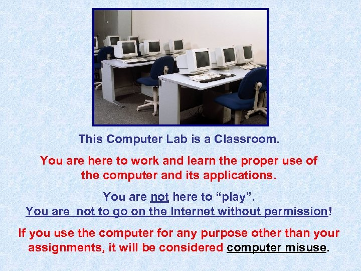

```toml
post_title='Exploring Dron's definition of educational technology'
layout="post"
published=false
id=18075
link="https://djon.es/blog/2021/06/04/exploring-drons-definition-of-educational-technology"
category="nodt"
img_base_url="https://djplaner.github.io/memex/share/blog/"
```

Pre-COVID the role of technology in learning and teaching in higher education was important. However, in 2020 it become essential as a core part of the COVID response. Given the circumstances, it is no surprise that chunks of that response was not that great. There was some good work. There was a lot of a "good enough for the situation" work. There was quite a bit that really sucked.


Arugably, however, I'm not sure there's much difference from pre-COVID practice. Yes, COVID meant that the importance and spread of digital technology use was much, much higher. But, rapid adoption whilst responding to a pandemic was unlikely to be better (or as good?) qualitatively than previous practice. There just wasn't time to engage in the work required to question prior assumptions and redesign prior practices to suit the very different context and needs. Let alone harness technology transformatively.

It is even less likely if - as I believe - most pre-COVID individual and organisational assumptions and practices around learning, teaching and technology were built on fairly limited conceptual foundations. Building a COVID response on that sandy foundation was never going to end well. As individuals, institutions, and [vendors](https://edublog.microsoft.com/en-au/2021/02/higher-ed-reimagined-navigating-the-three-rs-to-build-agility-and-resilience/) (thanks Microsoft?) begin to (re-)imagine what's next for learning and teaching in higher education, then it is probably a good time to explore and improve those limited conceptual foundations.

That's where this post comes in. It is an attempt to understand and apply [Dron's (2021)](https://jondron.ca/my-latest-paper-educational-technology-what-it-is-and-how-it-works/) definition of educational technology and how it works. There are other conceptual/theoretical framings that could be used. For example, postdigital ([Fawns, 2019](https://doi.org/10.1007/s42438-018-0021-8)). That's for other posts. The intent here it to consider Dron's definition of educational technology and if/how it might help improve the conceptual foundations of institutional practices with educational technology. 

By the end of writing this post, I'm seeing some interesting implications arising, including:

- Another argument for limitations in the "pedagogy before technology" argument.
- A possible explanation for why most L&T professional development is attended by the "usual suspects".  
- Thoughts on the problems created by the separation of pedagogy and technology into two organisational universities.
- One explanation why the "blank canvas" (soft) nature of the LMS (& why the NGDLE only makes this worse) is a big challenge for quality learning and teaching.
- Why improving digital fluency or the teaching qualifications of teaching staff are unlikely to address this challenge.

## Analysing a tutorial room

Imagine you're responsible for running a tutorial at some educational institution. You've rocked up to the tutorial room for the first time and you're looking at one of the following room layouts: computer lab, or classroom. How does Dron's definition of educational technology help understand the learning and teaching activity and experience you and your students are about to embark upon? How might it help students, teachers, and the people from facilities management and your institution's learning and teaching centre?

|Computer lab | Classroom  |
| --- | --- |
| |  |
| [Czeva](https://commons.wikimedia.org/wiki/File:Workshop_for_librarians_2019-06-04_JVK_%C4%8CBu_03.jpg), [CC BY-SA 4.0](https://creativecommons.org/licenses/by-sa/4.0) via Wikimedia Commons | [Thedofc](https://commons.wikimedia.org/wiki/File:SWW-classroom1.jpg), Public domain, via Wikimedia Commons |

Before going further, ask yourself these questions

1. What technology do you see in the rooms above (imagine you can see a tutorial being run in both)?
2. What is the nature of the work you and your students do during the tutorial?
3. Which of the rooms above would be "best" for your tutorial? Why?
5. How could the rooms above be modified to be better for tutorials? Why?

### What is the (educational) technology in the room?

Assuming we're looking at a tutorial being carried out in both images. What would be on your list of technology being used?

A typical list might include chairs, tables, computers, whiteboards (interactive/smart and static), clock, notice boards, doors, windows, walls, floors, cupboards, water bottles, phones, books, notepads etc.

You might add more of the technologies that you and your students brought with you. Laptops, phones, backpacks etc. What else?

How do you delineate between what is and isn't technology? How would you define technology?

### Defining technology

Dron (2021) starts by acknowledging that this is hard. That most definitions of technology are vague, incomplete, and often contradictory. He goes into some detail why. Dron's definition draws on [Arthur's (2009)](http://tuvalu.santafe.edu/~wbarthur/thenatureoftechnology.htm) definition of technlogy as (emphasis added)
> the **orchestration** of **phenomena** for some **purpose** (Dron, 2021, p. 1)

Phenomena includes stuff that is "real or imagined, mental or physical, designed or existing in the natural world" (Dron, 2021, p. 2). Phenomena can be drawn from physics (materials science for table tops), biology (human body climate requirements), chemistry etc. Phenomena can be: something you touch (the book you hold); another technology (the book you hold); a cognitive practice (reading); and, partially or entirely human enacted (think/pair/share, organisational processes etc).

For Arthur, technological evolution comes from combining technologies. The phenomena being orchestrated in a technology can be another technology. Writing (technology) orchestrates language (technology) for another purpose. A purpose [Socrates didn't much care for](https://newlearningonline.com/literacies/chapter-1/socrates-on-the-forgetfulness-that-comes-with-writing). Different combinations (assemblies) of technologies can be used for different purposes. New technologies are built using assemblies of existing technologies. There are inter-connected webs of technologies orchestrated by different people for different purposes.

For example, in the classrooms above manufacturers of furniture orchestrated various physical and material phenomena to produce the chairs, desks and other furniture. Some other people - probably from institutional facilities management - orchestrated different combinations of furniture for the purpose of designing cost efficieent and useful tutorial rooms. The folk designing the computer lab had a different purpose (provide computer lab with desktop computers) than the folk designing the classroom (provide a room that can be flexibly re-arranged). Those different purposes led to decisions about different approaches to orchestration of both similar and different phenomena.

When the tutorial participants enter the room they start the next stage of orchestration for different, more learning and teaching specific purposes. Both students and teachers will have their own individual purposes in mind. Purposes that may change in respone to what happens in the tutorial. Those diverse purposes will drive them to orchestrate different phenomena in different ways. To achieve a particular learning outcome, a teacher will orchestrate different phenomena and technology. They will combine the technologies in the room with certain pedagogies to create specific learning tasks. The students then orchestrate how the learning tasks - purposeful orchestrations of phenomena - are integrated into their individual purposes.

Some assemblies of technologies are easier to orchestrate than others. Collaborative small group pedagogies would probably be easier in the classroom, than the computer lab. The design of the furniture technology in the classroom has been orchestrated with the purpose of enabling this type of flexibility. Not so the computer lab.

For Arthur and Dron, **pedagogies are a technology** and **education is a technology**.


IMHO the plus side of this perspective is that it reduces the value of terms like e-learning, digital learning, technology-enhanced learning, and online learning; or, calls to put pedagogy before technology. Phrases that tend to elevate one of the phenomena (digital, online, "e-", or pedagogy) that may be orchestrated for the purpose of learning and teaching onto an unhelpful pedestal.

### What is educational technology?

Dron (2021) answers
> educational technology, or learning technology, may tentatively be defined as one that, deliberately or not, includes pedagogies among the technologies it orchestrates.

Consequently, both the images above are examples of educational technologies. The inclusion of pedagogies in the empty classroom is more implicit than in the computer lab which shows people apparently engaged in a learning activity. The empty classroom implicitly illustrates some teacher-driven pedagogical assumptions in terms of how it is laid out. With the chairs and desks essentially in rows facing front.

The teacher-driven pedagogical assumptions in the computer lab are more explicit and fixed. Not only because you can see the teacher up the front and the students apparently following along. But also because the teacher-driven pedagogical assumptions are enshrined in the computer lab. The rows in the computer lab are not designed to be moved (probably because of the phenomena associated with desktop computers, not the most moveable technologies). The seating positions for students are almost always going to be facing toward the teacher at the front of the room. There are even partitions between each student making collaboration and sharing more difficult.

The classroom, however, is more flexible. It implicitly enables a number of different pedagogical assumptions. A number of different orchetrations of different phenomena. The chairs and tables can be moved. They could be pushed to sides of the room to open up a space for all sorts of large group and collaborative pedagogies. The shapes of the desks suggest that it would be possible to push four of them together to support small group pedagogies. Pedagogies that seek to assemble or orchestrate a very different set of mental and learning phenomena. The classroom is designed to be assembled in different ways.

But beyond that both rooms appear embedded in the broader assembly of technology of formal education. They appear to be classrooms within the buildings of an educational institution. Use of these classrooms are likely scheduled according to a time-table. Scheduled classes are likely led by people employed according to specific position titles and role descriptions. Most of which are likely to make some mention of pedagogies (e.g. lecturer, tutor, teacher).

### Technologies mediate all formal education and intentional learning

Dron's (2021) position is that 
> All teachers use technologies, and technologies mediate all formal education (p. 2)

Everyone involved in education has to be involved in the orchestration of new assemblies of technology. e.g. as you enter one of the rooms above as the teacher, you will orchestrate the available technologies **including** your choice of explicit/implicit pedagogical approaches into a learning experience. If you enter one of the rooms as the learner, you will orchestrate the assembly presented to you by the teacher and institution with your technologies, for your purpose.

Dron does distinguish between learning and intentional learning. Learning is natural. It occurs without explicit orchestration of phenomena for a purpose. He suggests that babies and non-human entities engage in this type of learning. But when we start engaging in intentional learning we start orchestrating assemblies of phenomena/technologies for learning. Technologies such as language, writing, concepts, models, theories, and beyond.

### Use and particpation: hard and soft 

For Dron (2021) students and teachers are "not just _users_ but _participants_ in the orchestration of technologies" (p. 3). 

The technology that is the tutorial you are running, requires participation from **both** you and the students. For example, to help organise the room for particular activities, use the whiteboard/projector to show relevant task information, use language to share a particular message, and use digital or physical notebooks etc. Individuals perform these tasks in different ways, with lesser or greater success, with different definitions of what is required, and with different preferences. They don't just use the technology, the participate in the orchestration.

Some technologies heavily pre-deterimine and restrict what form that participation takes. For example, the rigidity of the seating arrangements in the computer lab image above.  There is very limited capacity to creatively orchestrate the seating arrangement in the computer lab. The students participation is largely (but not entirely) limited to sitting in rows. The constraints this type of technology places on our behaviour leads Dron to label them as **hard** technologies. But even hard technologies can orchestrated in different ways by coparticipants. Which in turn lead to different orchestrations.



Other technologies allow and may require more active and creative orchestration. As mentioned above, the classroom image includes seating that can be creatively arranged in different ways. It is a **soft** technology. The additional orchestration that soft technologies require, requires from us additional knowledge, processes and techniques (i.e additional technology) to be useful. Dron (2021) identifies "teaching methods, musical instruments and computers" as further examples of soft technologies. Technologies that require more from us in terms of orchestration.

### Hard is easy, soft is hard

Hard technologies typically don't require additional knowledge, processes and techniques to achieve their intended purpose. What participation hard technologies require is constrained and (hopefully) fairly obvious. Hard technologies are typically easy to use (but perhaps not a great fit). However, the intended purpose baked into the hard technology may not align with your purpose.

Soft technologies require additional knowledge, processes and techniques to be useful. The more you know the more creatively you can orchestrate them. Soft technologies are hard to use because they require more of you. However, the upside is that there is often more flexibility in the purpose you can achieve with soft technologies. 

For example, let's assume you want to paint a picture. The following images show two technologies that could help you achieve that purpose. One is hard and one is soft.

| Hard is easy |  Soft is hard |
| --- | --- |
| |  |
|[Aleksander Fedyanin](https://commons.wikimedia.org/wiki/File:%D0%9A%D0%B0%D1%80%D1%82%D0%B8%D0%BD%D1%8B_%D0%BF%D0%BE_%D0%BD%D0%BE%D0%BC%D0%B5%D1%80%D0%B0%D0%BC.jpg), [CC0](http://creativecommons.org/publicdomain/zero/1.0/), via Wikimedia Commons | [Small easel with a blank canvas](https://www.publicdomainpictures.net/en/view-image.php?image=62975&picture=small-easel-with-a-blank-canvas), [CC0](http://creativecommons.org/publicdomain/zero/1.0/)   |

Softness is not universally available. It can only be used if you have the awareness, permission, knowledge, and self-efficacy necessary to make use of it. Since I "know" I "can't paint", I'd almost certainly never even think of using of a blank canvas. But then if I'm painting by numbers, then I'm stuck with producing whatever painting has been embedded in this hard technology.

As a brand new tutor entering the classroom shown above, you may not feel confident enough to re-arrange the chairs. You may also not be aware of certain beneficial learning activites that require moving the chairs. If you've never taught a particular tutorial or topic with a particular collection of students, you may not be aware that different orchestrations of technologies may be required.

### Hard technologies are first and structural

Harder technologies are structural. They funnel practice in certain ways. Softer technologies tend to adapt to those funnels, some won't be able to adapt. The structure baked into the hard technology of the computer lab above makes it difficult to effectively use [a circle of voices](https://www.ufs.ac.za/sasse/classe-home/unlisted-pages/ideas/idea-18-circle-of-voices) activity. The structure created by hard technologies may mean you have to consider a different soft technology. For this reason, consideration of the hard technologies comes first. If only to figure out how to work around the constraints.

This can be difficult because hard technologies become part of the furniture. They become implicit, invisible and even apparently natural parts of education. The hardness of the computer lab above is quite obvious, especially the first time you enter the room for a tutorial. But what about the other invisible hard technologies embedded into the web technologies that is formal education. 

You assemble the tutorial within a web of other technologies. As the number of hard technologies and interconnections between hard technologies increases, the web in which you're working becomes harder to change. Various policies, requirements and decisions are made before you start assembling the tutorial. You might be a casual paid for 1 hour to take a tutorial in the computer lab shown above on Friday at 5pm. You might be required to use a common, pre-determined set of topics/questions. To ensure a common learning experience for students across all tutorials you might be required to use a specific pedagogical approach.

While perhaps not as physically hard as the furniture in the computer lab, these technologies tend to funnel practice toward certain forms.

### Education is a coparticipative technological process

For Dron (2021) education is a coparticipative technological process. Education - as a technology - is a complex orchestration of different nested phenomena for diverse purposes. 

How it is orchestrated and for what purposes are inherently situated, socially constructed, and ungeneralizable. While the most obvious coparticipants in education are students and teachers there are many others. Dron (2021) provides a sample, including "timetablers, writers, editors, illustrators of textbooks, creators of regulations, designers of classrooms, whiteboard manufacturers, developers and managers of LMSs, lab technicians". Some of a never ending list of roles that orchestrate some of the phenomena that make up the technologies that teachers and students then orchestrate to achieve their diverse purposes.

Dron (2021) argues that **how the coparticipants orchestrate the technologies is what is important**. That the technologies of education - pedagogies, digital technologies, rooms, policies, etc. - "have no value at all without how we creatively and responsively orchestrate them, fuelled by passion for the subject and process, and compassion for our coparticipants" (p. 10). Our coparticipative orchestration is the source of the human, socially constructed, complex and unique processes and outcomes of learning. More than this Dron (2021) argues that the purpose of education is to **both** develop our knowledge and skills **and** to encourge the never-ending development of our ability to assemble our knowledge and skills "to contribute more and gain more from our communities and environments" (p. 10)

Though, as a coparticipant in this technological process, I assume I could orchestrate that particular technology with other phenemona to achieve a different purpose. e.g. if I were a particular type of ed-tech bro, then profit might be my purpose of choice.

## Possible questions, applications, and implications

[Dron (2021)](https://jondron.ca/my-latest-paper-educational-technology-what-it-is-and-how-it-works/) applies his definition of educational technology to some of the big educational research questions including: the no significant different phenomena; learning styles; and the impossibility of replication studies for educational interventions. The following is an ad hoc list of questions, applications, and implications arising from his definition to my practitioner experience with educational technology within Australian Higher Education. A list for further consideration.

At this stage, I'm drawn to how this conception of educational technology breaks down the duality between technology and pedagogy. Instead, it positions pedagogy and technology as "just" phenomena that the coparticipants in education will orchestrate for their purposes. Echoing the sociomaterial and postdigital turns.  The notions of hard and soft technologies and what they mean for orchestration also seem to offer an interesting lens to understand and guide institutional attempts to improve learning and teaching.

Pulling apart Dron's (2021) definition 
> the orchestration of phenomena for some purpose (Arthur, 2009, p. 51)
seems to suggest the following questions about L&T as being important
1. Purpose: whose purpose and what is the purpose?
2. Orchestration: how can orchestration happen and who is able orchestrate?
3. Phenomena: what phenomena/assemblies are being orchestrated?

Questions that echo [Fawn's (2020) argument](https://www.teaching-matters-blog.ed.ac.uk/pedagogy-and-technology-from-a-postdigital-perspective/) using a postdigital perspective to argue against the pedagogy before technology purpose and landing on the following
> (context + purpose) drives (pedagogy [ which includes actual uses of technology])

A tutorial in one of the rooms above has to start with the content and purpose. In this case the context is the web of existing technologies that have led you and your students being in the room ready for a tutorial. The purpose includes the espoused learning goals of the tutorial, but also the goals of all the other participants, including those that emerge during the orchestration of the tutorial. This context and purpose is then what ought to drive the orchestration of various phenomena (which Fawn labels "pedagogy") for that purpose.

Suggesting that it might be useful if the focus for institutional attempts to improve learning and teaching aimed to improve the quality of that orchestration. The challenge is that the quality of that orchestration has to be driven by context and purpose, which are inherently diverse and situated. A challenge which I don't think current common practices are able to effectively deal with. Which is perhaps why discussions of quality learning and teaching in higher education "privileges outcome measures at the expense of understanding the processes that generate those outcomes" (Ellis and Goodyear, 2019, p. 2). 

It's easier to deal with abstract outcomes (very soft technologies) than with the specifics of how to help with the orchestration of how to achieve those outcomes. In part, because many of the technologies that contribute to institutional L&T are so hard to reassemble. Hence it's easier to put the blame on teaching staff (e.g. lack of teaching qualifications or digital fluency), than think about how the assembly of technologies that make up an institution should be rethought (e.g. [this thread](https://twitter.com/neilmosley5/status/1360272360088117248)).

More to come.

## References

Arthur, W. B. (2009). *The Nature of Technology: What it is and how it evolves*. Free Press.

Dron, J. (2021). Educational technology: What it is and how it works. *AI & SOCIETY*. <https://doi.org/10.1007/s00146-021-01195-z>

Fawns, T. (2019). Postdigital Education in Design and Practice. Postdigital Science and Education, 1(1), 132–145. https://doi.org/10.1007/s42438-018-0021-8
