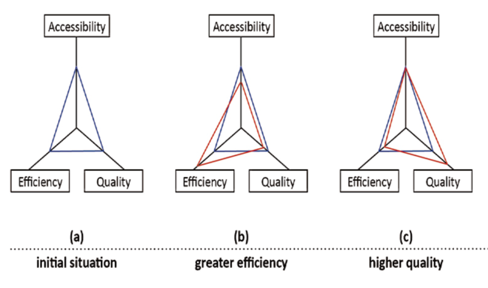
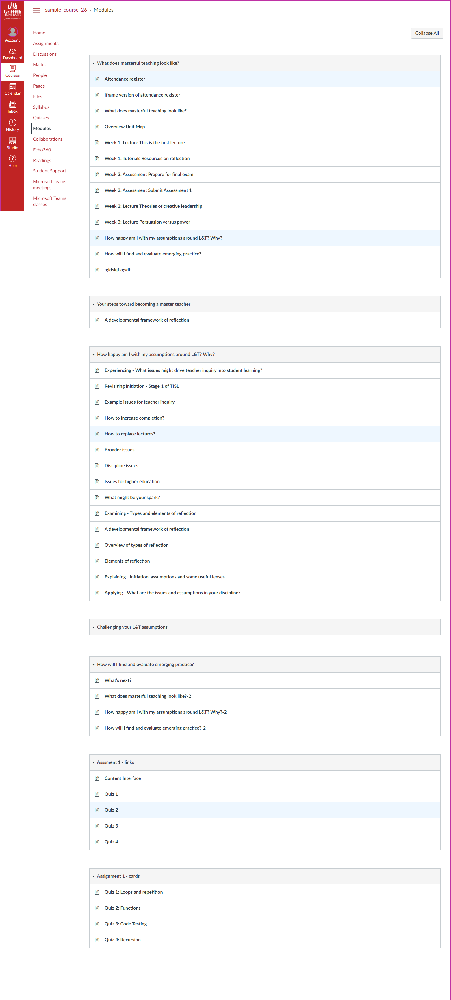
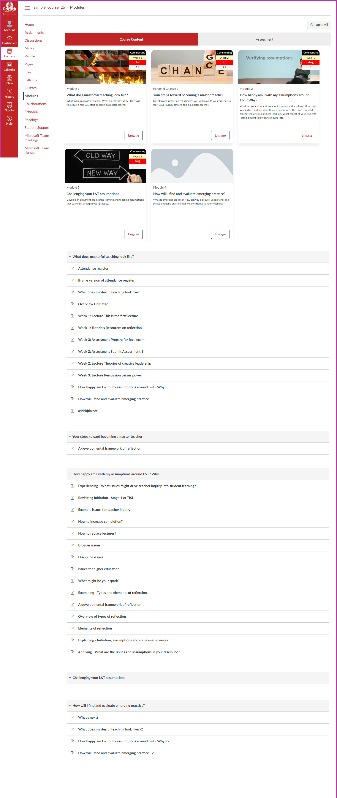
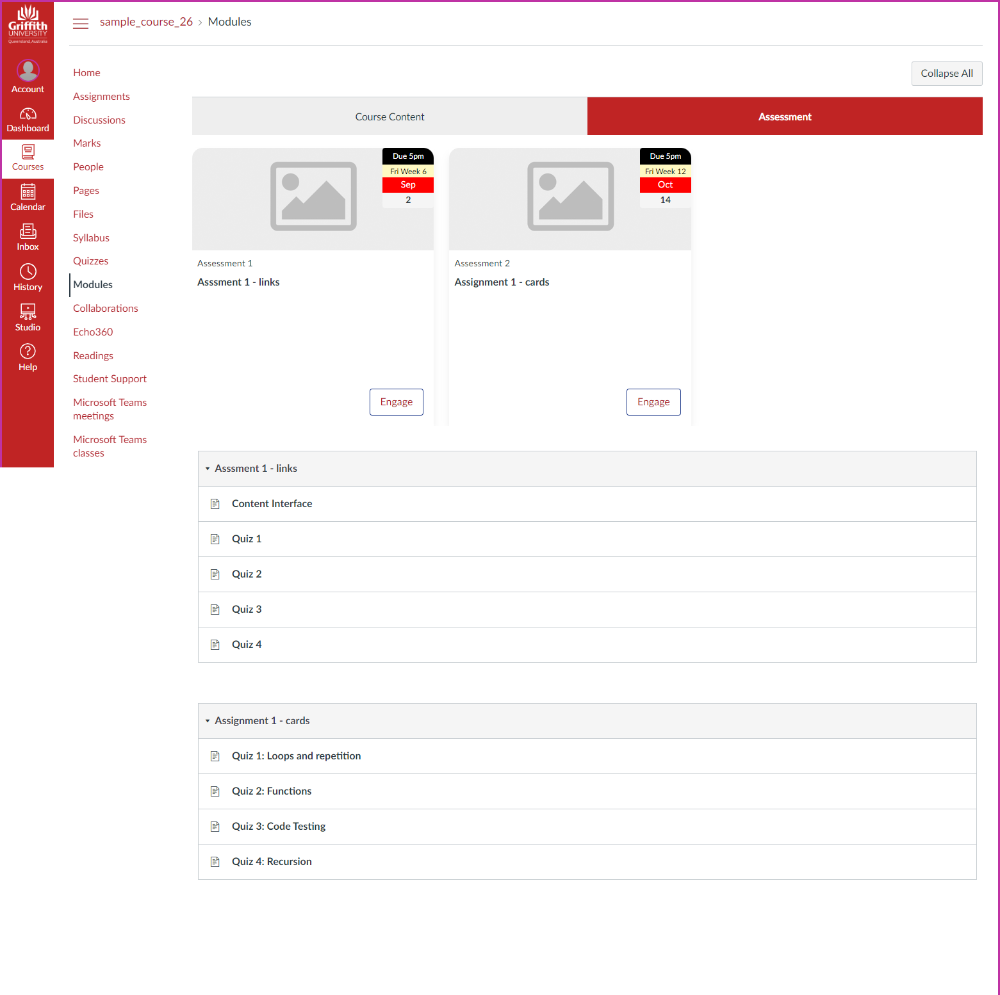

```toml
post_title='Orchestrating entagled relations to break the iron triangle: examples from a LMS migration'
layout="post"
published=false
id=??
link="https://djon.es/blog/??"
category="casa"
img_base_url="https://djplaner.github.io/memex/share/blog/"
```

## Introduction

All university strategies for learning and teaching by necessity are variations on maximising to different levels accessibility (as many people as possible can participate - feel the scale - in as many ways as possible), quality (it's good), and cost effectiveness (it's cheap to produce and offer). Seeking to maximise all three is argued by Ryan et al (2021) as a "key issue for contemporary higher education" (p. 1383) due to inevitable cost constraints, the benefits of increased access to higher education, and requirements to maintain quality standards. However, the literature on the "iron triangle" in higher education formed by these three vectors (Daniel et al, 2009; Mulder, 2013; Ryan et al, 2021) suggests that maximising all three is difficult, if not impossible. As illustrated in Figure 1 (adapted from Mulder, 2013, p. 100), the iron triangle suggests that changes in one quality (e.g. changing accessibility due to COVID) will have negatively impact at least one of the other qualities (e.g. the COVID response involving increase in workload for staff and resulting in less than happy participants). 

| Figure 1: Illustrating the iron triangle (adapted from Mulder, 2013, p. 100) |
|-----------------------------------------------------------------------------|
|   |

Much of the iron triangle literature identifies different strategies to breaking the iron triangle. Mulder (2013) suggests OER. Daniel et al (2009) suggest open and distance eLearning. Ryan et al (2021) suggest high-quality large group teaching and learning; alternative curriculum structures; and automation of assessment and feedback. I'm not convinced that any of these will work. Not due to the inherent validity of the specific solutions (though there are questions), instead my doubts arise from how such suggestions would be implemented in contemporary higher education. Each would be implemented via variations on common methods. My suspicion is that these  methods are likely to hinder any attempts to break the iron triangle. Largely because those methods are based on naive, atomistic, and deterministic understandings of education, technology, and organisations. I don't believe that these types are method are sufficiently able to efficiently or effectively orchestrate the entangled relations that - as suggested by entangled views of pedagogy (Fawns 2022) and educational technology (Dron) - are central to learning and teaching. A belief illustrated below using three separate examples taken from recent work on a LMS migration (Blackboard to Canvas).

What see below is evidence of how standard methods - based on practices like [stepwise refinement](http://sunnyday.mit.edu/16.355/wirth-refinement.html) and [loose coupling](https://en.wikipedia.org/wiki/Loose_coupling) - may be necessary but aren't sufficient for breaking the iron triangle. These methods decompose problems into smaller black boxes (e.g. pedagogy before technology; requirements and implementation; enrolment, finance, and HR; learning objects etc.) for easier and separate resolution and assume that solving larger problems (e.g. designing a quality learning experience) is a simply a matter of combining and re-combining the black boxes like lego blocks into a solution. What is evident below (IMHO) is that these methods as implemented in common approaches to an LMS migration (e.g. Common Cartridge, LTI, and the LMS) succeed in creating abstract black boxes with no entanglement with anything else. Solving larger problems (e.g. effectively migrating courses between LMSs or designing a quality learning experience) requires re-entangling and combining those black boxes with other boxes and the broader context - orchestration of entangled relations. Without doing this re-entangling the end product is disjointed and poor quality. Common means of re-entangling require significant manual effect. But there are alternatives.

The alternatives described below all arise from a different socio-technical knowledge regime than traditional enterprise approaches (Bygstad 2017). This alternative leverages digital technology to re-entangle the black boxes in ways that are more flexible (access) and cheaper (efficiency). These practices aren't new. Pre-designed templates (Perämäki, 2021) are an increasingly common, simple example. The common practice within the Canvas community of [developing and sharing userscripts](https://community.canvaslms.com/t5/Canvas-Developers-Group/UserScript-development-help-request/td-p/119615) is another example. A more surprising examples is that many Universities have significant enterprise projects in the form of [Robotic Process Automation](https://en.wikipedia.org/wiki/Robotic_process_automation) (e.g. the [University of Melbourne](https://www.automationanywhere.com/resources/customer-stories/university-of-melbourne), the [Australian National University](https://services.anu.edu.au/information-technology/software-systems/robotic-process-automation), [Griffith University](https://intranet.secure.griffith.edu.au/work/robotic-process-automation), and the [University of Auckland](https://www.uipath.com/resources/automation-case-studies/university-of-auckland)). These significant enterprise projects are designed to develop the capability to more efficiently and effectively re-entangle the black boxes of enterprise IT as applied to administrative processes such as HR, Finance, and student enrolment. What's surprising is that I'm not aware of any evidence of institutional proejcts explicitly focused on applying these methods to learning and teaching. Instead, leaving it to us tinkerers.

My argument is that more effective orchestration of entangled relations is a necessary (though probably not sufficient) enabler for breaking the iron triangle.

## LMS Migration - some common approaches, how they break, and can be done better

We're in the process of migrating from Blackboard Learn to Canvas. I work with one part of an institution responsible for migrating some 1400 courses (some with multiple course sites) over 18 months. An LMS migration "is one of the most complex and labor-intensive initiatives that a university might undertake" (Cottam, 2021, p. 66). Hence much of the organisation is expending effort to make sure it succeeds. This includes enterprise information technology players such as the new LMS vendor, our organisational IT division, and various other enterprise systems and practices. 

Hence we're making use of all sorts of existing traditional enterprise approaches. For example, the [common cartridge standard](https://www.imsglobal.org/activity/common-cartridge) for exporting content from one LMS to another. Then there's the [Learning Tools Interoperability (LTI) standard](https://www.imsglobal.org/lti-advantage-overview) for establishing "one-click, seamless" connections between an LMS and external learning tools. And of course the whole project is focused on the successful implementation of a brand-new enterprise system - the Canvas Learning Management System. A system designed ["to make teaching and learning easier"](https://www.instructure.com/en-gb/canvas/resources/home/canvas-lms-adopted-by-teachers-and-students-worldwide) and which over 13 years has grown to have more than a one-third share of the North American Higher Education LMS market.

What could go wrong?

## LTI: Migrating echo360 embeds from Blackboard to Canvas

Right now we're working on migrating ~500 Blackboard course sites. [Echo360](https://echo360.com/) is used in these course sites for lecture capture and for recording and embedding other videos.  Echo360 is an external tool, it's not part of the LMS (Blackboard or Canvas). Instead, the Learning Tools Interoperability (LTI) standard is used to embed and link echo360 videos into the LMS. LTI is an example of loose coupling. It makes it easy for the individual vendors - both LMS and external tools - to develop their own software. They focus on writing software to meet the LTI standard without a need to understand the internal detail of each other's software. Once done, their software can interconnect (via a very narrow connection). For institutional information technology folk the presence of LTI support in a tool promises to make it easy to connect one piece of software to another. i.e. it makes it easy to connect the Blackboard LMS and Echo360; or, to connect the Canvas LMS and Echo360.

**insert image showing canvas/lti/echo360 and blackboard/lti/echo360**

### Wrong purpose, no relationship, manual assemblage

Of the ~500 course sites we're currently working on there are 2162 echo360 embeds. Those are spread across 98 of the course sites. Those 98 course sites have on average 22 echo360 videos. 62 of the course sites have 10 or more echo360 embeds. One course has 142 echo360 embeds. The ability to provide those statistics is not common, more on that in the next section.

The problem we face in migrating these videos to Canvas is that our purpose falls outside the purpose of LTI. Our purpose is not focused on individual LMS to echo360. It's more on one LMS to another LMS. LTI is not designed to help with that purpose. LTI's purpose (one LMS to echo360) actually creates a problem. The code to embed an echo360 video in Blackboard (via LTI) is different to the code to embed the same video in Canvas (via LTI). If I use Blackboard's Echo360 LTI plugin to embed an echo360 video into Blackboard the id will be f34e8a01-4f72-46e1-XXXX-105064c3f75f. If I use the Canvas Echo360 LIT plugin to embed the very same video into Canvas it will use a very different id (49dbc576-XXXX-4eb0-b0d6-6bbeaa800707). 

This means that for each echo360 video you wish to migrate from Blackboard to Canvas you need to regenerate/identify a new id. 

The initial solution to this problem was:

1. A migration person goes through a course site and generates a list of names for all the echo360 videos.
2. That list is provided to a central helpdesk who use the echo360 search mechanism to find and generate a new id for each video

    Necessary because in echo360 only the owner of the video or the echo360 "root" user can access/see the video. So either the video owner (typically an academic) or the "root" user generate the new ids. From a risk perspective, only a very small number of people should have that access.
3. The migration person receives the new list and manually updates the new Canvas course site.

It's evident that this process involves a great deal of manual work and a bottleneck in terms of "root" user access to echo360.

### Orchestrating the relationships into a semi-automated assemblage

A simple improvement to this approach would be automate step #2 using something like [Robotic Process Automation](https://en.wikipedia.org/wiki/Robotic_process_automation). An approach to automating IT-based processes that even some universities are now applying to administrative processes (e.g. the [University of Melbourne](https://www.automationanywhere.com/resources/customer-stories/university-of-melbourne), the [Australian National University](https://services.anu.edu.au/information-technology/software-systems/robotic-process-automation), [Griffith University](https://intranet.secure.griffith.edu.au/work/robotic-process-automation), and the [University of Auckland](https://www.uipath.com/resources/automation-case-studies/university-of-auckland)). But apparently no so much to L&T IT-based processes.

With RPA some software could step through a provided list of video names, login to the echo360 web interface, search for the video, find it, generate a new echo360 id for Canvas, and write that id back to the original list. Ready for handing back to the migration person.

A better solution would be to automate the whole process. i.e. have software that will

1. Search through an entire Blackboard course site and identify all the echo360 embeds.
2. Use the echo360 search mechanism to find and generate a new id for each video.
3. Update the Canvas course site with the new video ids.

That's basically what we did. The Python code helps orchestrate the relationship between Blackboard, Canvas, and Echo360. It helps improve the cost effectiveness of the process though doesn't shift the dial on access or quality.

But there's more to it than echo360. Steps 1 and 2 required more and connects to the next example.

## Common Cartridge: Migrating content 

[Common Cartridge](https://www.imsglobal.org/activity/common-cartridge) provides "a standard way to represent digital course materials". Within the context of an LMS migration common cartridge (and some similar approaches) provide the main way to migrate content from one LMS to another. The lego block promise for LMS migration. Go to Blackboard and use it to produce a common cartridge export. Head over to the Canvas and use its import feature to bring the content in. Hey presto conversion complete.

### Migrating content without knowing anything about it or how it should end up

Of course it's not as simple as that, there are known problems, including:

1. Not all systems are the same so content can not be standardised.

    Vendors of different LMS seek to differentiate themselves from their competitors. Hence they tend to offer different functionality, or implement/label the same functionality differently. Either way there's a limit to how standardised digital content can be and not all LMS support the same functionality (e.g. [quizzes](https://community.canvaslms.com/t5/Canvas-Question-Forum/Migrating-Quizzes-that-Use-Pools-of-Questions-from-Blackboard-to/td-p/142448)). Hence a lot of manual work arounds.

2. Imports are ignorant of course learning design in both source and destination LMS.

    Depending on the specific learning design in a course, the structure and nature of the course site can be very different. Standardised export formats - like common cartridge - use standardised formats. They are ignorant of the specifics of course learning design as embodied in the old LMS. They are also ignorant of how best to adapt the course learning design to the requirements of the new LMS. 

3. Migrating information specific to the old LMS.

	Since common cartridge just packages up what is in the old LMS, detail specific to the old LMS gets ported to the new and has to be manually changes.  e.g. echo360 embeds as outlined above, but also language specific to the old lms (e.g. _Blackboard_)

4. Migrating bad practice.

    e.g. it's quite common for the "content collection" area of Blackboard courses to collect a large number of files. Many of these files are no longer used. Some are mistaken left overs, some are just no longer used. Most of the time the content collection is one long list of files with names like _lecture 1.pptx_, _lecture 1-2019.pptx_, _lectures 1a.pptx_. The common cartridge approach to migration, migrates any bad practice to the new LMS.

All these problems contribute to the initial migration outcome not being all that good. For example, the following images. Figure 2 is the original Blackboard course site. A common cartridge of that Blackboard course site was created and imported into Canvas. Figure 3 is the result.

It's a mess and that's just the visible structure. What was separate "modules" are now all combined together, because common cartridge is ignorant of that design. Some elements that were not needed in Canvas have been imported. Some information (_Staff Information_) was lost. And did you notice the default "scroll of death" in Canvas (Figure 3)?

| **Figure 2: Source LMS** | **Figure 3: Destination LMS** |
| --------- | -------------- |
|  |    |

The [Canvas Files area](https://community.canvaslms.com/t5/Canvas-Basics-Guide/What-are-Files/ta-p/7) is even worse off. Figure 4 shows the files area of this same course after common cartridge import. Only the first four or five files were in the Blackboard course. All the _web_content0000X_ folders are added by the common cartridge import.

| **Figure 4: Canvas files area - common cartridge import** |
| -------------- |
|   |

You can't leave that course in that stage. The next step is to manually modify and reorganise the Canvas site into a design that works in Canvas. This modification relies on the Canvas interface. Not the most effective or efficient interface for that purpose. This manual process has to be performed for each course.

The issue here is the common cartridge is a generic standard. It is purpose (in part) is to take content from any LMS (other other tool) and enable it to be imported into another LMS/tool. It has no contextual knowledge.

### Migration scaffolded by knowledge of source and destination structure: Driving the CAR

On the other hand, we know we are migrating from a specific version of Blackboard to a specific version of Canvas. We know the common approaches used in Blackboard by our courses. We eventually develop the knowledge of how what was common in Blackboard must be modified to work in Canvas. A better approach would leverage this additional knowledge and use it to increase the efficiency and the effectiveness of the migration.

To do this we developed the Course Analysis Report (CAR) approach. Broadly this approach performs the following steps:

1. Pickle the Blackboard course site.

    Details of the structure, make up, and the HTML content of the Blackboard course site is [extracted](https://en.wikipedia.org/wiki/Web_scraping) out of Blackboard and stored into a pickle file. A single data structure (residing in a shared network drive) that contains a snapshot of the Blackboard course site.

2. Analyse the pickle and generate a CAR.

    Perform various analysis and modifications to the pickle file (e.g. look for Blackboard specific language, modify echo360 embeds, identify which content collections files are actually attached to course content etc.) and generate a Word document providing a summary of the course site.

3. Download the course files and generate specially formatted Word documents representing course site content.

    Using knowledge of how Blackboard courses a structured and the modifications necessary for an effective Canvas course embodying a similar design intent create a couple of folders in the shared course folder containing all of the files and Word documents containing the web content of the Blackboard course. Format these files, folders, and documents to scaffold modification (using traditional desktop tools) and upload into Canvas.

4. Upload the modified files and Word documents directly into Canvas as mostly completed course content.

    Step #3 is where almost all the design knowledge necessary gets applied to the migrate the course. All that's left is to upload it into Canvas. Uploading the files is easy and supported by Canvas. Uploading the Word documents into Canvas as [modules](https://community.canvaslms.com/t5/Canvas-Basics-Guide/What-are-Modules/ta-p/6) is done via [word2Canvas](https://github.com/djplaner/word-to-canvas-module#word-to-canvas-word2canvas-module).

Steps #1 and #2 are entirely automatic as it the download of course content and generation of the Word documents in step #3. These are stored in shared folders available to the entire migration team (the following table provides some stats on those folders). From there the migration is semi-automated. People making decision and changes using common desktop tools.

| **Development Window** | **# course sites** | **# of files** | **Disk Usage** | 
| -------------- | -------------- | -------------- | -------------- |
| 1 | 219 | 15,213 | 163Gb |
| 2 | 555 | 2531 | 336Gb |

Figures 4 and 5 show the end result of this improved migration process using the same course as the Figures above. Figure 5 illustrates how the structure of "modules" in the Blackboard site has been recreated using the matching Canvas functionality. What it doesn't show is that Step 3 of the CAR process has removed or modified Blackboard practices to fit the capabilities of Canvas.

Figure 6 illustrates a much neater Files area compared to Figure 4. All of the unnecessary common cartridge crud is not there. Figure 5 also illustrates Step 3's addition of structure to the Files area. The three files shown are all within a _Learning Module_ folder. This folder was not present in the Blackboard course site's content collection. It's been added by the CAR to indicate where in the course site structure the files were used. These images were all used within the _Learning Modules_ content area in the Blackboard course site (Figure 2). In a more complex course site this additional structure makes it easier to find the relevant files.

Figure 5 still has a pretty significant whiff of the 'scroll of death' but that's a ["feature"](https://www.wired.com/story/its-not-a-bug-its-a-feature/) of Canvas. As part of this the highly visual [card interface](https://djplaner.github.io/Card-Interface-Tweak/) used in the Blackboard course site is also lost. Another "feature" of Canvas. More on that next.

| **Figure 5: Canvas site via CAR** | **Figure 6: Canvas files via CAR** |
| ------------------- | -------------- |
|  |   |

## LMS: Information architecture, usability and visual identity

There's quite a bit of literature and other work arguing about the value to learning and the learning experience of the aesthetics, findability, and usability of the LMS and LMS courses. Almost as much as there is literature and work expounding on the value of consistency as a method for addressing those concerns. Migrating to a new LMS typically includes some promise of enabling improvements. For example, one of the apparent advantages of Canvas is it looks prettier than the competitors.  People using Canvas generally get a cleaner feel from the user interface.  [Apparently it ](https://usc.custhelp.com/app/answers/detail/a_id/1907/~/why-is-blackboard-changing-to-canvas%3F) "provides students with an accessible and user-friendly interface through which they can access course learning materials".

### Linear, visual unappealing, context-free Generic, no context functionality, constrained by the vendor

Of course beauty is in the eye of the beholder. Some think Canvas is ["plain and ugly"](https://community.canvaslms.com/t5/Canvas-Question-Forum/Why-is-Canvas-so-plain-and-ugly/m-p/211923). As illustrated above by Figures 2 and 4 the Modules view - the core of how students interact with study material - is known widely (e.g. [University of Oxford](https://canvas.ox.ac.uk/courses/12009/pages/course-presentation-and-navigation-tool?module_item_id=894826)) to be very linear, involve lots of vertical scrolling, and is not very visually appealing. Years of experience has also shown that the [course navigation experience is less than stellar](https://community.canvaslms.com/t5/Canvas-Instructional-Designer/Improving-Course-Navigation-Experience-for-Students/m-p/205042) for a variety of reasons.

There are [common manual workarounds](https://community.canvaslms.com/t5/Canvas-Question-Forum/Why-is-Canvas-so-plain-and-ugly/m-p/211930/highlight/true#M112248) that are widely recommended to teaching staff to work around these limitations. There is also a community of [third party design tools](https://community.canvaslms.com/t5/Canvas-Instructional-Designer/Improving-Course-Navigation-Experience-for-Students/m-p/205045/highlight/true#M1000) intended to improve the Canvas interface and navigation experience. As well as requests to Canvas to improve the system. Some examples include: a [2015 request](https://community.canvaslms.com/t5/Canvas-Question-Forum/Module-groupings/td-p/115610); an [idea suggestion in 2016](https://community.canvaslms.com/t5/Idea-Conversations/Modules-within-Modules/idi-p/357681) to allow modules within modules; and [another grouping modules request in 2019](https://community.canvaslms.com/t5/Canvas-Question-Forum/Is-there-a-way-to-group-modules-together/m-p/179757). The last of which [includes a comment](https://community.canvaslms.com/t5/Canvas-Question-Forum/Is-there-a-way-to-group-modules-together/m-p/179757/highlight/true#M84952) touching on the shortcomings of most of the existing workarounds.

As Figure 2 demonstrates, we've been able to do aspects of this since 2019 in **Blackboard Learn**, but we can't do in Canvas. 

### Canvas Collections: Injecting context, visual design, and alternatives into the Canvas' modules page

[Canvas Collections](https://github.com/djplaner/canvas-collections#canvas-collections) is an early attempt to address the shortcomings of the current Canvas modules page. It is inspired by related approaches within the Canvas Community, including: [CSS-based approaches to creating interactive cards](https://www.howtocanvas.com/theme-editor/interactive-cards); and, Javascript methods for [inserting cards into Canvas](https://learntech.medsci.ox.ac.uk/wordpress-blog/a-dashboard-view-of-modules-in-canvas-v2/) which appears to have [gone into production at the University of Oxford](https://canvas.ox.ac.uk/courses/12009/pages/course-presentation-and-navigation-tool?module_item_id=894826). But also drawn on the experiences of supporting the use of [the Card Interface in Blackboard](https://djon.es/blog/2021/03/12/reflecting-on-the-spread-of-the-card-interface-for-blackboard-learn/).

Canvas Collections modifies the Canvas modules through a combination of two new abstractions:

1. Collections; and,

    Rather than a single, long list of modules. Modules can be grouped into collections that align with the design intent of the course. Figures 7 and 8 illustrate a common use of two collections: course content and assessment. A navigation bar is provided to switch between the two collections. When viewing a collection you only see the modules that belong to that collection.

2. Representations.

    Rather than just a text-based list of modules and their contents, collections supports the development of different ways of representing a collection of modules. Figures 7 and 8 demonstrate use of a representation that borrows heavily from [the Card Interface](https://djplaner.github.io/Card-Interface-Tweak/). 

Canvas Collections also enables the injection of additional context for each module no visible in the Canvas Modules view, examples in Figures 7 and 8, include:

- a description summarising the purpose of the module;
- a


| **Figure 7: Canvas Collections - content collection** | **Figure 8: Canvas Collections - assessment collection** |
| ----------- | ------ |
|     |      |

## References

Ryan, T., French, S., & Kennedy, G. (2021). Beyond the Iron Triangle: Improving the quality of teaching and learning at scale. *Studies in Higher Education*, *46*(7), 1383--1394\. <https://doi.org/10.1080/03075079.2019.1679763>