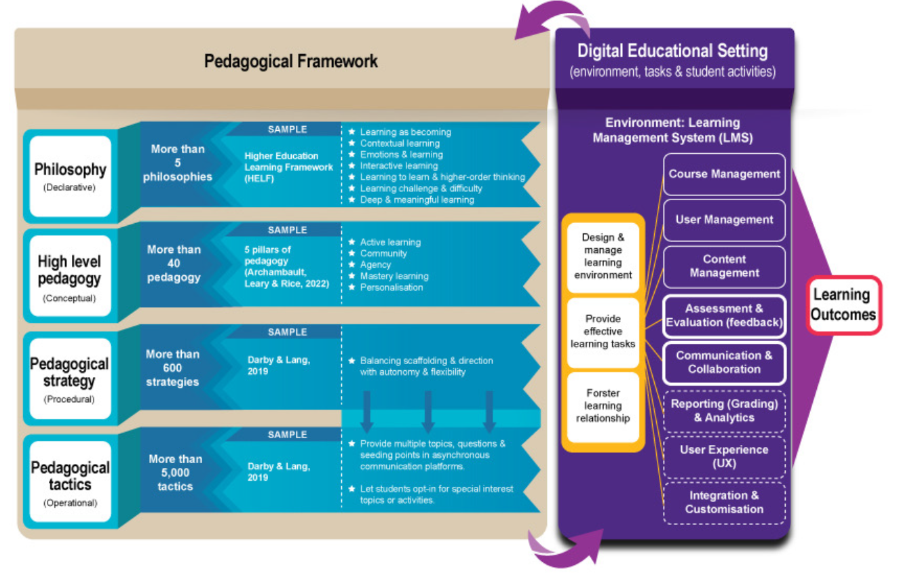

<!--
 Copyright (C) 2023 David Jones
 
 This file is part of memex.
 
 memex is free software: you can redistribute it and/or modify
 it under the terms of the GNU General Public License as published by
 the Free Software Foundation, either version 3 of the License, or
 (at your option) any later version.
 
 memex is distributed in the hope that it will be useful,
 but WITHOUT ANY WARRANTY; without even the implied warranty of
 MERCHANTABILITY or FITNESS FOR A PARTICULAR PURPOSE.  See the
 GNU General Public License for more details.
 
 You should have received a copy of the GNU General Public License
 along with memex.  If not, see <http://www.gnu.org/licenses/>.
-->

# Conceptualising education design practice - where do we fit?

See also: [[goodyear-patterns-design-practice]]

Last week, Henry, Steven and I were at the THETA'2023 conference [sharing our experience](https://djon.es/blog/2023/02/09/gathers-weavers-and-augmenters-three-principles-for-dynamic-and-sustainable-delivery-of-quality-learning-and-teaching/) trying to maximise the cost efficiency, quality, and accessibility (scale and diversity) of an LMS migration and beyond. Amongst the many interesting presentation were a couple from [Jason Lodge](https://education.uq.edu.au/profile/2054/jason-lodge). Presentations that included mention of how he and colleagues were leveraging Goodyear (2005) to figure out how to better integrate what is known about learning into higher education practices.

Goodyear explicitly tries to respond to "growing demand for advice about effective, time efficient ways of using ICT to support student learning in higher education". Goodyear critiques much of existing practice about how it fails to meet the needs of teachers and fails to effectively necessary knowledge. In response, he offers a conceptualisation of education design **insert definition** and then offers design patterns as a way to improve educational design. 

The question is, does this approach work?

There was a lot of design patterns work in the mid-noughties. Anecdotally, I've not seen anything like this in action over recent years. It doesn't appear to have entered the mainstream.

Also in 2005, McAndrew, Goodyear and Dalziel (2005) compare design patterns with two other approaches to describing learning tasks/activities. As part of this comparison they identify that what is missing from design patterns is the expertise to implement the design pattern ("to get the pattern into the LMS"). This appears to be a space where our [[gatherers-weavers-augmenters]] and [[casa]] work might help?

Goodyear (2005) mentions the use of patterns by the object-oriented programming (OOPs) crowd as an example of another discipline adopting Alexander's architectural design patterns work. While not universal, design patterns remain fairly widely used by the OOPs community. Much more so than in higher education learning and teaching. Why?

| | OOP | Higher Ed L&T |
|:--|:--|:--|
| Design, develop, maintain | Software applications | L&T environments & activities |
| Practitioner | Primarily OO programmers | Primarily teaching staff |
| Practitioner purpose | OO programming | Research etc, maybe L&T |
| Practitioner expertise | OO programming | Disciplinary, bit of L&T etc |
| Support tools | Integrated development environments | Ad hoc collection of institutional tools with only a few integrated |
| Focus on improving | Developer experience | **Student experience** |

	Perhaps it is because the translation of the design problem into practice/artefact is more straight forward and consistent in OO programming than higher ed L&T. In OO programming, the design pattern the software developer translates it into code (that can be tested etc) using increasingly fairly common integrated development practices and tools.  Knowledge of those practices and tools are seen as fairly central to the expertise of the software developer. Software development itself has quite an explicit focus on improving the developer experience. On the other hand, in higher ed L&T translating a design pattern into a learning environment relies on the complex gathering and weaving of of whatever random collection of physical/digital tools and processes within their individual institution. This complex gathering and weaving is not typically seen as central to the expertise of the practitioner. Often quite the opposite. Also, there is typically no on-going focus on "teacher experience" that echoes the focus on the "developer experience".

- THETA presentation - Henry, Steven and I 
- Jason Lodge and colleagues were wondering how to weave "what we know about learning" into we do and was harking back to Goodyear (2005)
- If/how does our work fit/relate

## Goodyear (2005)

|  |
|:--:|
| *Conceptualising the problem space of educational design (Goodyear, 2005, p. 85)*  |

## Lodge (2023)

Random thoughts
- done a lot more expanding out the pedagogical framework
- But perhaps the arrows are too coarse grained
- And the boxes of the various components of LMS are too blackbox - don't represent the entangled nature
- 
|  |
|:--:|
| *Adapting Goodyear's conceptualisation (Lodge, 2023, slide 45)*  |

## Gather, weave, augment

|  |
|:--:|
| *Adapting, the adaptation to include gather, weave & augment* |

Link this to
- Ahn et al (2019) - design in context
- Ellis & Goodyear (2019) - "research practice partnership" stuff

But still need to spread it to the teachers and the students

## References

Ahn, J., Campos, F., Hays, M., & Digiacomo, D. (2019). Designing in Context: Reaching Beyond Usability in Learning Analytics Dashboard Design. *Journal of Learning Analytics*, *6*(2), 70-85-70--85. <https://doi.org/10.18608/jla.2019.62.5>

[//begin]: # "Autogenerated link references for markdown compatibility"
[goodyear-patterns-design-practice]: <../../../sense/Paper Summaries/goodyear-patterns-design-practice> "Patterns, pattern languages and design practice"
[//end]: # "Autogenerated link references"