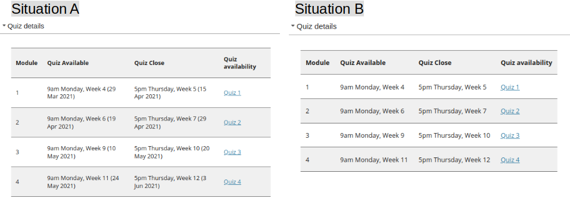
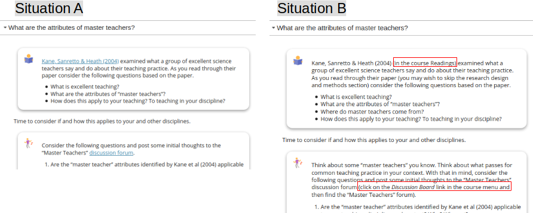

```toml
post_title='Do the little things matter in design for learning?'
layout="post"
published=true
id=18022
link="https://djon.es/blog/2021/03/06/do-the-little-things-matter-in-design-for-learning/"
category="casa"
img_base_url="https://djplaner.github.io/memex/share/blog/"
```

In learning what matters most is what the learner does. As people looking to help people learn we can't make them learn. The best we can do is to create learning situations - see Goodyear, Carvalho & Yeoman (2021) for why I'm using situation and not environment. We design the task, the learning space and social organisation (alone, pairs, groups etc.) that make up the situation in which they will engage in some activity. Hopefully activity that will lead to the learning outcomes we had in mind when designing the situation.

But maybe not. We can't be certain. All we can do is create a learning situation that is more likely to encourage them to engage in "good" activity.

How much do the little things matter in the design of these learning situations?

We spend an awful lot of time on the big picture things. A lot of time is spent on: creating, mapping and aligning learning outcomes; ensuring we've chosen the right task informed by the right learning theory and research to achieve those outcomes; and, a lot of time selecting, building, and supporting the physical and digital learning spaces in which the activity will take place. But what about the little things?

Are the little things important? I'm not sure, but in my experience the little things are typically ignored. Is that experience? Why are they ignored? What impact does this have on learners and learning?

Some early thinking about these questions follow. Not to mention the bigger question, if we can't get the little things right, what does that say about our ability to get the big things right?
## What are some "little things"?

To paraphrase [Potter Stewart](https://en.wikipedia.org/wiki/I_know_it_when_I_see_it) I won't attempt to define "little things" but rather show what I think I mean with a couple of examples from recent experience. 
### Specific dates

For better or worse, dates are important in formal education. Submit the assignment by date X. We'll study topic Y in week X. Helping students plan how and when to complete the requested task is a good thing. Making explicit the timeframes would seem a good thing. i.e. something more like situation A in the following image than situation B.

However, as pointed out in [this 2015 comment](https://djon.es/blog/2015/06/26/and-the-little-one-said-roll-over-roll-over/#comment-1340) the more common practice has been situation B. Since the print-based distance education days of the 80s and 90s the tendency has been to make learning materials (physical or digital) "stand-alone". i.e. independent of a particular study period so that they can be reused again and again. Generally because it's hard to ensure that the dates continue to be correct in offering after offering.


**Note:** These images are intended as examples of "little things" not examplars of anything else
### Using web links

In a web-based learning situation, it's not uncommon to require students to use some additional web-based resources to complete a task. For example, read some document, contribute to a discussion board etc. If it is an online resource then it appears sensible to - use a core feature of the web and - provide a link to that resource. Making it easier - requiring less cognitive load - for the student to complete the task.

But, as someone who gets to see a little of different web-based learning situations I continue to be shocked that the majority are more like situation B then sitation B in the following image. 


## Is it common to ignore the "little things"?

As mentioned in the above, my observations over the last 10 years suggest that these two examples of "little things" are largely ignored. I wonder if this is a common experience?

There can be differences. For example, it can be difficult to use links to resources within an LMS. It's not unusual for different offerings of the same course to use different sites within the LMS. This means that a link to a discussion forum in one course offering is not the same as the same discussion forum in the next course offering. I was shocked that my current institution's LMS' site roll over process did not automatically update such links as was standard practice at a previous institution. The previous institution also had a course based link checker that would look for broken links. My current institution/LMS doesn't.
## "Little things" appear to matter 

A course I helped re-design has just completed. The results from the student evaluation of the course are in with a respons rate of ~30% (n=21). All very positive. 

There was a question about the course being well organised and easy to use. 15 strongly agreed and 6 agreed. What struck me was the organisation of the course included mentions of the little things.

Two of the responses mentioned dates, both positively. Explaining that the dates were "very helpful". That this was the first course to have included them and that it was "a big stress having to look it up often".

Three of the responses mentioned links, all positively. Explaining that the numerous links to discussion board topics were "helpful", "great" and "easy".

These "little things" aren't likely to radically transform the learning outcomes, but they appear to have improved the learner experience. Removing a "stress" has to help.
## Why are the "little things" ignored?

My primary hypothesis is that while these are "little things", they aren't "easy things". Our tools and process don't make it easy to do the "little things". The following describes three possible reasons for this inability. Are there more?
### Reusability paradox

First, is the [[reusability-paradox]]. As mentioned in the dates example above. To make study materials reusable you have to remove context. For example, dates specific to a particular study period. The emphasis on reuse is a plus, but comes at the cost of reducing the pedagogic value. With the rise of micro-credentials and the flexible reuse of modular learning materials this is only going to be more of a factor moving forward. 

The reusability paradox extends to the tools we use to produce and host our learning sitations (e.g. various forms of LMS and the latest shiny things like Microsoft Teams). Any tool that's designed to be sold/used by the broadest possible market tends to be designed to be reusable. It doesn't know a lot about the specifics of one individual context. For example, it doesn't know about the dates for the institution's study periods, let alone the dates important for an individual learning situation. 
### Hierarchical versus Distributed

Second, is the difference between [a hierarchical (tree-like) and distributed conception](https://djon.es/blog/2014/09/21/breaking-bad-to-bridge-the-realityrhetoric-chasm/#how-you-see-the-world-distributed-or-tree-like) of the world. Most contemporary professional practices (e.g. software development, design for learning, and managing organisations) is hierarchical. A tree of black box components responsible for specific purposes. With the complexity and detail of each activity hidden from view. The functionality of an LMS is generally organised this way. There's a lot of value in this approach, but it makes it very difficult to do something in across each of the black boxes. To be distributed. For example, make sure that all the dates and links mentioned in the discussion forums, the quizzes, the content areas, the lecture slides etc. are correct.

This is also visible at an organisational level. It appears that offering specific dates for assignemnts and the linked are typically entered into some sort of administrative system that produces a formal profile/synopsis for a course/unit. Learning typically takes place elsewhere (e.g. the LMS). Extra work has to be performed to transfer information between the two systems. Work to transfer such information between systems is typically only done for "important" tasks. e.g. transfering grades out of the LMS into the student administration system.

### Limited focus on forward-oriented design

Third, is limited attention paid to forward-oriented design (Goodyear & Dimitriadis, 2013). Common practice is that design focuses on configuration. i.e. making sure that the learning situation is ready for students to engage with. Goodyear & Dimitriadis (2013) argue that design for learning should be an on-going and forward-looking process that actively considers design for configuration, orchestration, reflection and re-design. For example, rather than just provide ways for links to be added during configuration of a learning situation. Think about what link related functionality will be required during (orchestration) and after (reflection and re-design) learntime. For example, provide indications of if and how links are being used, or a link checker.
## References

Goodyear, P., Carvalho, L., & Yeoman, P. (2021). Activity-Centred Analysis and Design (ACAD): Core purposes, distinctive qualities and current developments. *Educational Technology Research and Development*. <https://doi.org/10.1007/s11423-020-09926-7>

Goodyear, P., & Dimitriadis, Y. (2013). In medias res: Reframing design for learning. *Research in Learning Technology*, *21*, 1--13\. <https://doi.org/10.3402/rlt.v21i0.19909>


[//begin]: # "Autogenerated link references for markdown compatibility"
[reusability-paradox]: ../../sense/Bricolage/reusability-paradox "Reusability Paradox"
[//end]: # "Autogenerated link references"