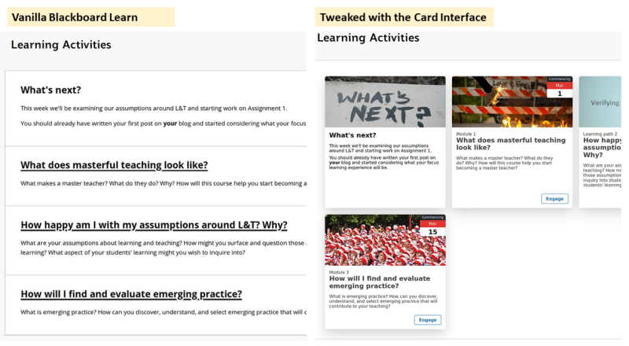
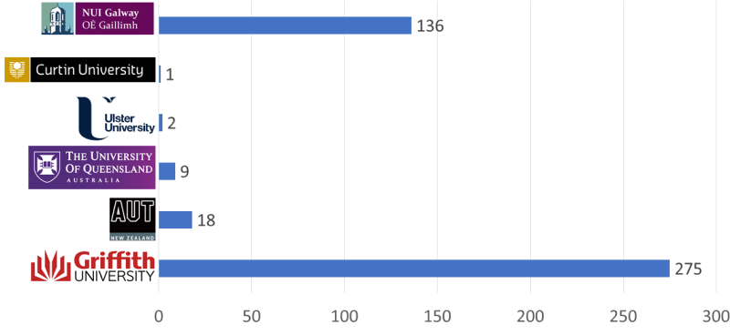

```toml
post_title='Questions about the spread of the Card Interface for Blackboard Learn'
layout="post"
published=false
id=
link="https://djon.es/blog/"
category="casa"
img_base_url="https://djplaner.github.io/memex/share/blog/"
```

In late 2018 I started work at an institution using Blackboard Learn. My first project helping "put online" 7 courses highlighted just how ugly Blackboard sites could be and how hard it was to do anything abou it. By January 2019 [I shared the solution](https://djon.es/blog/2019/01/30/improving-reuse-of-design-knowledge-in-a-lms/) I'd developed - [the Card Interface](https://github.com/djplaner/Card-Interface-Tweak) - for this project. Below is a before/after image illustrating how the Card Interface 'tweaks' a standard Blackboard content area into something more visual and contemporary. To do this you add some provided Javascript to the page and then add some card meta data to the other items.



Since 2019, the work has since grown in three ways:
1. The addition of [the Content Interface](https://github.com/djplaner/Content-Interface-Tweak) as a way to [design and maintain online content](https://djon.es/blog/2019/02/24/exploring-knowledge-reuse-in-design-for-digital-learning/#problem-developing-and-maintaining-online-learning-content) and refinement of both.
2. Conceptually through the [development of some design principles](https://djon.es/blog/2019/08/08/exploring-knowledge-reuse-in-design-for-digital-learning-tweaks-h5p-constructive-templates-and-casa/#initial-design-principles-adr-stage-4) for this type of artefact (dubbed Contextually Appropriate Scaffolding Assemblages - CASA). 
3. Uptake of the Card Interface (and to a lesser extent the Content Interface) within my institution and beyond.

## Card Interface Usage - Jan-March 2021

The following graph illustrates the number of unique Blackboard sites that have requested the Card Interface javascript file in the first few months of 2021. (In the same time frame, the Content Interface has been used by a bit over 70 Griffith University sites)



The heaviest use is within the institution where this all started. This work is not an officially approved technology. It's just a kludgge developed by some guy that works for one of the L&T areas in the institution. Uptake appears to have largely happened through word of mouth.

Adoption beyond the original institution - especially in Ireland - was sparked by this chance encounter on Twitter. Right person, right time.

<blockquote class="twitter-tweet"><p lang="en" dir="ltr">One small step more with &quot;Structure&quot; (in Blackboard Learn) could be to add a card interface <a href="https://t.co/qtiBfgpKa5">https://t.co/qtiBfgpKa5</a> <a href="https://t.co/547adFd7Mz">https://t.co/547adFd7Mz</a></p>&mdash; David Jones (@djplaner) <a href="https://twitter.com/djplaner/status/1281688249753165824?ref_src=twsrc%5Etfw">July 10, 2020</a></blockquote> <script async src="https://platform.twitter.com/widgets.js" charset="utf-8"></script>

## Why? Why not? What for? How?

Which has asking why people have or haven't used these tweaks? 

My thinking is bundled up with the [CASA design princples](https://djon.es/blog/2019/08/08/exploring-knowledge-reuse-in-design-for-digital-learning-tweaks-h5p-constructive-templates-and-casa/#initial-design-principles-adr-stage-4), in particular numbers 1, 2, 4, and 6.

> 1. A CASA should address a specific _contextual_ need within a specific _activity_

The Card Interface address an unfulfilled need. The default Blackboard Learn interface is ugly and people want it to look better. But there isn't much help coming from elsewhere.

> 2. CASA should be built using and result in _generative technologies_

Early versions of the Card Interface didn't do much. But over the years its evolved and added features. Perhaps making it more useful?

I think a key point is that the Card Interface is generative for the designer. It provides some scope for the designer to change how it works. The most obvious example being the easy inclusion of images.

> 4. CASA should package appropriate design knowledge to enable (re-)user by teachers and students.

No need for people 

How have they used them? What for?

## Broader implications?


