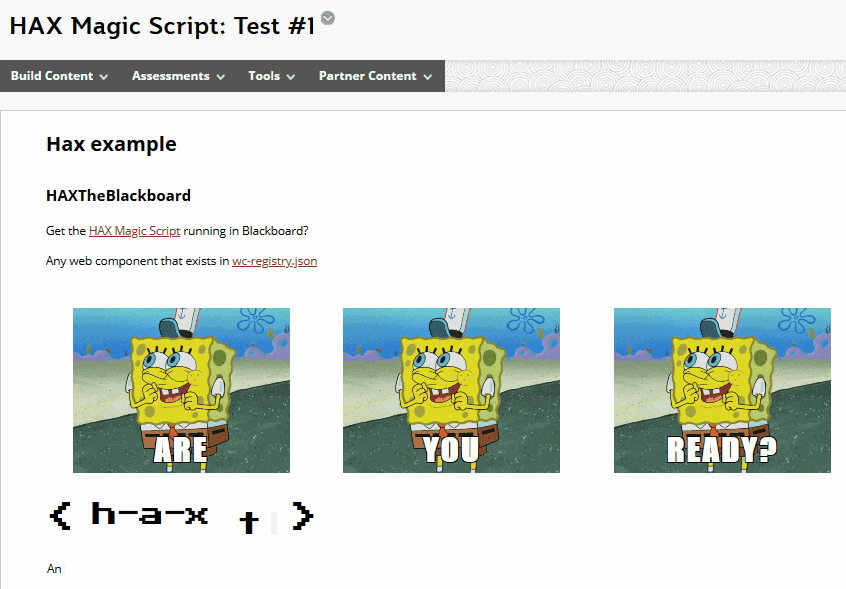
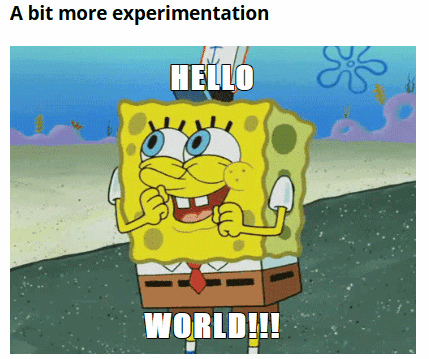
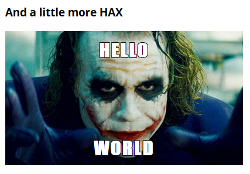

```toml
post_title='Pondering if/how Hax & web components fit in Blackboard'
layout="post"
published=false
id=
link=""
category="casa"
```

So look what I've done inside my [Blackboard Learn](https://en.wikipedia.org/wiki/Blackboard_Learn) sandpit site.



It probably doesn't look that exciting. A bit of HTML and a couple of animated GIFS. Anyone could do that, right?

Not quite.

## It's not the what, it's the how

...And what the how makes possible

The core of this image is enabled by four different [web components](https://developer.mozilla.org/en-US/docs/Web/Web_Components)
1. [grid-place](https://www.npmjs.com/package/@lrnwebcomponents/grid-plate) - provides an easy way to display the three SpongeBob images in a grid
2. [meme-maker](https://www.npmjs.com/package/@lrnwebcomponents/meme-maker) - overlays the meme-like words (i.e. ARE, YOU, READY?) onto the SpongeBob images (no image manipulation required)
3. [hax-logo](https://www.npmjs.com/package/@lrnwebcomponents/hax-logo)
4. [type-writer](https://www.npmjs.com/package/@lrnwebcomponents/type-writer) - provides the "type-writer" animation of "Any tag you type here that is listed..." 

A web component is a nicely encapsulated bit of code. Code that provides some specific functionality. For example, the ability to make a meme. i.e. take any image on the web and overlay words of my choosing on that image. (e.g. the three times SpongeBob's happy dance gif was used in the image above. 

No online meme maker was used in the construction of the above Blackboard-based content.

Instead - like all web components - I used a specially created HTML tag. Just like any other HTML tag, but provide this unique meme making functionality. What's more I could use this functionality as many times as I want. For example, I could add a meme with happy dance SpongeBob saying ["hello world"](https://en.wikipedia.org/wiki/%22Hello,_World!%22_program)

To do this I would (and did) add the following HTML to my Blackboard page.

```HTML
<p><meme-maker alt="happy dance GIF by SpongeBob SquarePants" 
  image-url="https://media0.giphy.com/media/nDSlfqf0gn5g4/giphy.gif" 
  top-text="Hello" bottom-text="World" 
  imageurl="https://media0.giphy.com/media/nDSlfqf0gn5g4/giphy.gif" 
  toptext="happy dance GIF by SpongeBob SquarePants"></p>
```
Which produces the following (all on the same Blackboard page).



**Note:** The _meme-maker_ tag wouldn't work without the _p_ tag around it. Perhaps a Blackboard thing, or perhaps an artefact of the kludge I've used to get it to work in Blackboard.

The **meme-maker** web component includes code that knows how to take the values I've placed in the **top-text** and **bottom-text** attributes and overlay them onto the image I've specified in **image-url**.  Change those attributes and I can create a new "meme".  For example, something a little more HAX.



## But wait, there's more

But I'm not limited to those four tags/web components. I can use any of the 560+ web components listed in [this JSON file](https://cdn.webcomponents.psu.edu/cdn/wc-registry.json). A list that includes: various types of charts; more layout components like the grid; players for various types of multimedia; a discussion form; rich text editor; and, much, much more.

Thanks to [the magic script](https://dev.to/btopro/uwc-part-3-the-magic-script-122a) I just include the right HTML tags and it all happens as if by magic.


**TODO** I do need to find out if and where the docs are for the various components. The NPM pages and git repo aren't doing it for a lowly end user.

## And it works anywhere on the web

Web components are based on web standards that are supported by all modern web browsers. Meaning that the magic script and the bit of content I've written above will work in any HTML hosted by any "content management system".

e.g. view the content from Blackboard in [this page from my personal website](https://djon.es/hax.html)

## How it works in Blackboard, currently

It's a currently a horrendous [kludge](https://en.wikipedia.org/wiki/Kludge) that's not really usable. I certainly wouldn't be using it as it stands (but more on that below).

The main problem is the configuration of the TinyMCE editor in Blackboard. Configuration which ends up encoding the web components HTML elements into [HTML entities](https://www.w3schools.com/html/html_entities.asp). Meaning the web components don't work.

The kludge is to

1. Use TinyMCE to enter the web components HTML into a Javascript string.
   When saved the web components HTML is encoded.
2. Add a [Javascript function](https://stackoverflow.com/questions/7394748/whats-the-right-way-to-decode-a-string-that-has-special-html-entities-in-it/7394787#7394787) to decode the string.
3. Add some more Javascript that injects the decoded string into the DOM (the Blackboard page).

This allows the magic script to do its magic.

All this proves is that the magic script can work. Question now is

## How to better use this within Blackboard

The method described above is usable for just about no-one. A better approach is required for broader, effective adoption. As web components work in any browser this approach can be integrated into most platforms (e.g. Drupal and Wordpress). **list of what HAX has been integrated into**

###  ?? Hax the editor

**talk about the HAX wordpress thing**
https://plugins.trac.wordpress.org/browser/haxtheweb/tags/3.9.4/js/hax-the-press.js

Something like this might be possible with Blackboard. [JSHack](https://github.com/AllTheDucks/jshack-v1/wiki) is a Blackboard building block that enabled the injection of HTML/Javascript into Blackboard pages. Beyond what is possible by manually including HTML/Javascript via TinyMCE.

I don't have the ability to install Building Blocks into the institutional Blackboard. I'm not even going to try to make the case.

Without this ability, I can't see how the **"hax editor"** approach can work. I need alternatives.

### Make a Black(board) magic script

One potential approach might be to write an extension to the magic script specifically for Blackboard that would work something like this:

1. Add the magic script to any Blackboard page via the Blackboard editor.
2. Author adds any of the web components by typing HTML into the Blackboard editor.
   And here's the first problem. It requires the authors to write HTML manually. High knowledge requirement, not widespread.
3. When saved the web component HTML would be encoded to HTML entities.
4. But on page load, the magic script would search the content items for any web component HTML entities and decode them.
   Not sure how challenging correctly finding all the HTML entities will be.
5. At this stage, the original magic script takes over and magic happens.

**talk about problems with this approach**

### The Content Interface approach

use Word styles to indicate which are web component HTML and have the Content Interface include the magic script 

This makes it easy to find the web components.  But still requires HTML

### The Card Interface approach

Rather than enter HTML (or use the HAX editor).  Use existing Blackboard items to configure the web components and have another magic script translate

In essence what happens with card interface

Explain how the card interface works.

No longer requires HTML.  But only works for specific things.

### Rewrite the card and content interfaces

Rewrite the card/content interfaces to use web components. 

Both could have restricted magic scripts.  A set of different possible representations for cards/content.  Enabling quicker development of alternative views.  Fixing the primitive spaghetti code that these interfaces currently rely upon 


**Move onto the Card Content Interface approach**


## Broader implications: the NGDLE and the VLE 

The rise of the idea of the Next Generation Digital Learning Environment (NGDLE) is a recognition that no single system can meet the requirements of learning and teaching. Instead, there needs to be an ecosystem of components available that “allow individuals and institutions the opportunity to construct learning environments tailored to their requirements and goals” (Brown et al., 2015, p. 1). This "lego approach" to constructing an ecosystem of technologies requires standards that specify how the lego pieces connect. Otherwise there will be a disconnected user experience.

For institutions the standard de jour is [Learning Tools Interoperability (LTI)](https://en.wikipedia.org/wiki/Learning_Tools_Interoperability). And it sort of works. A lot of educational technology vendors and their tools (sort of) support it. One of the problems is that the individual "blocks" in LTI lego tend to be individual applications. You use LTI to connect Blackboard with the portfolio system. 

LTI typically doesn't support and/or get used for the what was originally proposed as a model for the NGDLE, the mash-up.
> the model for the NGDLE architecture may be the mash-up. A mash-up is a web page or application that “uses content from more than one source to create a single new service displayed in a single graphical interface (Brown et al., 2015, p. 3)

Being based on standard web standards and implemented by all modern web browsers web components appear to provide the best approach to supporting the mash-up model of the NGDLE. As illustrated above (in a not very educational example) I've been able to combine content and services from various sources into a single interface. Creating web components - like those produced by the folk at Penn State University when developing HAX and the magic script - enable sharing and reuse. 

Web components provide lego blocks at a smaller scale than LTI. And perhaps enable the curation of more seamless learning environments.

### Magic script as permeable membrane

Entropy will kill a closed system. An open system is needed and web components provide such an open system. But institutions also tend not to want a system that is too open. For many reasons, some good. They'd like to be able to define a permeable membrane that enables them to specify how open the system is.

The [magic script approach](https://dev.to/btopro/uwc-part-3-the-magic-script-122a)  provides a permeamble membrane. It only recognises the web components specified in [the JSON registry file](https://cdn.webcomponents.psu.edu/cdn/wc-registry.json). Suggesting something for the institution to control. (Though it wouldn't be difficult to create my own registry and point the script there)

### Unbundling as being platform agnostic

The folk behind this are using an [unbundled approach](https://dev.to/btopro/part-1-how-penn-state-unbundles-web-components-for-cdn-deployments-20di) to web components.

HAX promises to transform "authorship so faculty can focus on instruction rather than HTML in order to accurately represent their expertise" ([Ollendyke, 2018](https://psu.app.box.com/s/gk6013odcl3115j3ibfzudj3bqar059v)). **Card and content interface** do something similar but take a different approach...

Something here about breaking out of the LMS...but what about my work with tweaks and links to the design principles of CASA and/or my ISDT
