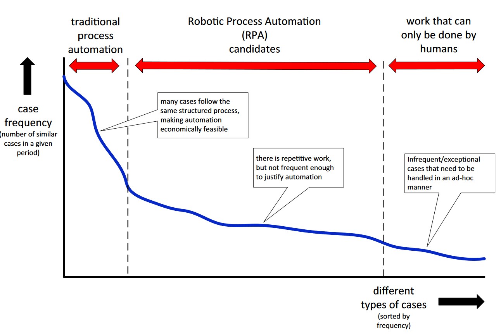

```toml
post_title='"Robotic Process Automation" (RPA) in L&T in tertiary education: LMS migration examples'
layout="post"
published=false
id=??
link="https://djon.es/blog/??"
category="casa"
img_base_url="https://djplaner.github.io/memex/share/blog/"
```

# Introduction

- RPA is billon dollar industry growing since ??
- Universities have started projects to leverage RPA in administrative work, but anecdotally not as obviously in learning and teaching 
- RPA is one example of a broader recognition that enterprise information systems practices are not sufficient, but it's not yet in L&T
- at least not in formal organisational structure and projects (individual staff having been engaged in activities like RPA forever)
- Aim here is to illustrate that the need for RPA for administrative purposes is even more prevalent in L&T in tertiary education - with its focus on lots of disparate digital technology to support large numbers of students and the on-going struggle to unite those technologies into an efficient and effective L&T environment  

__Link to 

# Introducing Robotic Process Automation (RPA)

Robotic Process Automation (RPA) is a label applied to software
- What is RPA and its origins

# Why RPA

The explanation/image

  

# "RPA" in an LMS migration

Problem - echo360. Diagram showing echo360, Bb and Canvas.  Same video in echo360, but different ids in Bb than Canvas.

**Question** Can I get a graph of courses with echo360 videos in DW2?

Manual solution. The "RPA" solution - but someone still needs to manually gather the list of video titles in a course. Send it to someone with permission and get the response back and then integrated into Canvas

explain
- Pickle - already have the list
- coursePages - old echo360 iframes modified to new
- word2canvas - upload into Canvas


This type of work is not new, I imagine there are staff all over doing this work which a quick look at github and Canvas community forums confirms.

# "RPA" as part of digital transformation

"Digital transformation" increasingly features in the strategic plans for many universities. Personally observed plans for achieving "digital transformation" currently appear to largely focused on the IT department implementing lots of big enterprise platforms. As highlighted above those platforms are probably going to struggle to meet the purposes of the learners, teachers, and other staff trying to implement "digital transformation".

Anne-Marie Scott writes about a [very different take on digital transformation](https://ammienoot.com/brain-fluff/digital-transformation-and-why-it-cant-be-done-without-learning-technologists/). One where digital transformation won't work if all the digital expertise is constrained in the IT department. Or - linke to Col's post about taking tech as given

Scott talks about "vary widly between disciplines and institutions"....touch on this

Migration is a one-off process, but these requirements will continue...something about purpose and assemblage

# References

van der Aalst, W. M. P., Bichler, M., & Heinzl, A. (2018). Robotic Process Automation. *Business & Information Systems Engineering*, *60*(4), 269--272\. <https://doi.org/10.1007/s12599-018-0542-4>